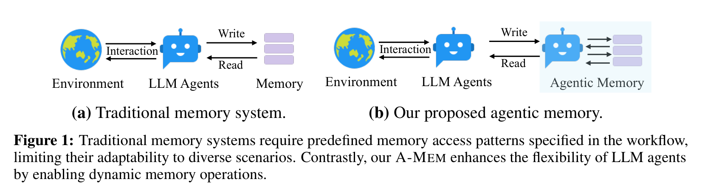
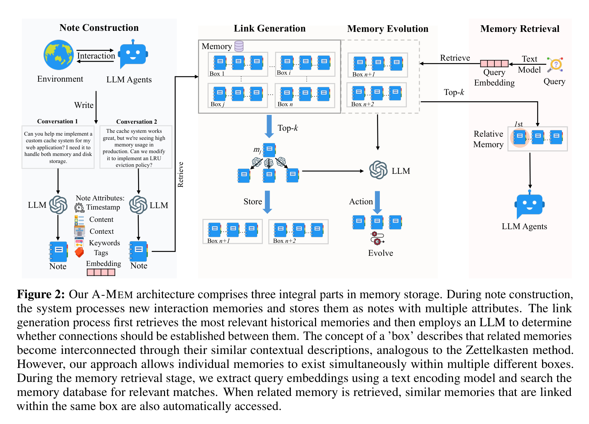
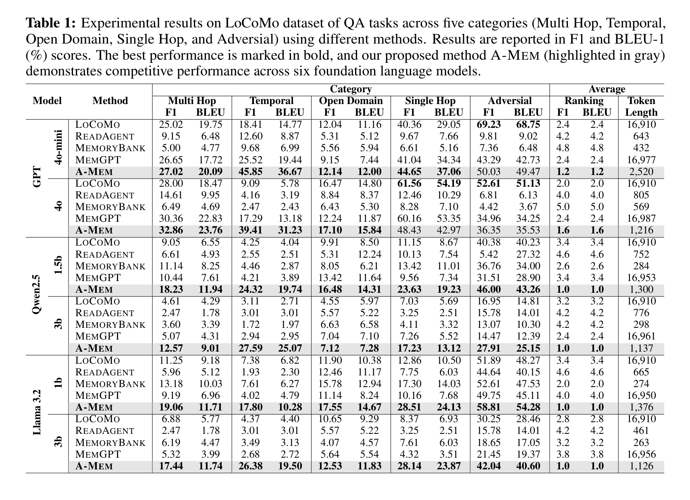
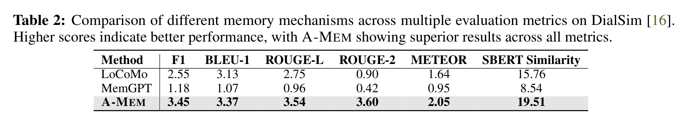
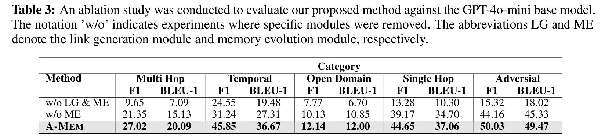
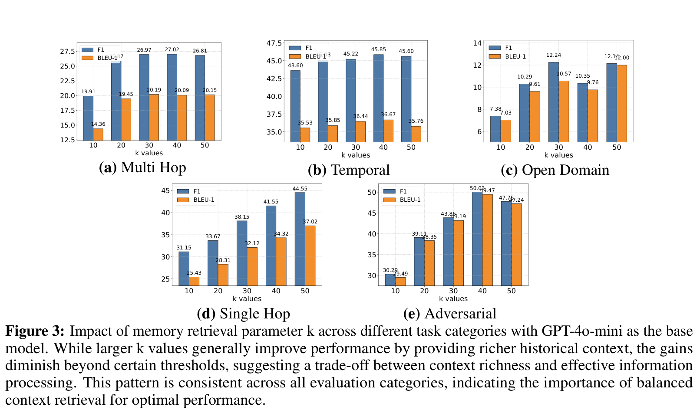
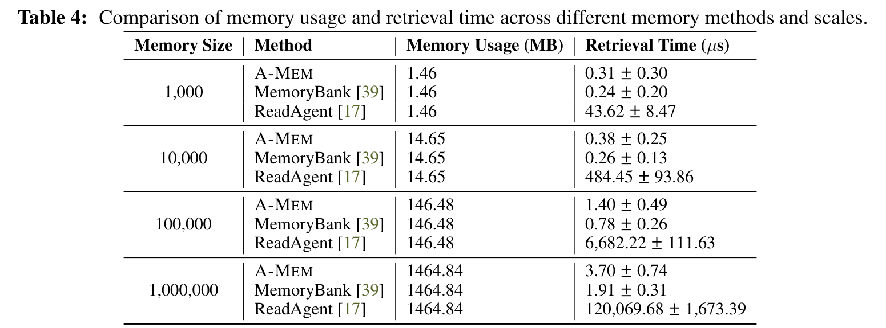
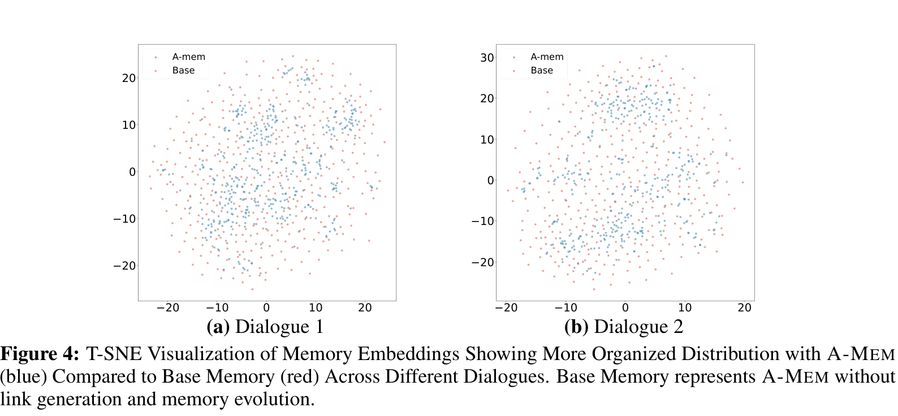

# 别再把 Agent 的记忆当数据库了：A-MEM 让它学会整理、联想和更新经验

## TL;DR

A-MEM 解决的是 LLM Agent 的一个老问题：记忆不是存进去、搜出来就完事了。它把交互记录写成带上下文、关键词和链接的“笔记”，再让新记忆反过来更新旧记忆。结果很直观：长对话 QA 上更会跨轮推理，也更省 token。

## 论文基本信息

- 论文链接：[arXiv 2502.12110v11](https://arxiv.org/abs/2502.12110v11)
- 代码链接：[Benchmark Evaluation](https://github.com/WujiangXu/AgenticMemory)，[Production-ready Agentic Memory](https://github.com/WujiangXu/A-mem-sys)
- 作者团队：Wujiang Xu, Zujie Liang, Kai Mei, Hang Gao, Juntao Tan, Yongfeng Zhang；Rutgers University, Independent Researcher, AIOS Foundation
- 关键词：智能体记忆、长期对话、记忆演化、Zettelkasten、A-MEM

## Agent 不是缺记性，是缺“会整理”的记忆

很多 LLM Agent 的记忆系统，本质上还是一个被工作流控制的外部仓库：什么时候写、写成什么结构、什么时候读，开发者先规定好。这样当然能跑，但一旦任务变长、场景变杂，系统就会变得很笨。它可以存下“发生过什么”，却很难自己发现“这些经验之间有什么关系”。

A-MEM 抓住的就是这个差别。论文不满足于把记忆做成更大的向量库，而是问了一个更像智能体系统的问题：如果 Agent 的经验越来越多，记忆结构能不能自己长出来？

图 1 里的对比很直接：传统记忆系统像一个被动模块，Agent 按照预先写好的流程读写它；A-MEM 则把记忆系统变成更主动的组织者。这个差别不只是工程封装，而是决定了记忆能不能适应不同任务。

## 把卡片盒搬进 Agent：A-MEM 的核心直觉

A-MEM 借鉴的是 Zettelkasten，也就是“卡片盒笔记法”。它的关键不在“写了很多笔记”，而在每条笔记是原子化的，并且可以不断和其他笔记建立连接。人类做研究时经常靠这种连接产生新理解，A-MEM 想把这个过程交给 LLM Agent。

它的流程可以拆成四步。

第一步是 Note Construction。每条新交互不会只保存原文，还会被 LLM 扩展成一张结构化笔记，里面包含时间戳、原始内容、上下文描述、关键词、标签、embedding 和链接集合。这里的重点是“上下文描述”：它让一条具体对话不再只是孤立文本，而是带有可组织的语义。

第二步是 Link Generation。系统先用 embedding 找到 top-k 相似历史记忆，再让 LLM 判断哪些记忆之间真的应该建立连接。也就是说，向量检索只是候选过滤，真正的关系判断交给语言模型做。

第三步是 Memory Evolution。新记忆加入后，不只是自己入库，还会触发相关旧记忆的上下文、关键词和标签更新。这是论文里最有意思的一点：记忆不是静态存档，而是会随着新经验重新解释旧经验。

第四步是 Retrieve Relative Memory。查询时先找相关记忆，再把同一个“box”里的关联记忆也带出来。这里的 box 不是固定分类，而是由记忆之间的上下文相似性和链接关系自然形成。

## 实验想证明的不是“记得多”，而是“用得准”

论文主要在 LoCoMo 和 DialSim 上评测。LoCoMo 很适合这类工作，因为它有长达多 session 的对话，并覆盖 multi-hop、temporal、open-domain、single-hop 和 adversarial 问题。换句话说，它不只是问模型有没有记住事实，还问模型能不能跨轮整合、理解时间关系，以及识别不可回答的问题。

表 1 里最值得看的不是某一个最高分，而是趋势：A-MEM 在 GPT-4o-mini、GPT-4o、Qwen2.5 1.5B/3B、Llama 3.2 1B/3B 上都能给出稳定提升。尤其 GPT-4o-mini 上，Temporal 从 LoCoMo 的 18.41/14.77 提升到 45.85/36.67，Multi Hop 也从 25.02/19.75 到 27.02/20.09。对小模型来说，A-MEM 的增益更像是在补“长期上下文组织能力”，而不是简单依赖模型本身的参数知识。

DialSim 的结果更干脆。A-MEM 的 F1 是 3.45，高于 LoCoMo 的 2.55，也明显高于 MemGPT 的 1.18；SBERT Similarity 达到 19.51，而 LoCoMo 是 15.76，MemGPT 是 8.54。分数本身不算“华丽”，但在长对话记忆任务里，这种跨指标一致提升说明它不是只对某个评价指标做了优化。

## 消融给出的答案很直接：连接是骨架，演化是后劲

如果只看架构，A-MEM 很容易被误解成“LLM 帮你给记忆打标签”。消融实验把这个误会拆掉了。作者分别去掉 Link Generation 和 Memory Evolution，看系统还能剩下多少能力。

表 3 很有说服力。GPT-4o-mini 上，w/o LG & ME 的 Multi Hop F1 只有 9.65，完整 A-MEM 是 27.02；Temporal 从 24.55 到 45.85；Adversarial 从 15.32 到 50.03。只去掉 Memory Evolution 时，性能处在中间位置，比如 Multi Hop F1 是 21.35。

这说明 Link Generation 是基础，它先把记忆从“散点”变成“网络”；Memory Evolution 则负责让这个网络随着新信息不断更新。没有连接，系统找不到关系；没有演化，系统能连起来，但旧记忆不会变得更懂上下文。

## 多拿一点历史有用，但不是越多越好

A-MEM 还有一个很现实的问题：top-k 取多少？拿得太少，历史信息不足；拿得太多，噪声和上下文负担都会上来。

Figure 3 展示了 k=10 到 50 的变化。Multi Hop 和 Temporal 大体随着 k 增大提升，但到 40 或 50 后收益变小。Open Domain 在 k=30 和 50 都不错，中间还会有波动。这个结果挺符合直觉：长记忆系统不能只追求“召回更多”，还要考虑模型能不能消化这些记忆。

这也是 A-MEM 和普通 RAG 的相通之处：检索不是越多越好，真正重要的是把对当前问题有解释力的上下文拿出来。

## 跑得快，才有资格谈长期记忆

很多记忆系统论文会把结构做得很复杂，但实际部署时卡在延迟和成本上。A-MEM 在这点上给了一个比较务实的答案：它的组织过程有 LLM 调用，但检索阶段依然保持向量检索级别的效率。

表 4 里，A-MEM 从 1K 到 1M 条记忆，检索时间从 0.31±0.30 微秒增加到 3.70±0.74 微秒。MemoryBank 更快一些，但功能也更薄；ReadAgent 在 1M 条时到了 120,069.68 微秒。空间使用上三者都是线性增长，这说明 A-MEM 的额外能力没有把存储复杂度炸掉。

论文还提到，A-MEM 每次记忆操作大约使用 1,200 tokens，相比 LoCoMo 和 MemGPT 的 16,900 tokens 有 85% 到 93% 的下降。对真实 Agent 应用来说，这个点很关键。长期记忆如果每次都把大量历史塞进 prompt，最后不是效果问题，而是账单和延迟先撑不住。

## 聚类图透露了一件事：记忆真的被重新组织了

论文最后用 t-SNE 可视化比较了 A-MEM 和没有链接、没有演化的 Base Memory。可视化不能当最终证据，但可以作为一个直观侧影：A-MEM 的记忆点更容易形成簇。

这张图的意义不在于“蓝点更好看”，而在于它补上了方法直觉和实验结果之间的桥：如果系统真的在生成上下文、建立链接、演化旧记忆，那 embedding 空间里出现更有组织的结构是合理的。它不能单独证明因果，但和消融结果放在一起看，论据链条是顺的。

## 我会如何读这篇论文：它不是终点，但方向很对

我喜欢这篇论文的地方，是它把 Agent 记忆从“检索工程”往“知识组织”推了一步。现在很多 Agent 系统的长期记忆听起来很强，实际更像外挂日志库：存得越多，检索越难，最后靠 prompt 勉强拼起来。A-MEM 至少明确说，记忆要能自己组织，旧经验要能被新经验重新解释。

但也要冷静看它的边界。A-MEM 很依赖底层 LLM 生成上下文、关键词、标签和链接判断的质量。如果 LLM 对某条经验理解错了，系统可能会把错误关系写进记忆网络，后面还会被演化机制继续传播。也就是说，它把灵活性带进来了，也把 LLM 的不稳定性带进了记忆结构本身。

另一个值得注意的点是评测场景。LoCoMo 和 DialSim 都是长对话 QA，能证明 A-MEM 对长期 conversational memory 有帮助；但真实 Agent 往往还包含工具调用、任务执行、代码修改、多模态输入和环境状态变化。A-MEM 的“笔记化记忆”能不能支撑这些更脏、更动态的场景，还需要更多实证。

所以我的判断是：这篇论文的贡献不是把记忆系统一次性做完，而是提出了一个更有生命力的建模方向。Agent 的长期记忆不应该只是搜索历史，而应该像研究者的笔记一样，能重组、能联想、能随着新经验改变旧理解。

## 值得关注的地方

1. 记忆演化需要“防污染”机制。A-MEM 让新记忆更新旧记忆很有吸引力，但真实系统里必须回答一个问题：如果新信息是错的、过时的、恶意的，旧记忆该不该被改？后续可以把置信度、来源可信度、时间衰减和冲突检测加入演化过程。

2. 记忆链接不一定只靠 LLM 判断。论文用 LLM 决定哪些历史记忆应该建立连接，这很灵活，但成本和一致性都会受模型影响。一个有价值的方向是混合策略：embedding 做召回，规则或小模型做初筛，LLM 只处理高价值候选链接。

3. 记忆系统需要面向任务闭环评测。长对话 QA 是好的起点，但 Agent 记忆最终要服务任务成功率，比如软件工程、数据分析、个人助理、科研协作。未来评测应该看记忆是否减少重复试错、是否帮助跨天任务延续、是否降低错误工具调用。

4. 多模态记忆会是下一步硬题。作者也承认当前主要处理文本交互。真正的 Agent 可能要记住截图、界面状态、表格、音频、日志和代码 diff。如何把这些信息变成可链接、可演化、可检索的“笔记”，会决定 A-MEM 这类方法能走多远。
