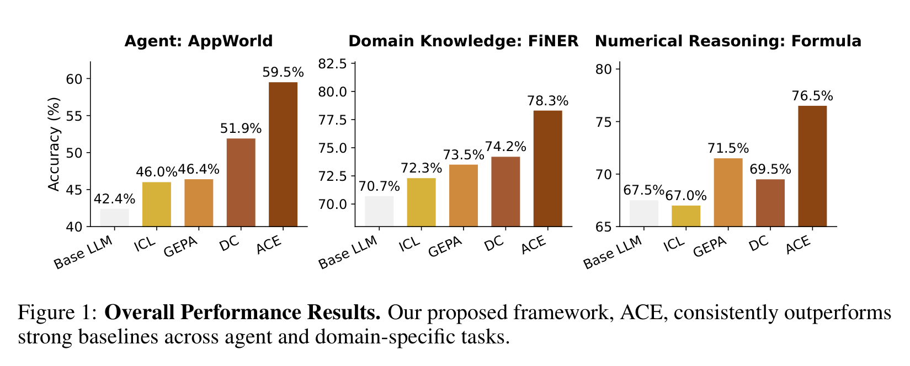
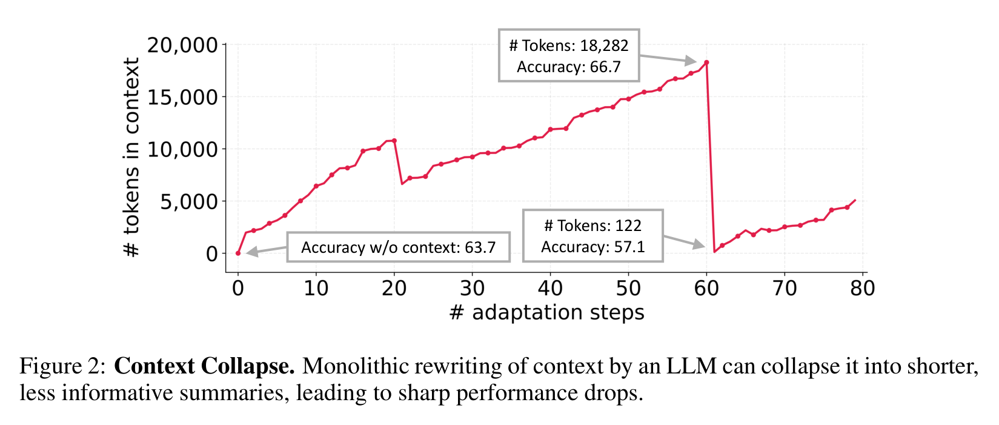
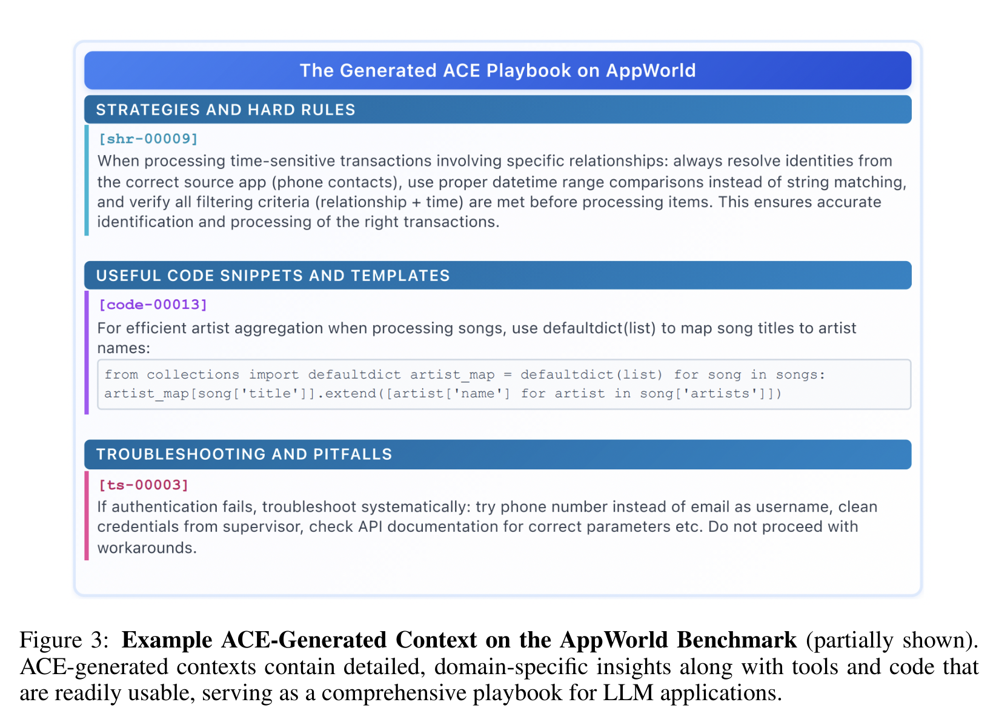
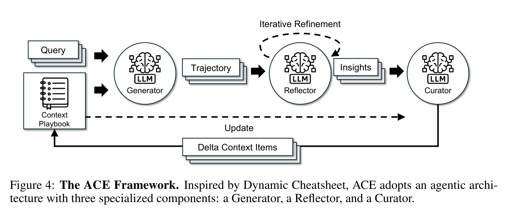
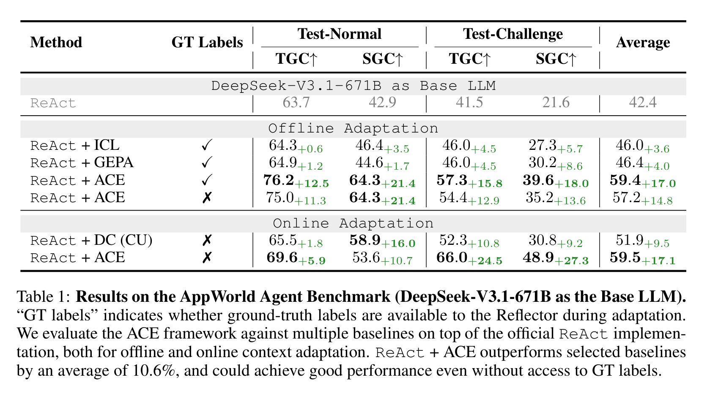
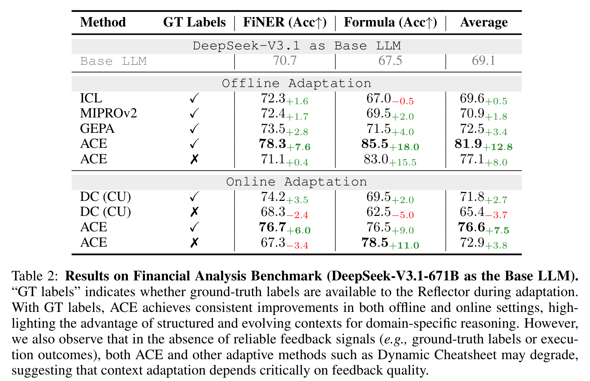
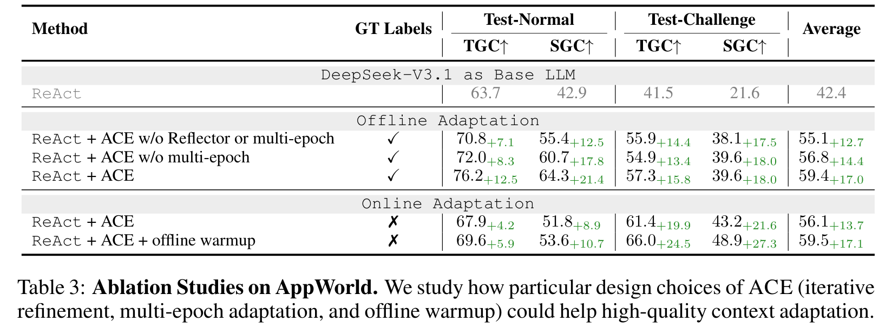
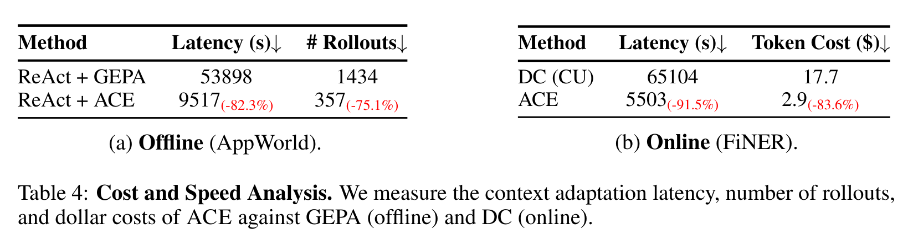

# 别再把 Prompt 越改越短了：ACE 让大模型把经验攒成一本会进化的攻略书

## TL;DR

ACE 想解决的是 context adaptation 的“越优化越失忆”：传统方法会把经验压成短 prompt，细节和失败教训被洗掉。它把 context 变成可增长、可反思、可整理的 playbook，用 Generator、Reflector、Curator 逐步写入 delta。结果在 Agent 和金融推理任务上都更强，还明显省 rollout 和延迟。

## 论文基本信息

- 论文链接：[arXiv 2510.04618v3](https://arxiv.org/abs/2510.04618v3)
- 代码链接：[github.com/ace-agent/ace](https://github.com/ace-agent/ace)，项目页：[ace-agent.github.io](https://ace-agent.github.io)
- 作者团队：Qizheng Zhang, Changran Hu, Shubhangi Upasani, Boyuan Ma, Fenglu Hong, Vamsidhar Kamanuru, Jay Rainton, Chen Wu, Mengmeng Ji, Hanchen Li, Urmish Thakker, James Zou, Kunle Olukotun；Stanford University, SambaNova Systems, UC Berkeley
- 关键词：上下文工程、智能体自改进、在线适应、Prompt 优化、ACE

## 这篇论文真正反对的，是“把经验压成一句话”

过去几年大家一直在说 context engineering，但很多方法本质上还是在找一个更短、更顺、更泛化的系统提示词。问题是，Agent 和垂直领域任务并不总是需要“更简洁”的提示词。它们需要的是一堆具体的经验：这个 API 怎么调用、某类错误为什么会发生、某个领域概念如何判断、之前哪条策略坑过模型。

ACE 这篇论文的观点很鲜明：context 不应该被当成短摘要，而应该被当成一本持续生长的 playbook。它不是要把模型训练得更聪明，而是让模型在运行过程中不断把可复用经验写进输入上下文里。

Figure 1 先给了一个总览：ACE 在 Agent 任务 AppWorld、金融实体识别 FiNER、金融数值推理 Formula 上都超过强基线。这里最关键的不是单点分数，而是它同时覆盖了工具调用型 Agent 和领域知识密集型推理。换句话说，论文想证明的不是“某个 prompt 调好了”，而是“把上下文做成可演化资产”这件事有普适价值。

## Context collapse：模型会把自己辛苦攒下的经验洗没

论文里最有记忆点的概念是 context collapse。很多自适应方法会让 LLM 每一轮重写完整 context，看起来很自然：旧经验加新经验，交给模型重新总结一下。但这恰恰是危险点。

Figure 2 展示了一个很刺眼的例子：AppWorld 中某一步 context 已经积累到 18,282 tokens，准确率 66.7；下一步被模型重写后只剩 122 tokens，准确率跌到 57.1，甚至低于不使用 context 的 63.7。这个现象不是小瑕疵，而是直接说明“让 LLM 整体重写记忆”很容易把长期经验洗成一段漂亮废话。

这也是 ACE 的出发点：不要反复重写整本笔记，而是只追加和修订局部条目。经验可以增长，但不能一轮总结就消失。

## ACE 的 playbook 不是口号，而是可执行的经验库

ACE 生成的 context 不是一段抽象说明，而是很像工程师会真的拿来查的手册：有 hard rules，有 code snippets，有 troubleshooting。它保留的是任务现场的细节，而不是把一切压成“be careful with APIs”这种空话。

Figure 3 很能说明 ACE 的味道。比如它会记录处理时间敏感交易时要从正确来源解析身份、用 datetime range 比较而不是字符串匹配；也会留下 `defaultdict(list)` 这样的代码模板；还会记录认证失败时应该按哪些顺序排查。这样的 context 更像“战术知识库”，而不是传统 prompt optimization 追求的短指令。

这也是它和 GEPA、MIPROv2 一类方法的差别：ACE 不只是优化提示词表达，而是在积累任务执行经验。

## 三个角色分工：做题、反思、入库

ACE 的结构不复杂，反而是这篇论文比较聪明的地方。它把 context adaptation 拆成三个角色。

Generator 负责拿当前 playbook 去解题，产出 trajectory。Reflector 负责看这些轨迹，提取成功策略、失败原因和可复用 insight。Curator 负责把这些 insight 写成结构化 delta context items，再合并进 playbook。

这个分工解决了两个问题。第一，Reflector 不需要同时承担生成答案和整理经验，反思质量更稳定。第二，Curator 不重写完整 context，而是做局部增量更新，避免 context collapse。

论文还引入 grow-and-refine：新 bullet 可以追加，旧 bullet 可以更新计数，重复内容通过 embedding 去重。这样 context 能生长，但不会无限变成一堆重复条目。

## 在 AppWorld 上，ACE 不靠标签也能学到东西

Agent 任务最有意思，因为真实 Agent 往往没有标准答案标签，但会有执行反馈：代码跑没跑通、API 调用是否成功、环境状态有没有达到目标。ACE 正是利用这些自然信号来做 online adaptation。

Table 1 显示，在 DeepSeek-V3.1-671B 作为 Base LLM 的 AppWorld 上，ReAct baseline 平均 42.4。Offline adaptation 中，ReAct + ACE 有 GT labels 时平均 59.4，没有 GT labels 时也有 57.2；Online adaptation 中，ReAct + ACE 无标签平均达到 59.5，高于 Dynamic Cheatsheet 的 51.9。

这个结果非常重要：ACE 不是只能在训练集有标准答案时工作。对 Agent 来说，环境反馈本身就能成为反思信号。这让它更接近“自改进 Agent”的实际形态。

论文还提到，ReAct + ACE 在 AppWorld leaderboard 上用 DeepSeek-V3.1 接近 GPT-4.1 驱动的生产级 Agent IBM CUGA 的整体平均表现，并在更难的 test-challenge split 上超过它的部分指标。这个说法需要谨慎看，因为作者也说明 IBM CUGA 只是上下文参照，不是严格同设置 baseline；但它确实说明 ACE 的收益不是小修小补。

## 金融任务证明：详细 context 对领域推理尤其有用

ACE 在金融 benchmark 上也很强。FiNER 要处理 XBRL 金融文档里的细粒度实体类型，Formula 要做金融概念和数值推理。这类任务很吃领域规则和常见陷阱，不是靠一句“think step by step”能解决的。

Table 2 里，Base LLM 平均 69.1。Offline adaptation 中，ACE 有标签时平均 81.9，超过 GEPA 的 72.5；Formula 从 67.5 提到 85.5，提升 18.0。Online adaptation 有 GT labels 时，ACE 平均 76.6，也高于 DC 的 71.8。

但这张表也暴露了 ACE 的边界：没有可靠反馈时，FiNER 上 ACE online 从 70.7 掉到 67.3，DC 也掉到 68.3。说明 context adaptation 不是魔法，如果反思信号本身不可靠，playbook 可能会被错误经验污染。论文在这里没有遮掩，这是一个加分点。

## 消融实验告诉我们：Reflector 和 warmup 都不是装饰

ACE 的消融实验主要看三个设计：Reflector 的迭代反思、多 epoch adaptation，以及 online 前的 offline warmup。

Table 3 中，offline 完整 ACE 平均 59.4；去掉 Reflector 或 multi-epoch 后是 55.1，只去掉 multi-epoch 是 56.8。Online adaptation 中，ACE 平均 56.1，加 offline warmup 后到 59.5。

这说明 ACE 的收益不只是“多塞一点 context”。更好的反思机制、更充分的多轮整理、以及上线前先用离线数据热启动，都会影响最终 playbook 的质量。

## 更长的 context 并不一定更贵，关键看怎么更新和复用

长 context 方法常被质疑：是不是效果上去了，但成本也爆了？ACE 的回答是，成本主要来自适应阶段，而它用 delta update 和非 LLM 合并来压低这个成本。

Table 4 显示，在 AppWorld offline adaptation 上，ReAct + ACE 相比 ReAct + GEPA latency 从 53,898 秒降到 9,517 秒，减少 82.3%；rollouts 从 1,434 降到 357，减少 75.1%。FiNER online adaptation 中，ACE 相比 DC latency 从 65,104 秒降到 5,503 秒，减少 91.5%；token cost 从 17.7 美元降到 2.9 美元，减少 83.6%。

论文还补充了一个部署层面的判断：ACE 的 raw input tokens 可能更长，但如果 playbook 被频繁复用，KV cache/prompt caching 会显著降低实际 billed cost。作者在 GPT-5.1 的 prompt-caching study 中报告，评估阶段 91.8% 的 input tokens 来自 cache，相比按 raw tokens 计费降低 82.6%。这个论证很现实，因为长 context 能不能落地，最后往往取决于服务系统能不能复用前缀。

## 我会如何读 ACE：它把 prompt 工程推向了“运行时知识管理”

我觉得 ACE 最有价值的地方，不是提出了一个复杂算法，而是把 context engineering 的目标重新摆正了。很多 prompt optimizer 追求的是“更好的指令”，ACE 追求的是“更好的经验组织”。这更接近 Agent 真正需要的东西。

它也很适合和近期 Agent memory、Dynamic Cheatsheet、A-MEM 这类工作放在一起看。A-MEM 强调记忆条目的链接和演化，ACE 强调 context playbook 的增量更新与反思整理。两者共同指向一个趋势：未来的 Agent 不会只靠模型参数，也不会只靠一次性 RAG，而是会维护一套可解释、可编辑、可复用的运行时知识结构。

不过 ACE 的风险也很清楚。它依赖 Reflector 的判断能力；如果 Reflector 从错误轨迹里提取了错误经验，Curator 再把它写进 playbook，系统可能会越学越偏。论文说 ACE 对弱 Reflector 和噪声有一定鲁棒性，但真正部署时，反馈信号的可信度、条目的过期机制、错误经验回滚，都会变成核心工程问题。

所以我的判断是：ACE 不是“自动 prompt 优化”的终局，而是一个更可取的方向。它把自改进从一次性调 prompt，变成了长期维护一本任务攻略书。

## 值得关注的地方

1. 反馈质量会决定 ACE 的上限。Agent 任务有执行成功/失败这种强信号，所以 ACE 很吃香；但开放式文本任务、主观判断任务、弱监督领域里，错误反馈会污染 playbook。后续值得研究如何给 insight 打置信度、来源和时效标签。

2. Playbook 需要版本控制和回滚。ACE 让 context 可增长，但真实系统必须能回答“哪条经验导致性能下降”。把 delta context items 做成可审计版本树，可能比单纯追加 bullet 更重要。

3. 长 context 与检索式 context 可以结合。ACE 偏向维护一个丰富 playbook，但当条目很多时，不一定每次都全量塞入模型。后续可以探索 playbook 内部检索、分层摘要、任务路由和 KV cache 结合的系统设计。

4. 自改进 Agent 需要防止“过拟合环境”。AppWorld 和金融任务里的经验可复用性较强，但真实世界环境会变。ACE 需要机制区分稳定规则、临时 workaround 和已经过期的策略，否则 playbook 会变成一堆历史包袱。
