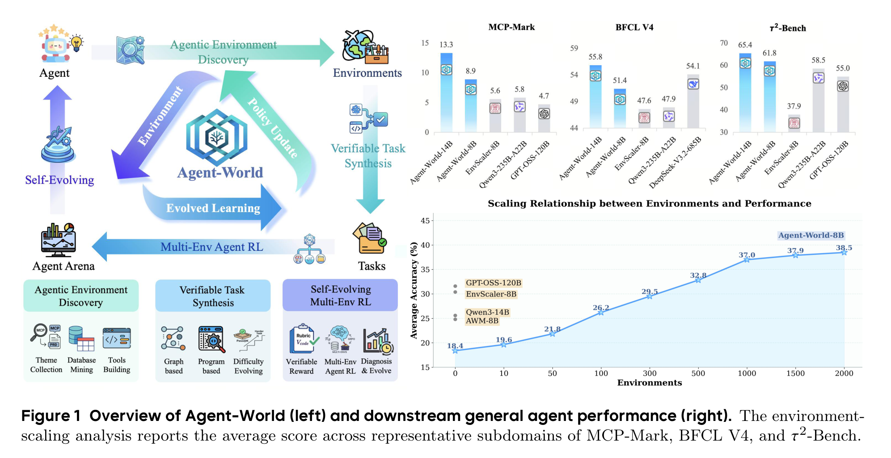
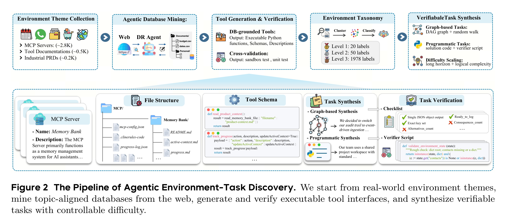
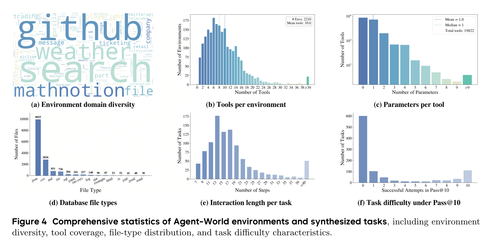
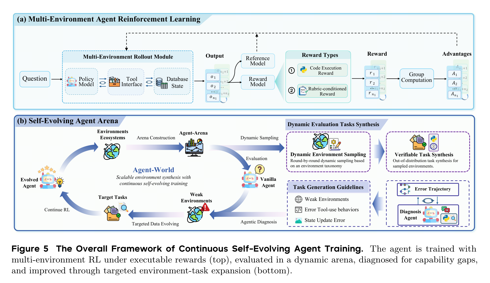
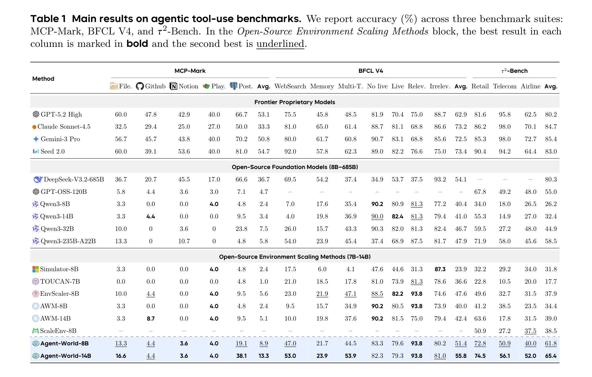
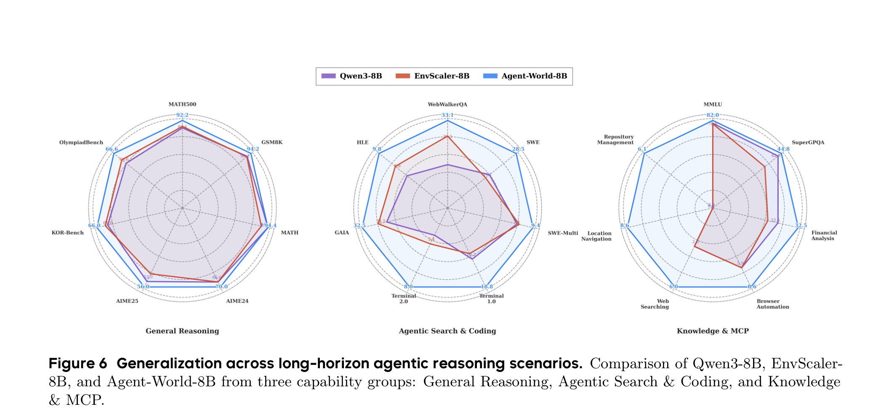
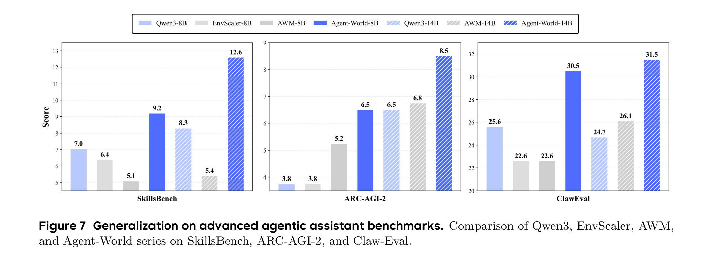
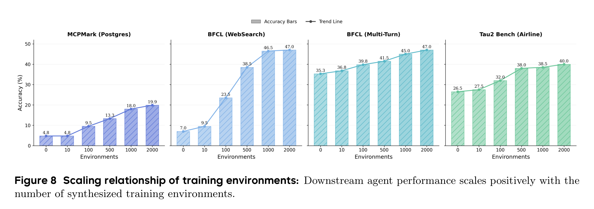
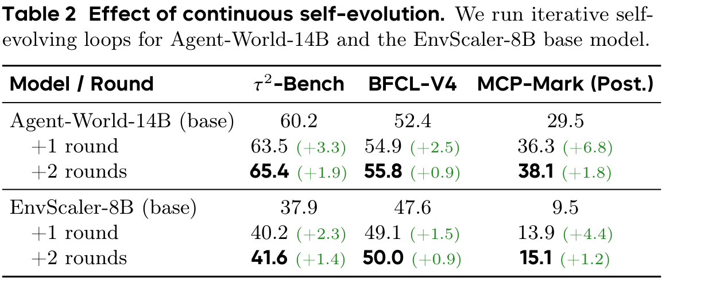
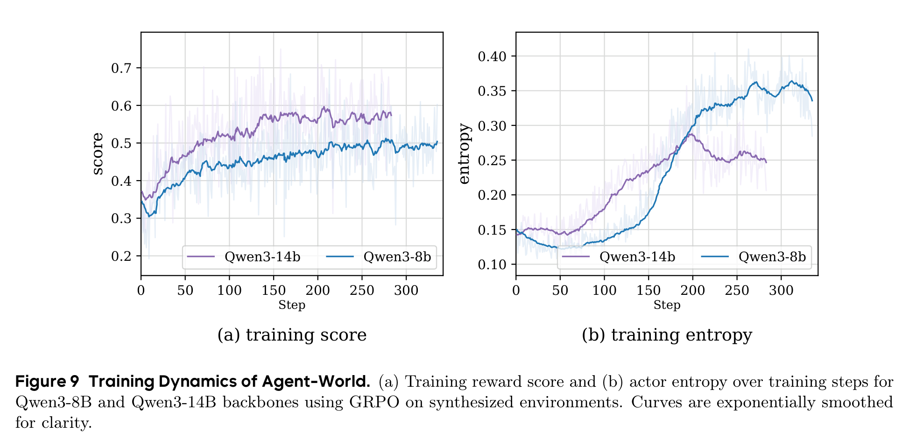

# 别再把 Agent 关在玩具环境里：Agent-World 想给它造一座会进化的训练城市

## TL;DR

Agent-World 盯上的不是“再给模型塞几个工具”，而是 Agent 训练长期缺少真实、可执行、会变难的环境。它从真实主题中合成近两千个工具环境，用可验证任务做多环境 RL，再让 Arena 诊断弱点、继续造题训练。结果显示，环境规模和自进化轮次都能带来稳定收益，但这更像一套训练基础设施，而不是一次性刷榜技巧。

- 论文链接: [arXiv:2604.18292v1](https://arxiv.org/abs/2604.18292v1)
- 代码链接: [Project Page](https://agent-tars-world.github.io/-/)；未在 PDF 中提取到 GitHub 仓库
- 作者团队: 中国人民大学高瓴人工智能学院；ByteDance Seed；Guanting Dong、Junting Lu、Junjie Huang 等
- 关键词: 智能体训练，环境合成，工具调用，自进化学习，MCP

## 🌍 问题不是 Agent 不够聪明，而是它没在真实世界里练过

现在很多 Agent 训练听起来很热闹：工具调用、MCP、浏览器、代码执行、多轮任务。但真到训练阶段，环境经常还是太静态、太单轮、太像题库。模型可能学会了“看起来会调用工具”的格式，却没有真正学会在一个会被自己动作改变的环境里规划、试错、修正。

Agent-World 这篇论文抓住的痛点很直接：通用 Agent 需要的不是更多孤立样例，而是一个足够丰富、可执行、可验证、还能持续进化的训练场。它把 Agent 训练重新拆成两个问题：第一，怎么规模化造出接近真实世界的工具环境；第二，怎么让模型在这些环境里不断暴露弱点，再被针对性训练。

这张总览图其实已经把论文主张说透了：Agent-World 不是只做数据集，也不是只做 RL，而是把“环境生成 -> 任务验证 -> 多环境训练 -> 弱点诊断 -> 再生成更针对的任务”串成闭环。对 Agent 来说，这比一次性喂大量静态轨迹更接近真实学习过程。

## 🧱 它先造环境，再造题，而且题必须能被验证

Agent-World 的第一步叫 Agentic Environment-Task Discovery。它从 MCP servers、工具文档、工业 PRD 等来源收集环境主题，然后让深度研究式 Agent 去挖数据库、生成工具接口、写测试、做交叉验证，最后组织成分层环境 taxonomy。

这里最重要的不是“生成了多少文本”，而是每个环境都要落到可执行的数据库和工具函数上。Agent 在里面调用工具会读写状态，任务答案也能通过 rubric 或 verifier script 检查。这一点很关键，因为没有可执行反馈，Agent RL 很容易退化成让模型学会迎合 judge 的语言游戏。

论文最终保留了 1,978 个环境和 19,822 个工具。更值得看的是这些环境不是单一 API 复制粘贴：文件类型覆盖 json、csv、sql、html、yaml 等，任务交互步数平均超过 20，有相当一部分任务超过 40 步。换句话说，它想训练的不是“调用一个函数回答问题”，而是在一堆状态、文件和工具之间完成长期工作流。

这组统计图给了这篇论文一个比较扎实的支点。很多环境合成论文会强调规模，但规模本身不等于训练价值；Agent-World 至少进一步展示了工具覆盖、文件类型和任务长度，让读者能判断这些环境是否真的比“玩具工具调用”更复杂。

## 🔁 真正有意思的是：训练场会反过来挑模型的毛病

第二个核心组件是 Continuous Self-Evolving Agent Training。它先做多环境 RL：模型在不同环境中 rollout，工具接口执行动作，数据库状态发生变化，奖励来自代码执行或 rubric-conditioned reward。然后，Agent Arena 会在 held-out 环境中动态合成任务，收集失败轨迹，让诊断 Agent 找出弱环境和错误类型，再生成更有针对性的训练任务。

这套机制的思路很像一个严格的导师：不是只给学生更多题，而是先看他哪里错、为什么错、在哪类题上错，再围绕这个弱点继续出题。

这个设计的价值在于，它把环境从“训练材料”升级成了“诊断设备”。如果一个 Agent 在某类数据库更新、长链工具依赖、状态追踪任务上频繁失败，Arena 会把这些失败转化成下一轮训练的目标。这比一次性扩充训练集更贴近 Agent 系统部署后的真实迭代方式。

## 📊 结果最强的信号：小模型路线在工具环境里被明显拉起来了

主结果表覆盖 MCP-Mark、BFCL V4 和 τ²-Bench 三组 agentic tool-use benchmark。Agent-World-8B 达到 MCP-Mark 8.9、BFCL V4 51.4、τ²-Bench 61.8；Agent-World-14B 进一步到 13.3、55.8、65.4。在开源环境扩展方法这一组里，它基本是最强的。

但这里也要冷静一点看：这张表并不支持“Agent-World 全面击败闭源旗舰模型”这种粗暴说法。闭源模型在不少指标上仍然更高，尤其 τ²-Bench 上 GPT-5.2 High、Claude Sonnet-4.5、Gemini-3 Pro 仍有优势。Agent-World 更可信的结论是：在 8B/14B 这个开源可训练规模上，真实环境扩展和自进化训练确实能把工具使用能力明显抬起来，并且在 BFCL V4 上 Agent-World-14B 的 55.8 还超过了 DeepSeek-V3.2-685B 的 54.1。

这也是这篇论文最实际的价值：它不是告诉你“14B 立刻比所有大模型都强”，而是说明如果训练环境足够真实、反馈足够可验证、迭代足够有针对性，小模型在 Agent 场景里还能继续被系统性挖潜。

## 🧪 泛化部分说明：它学到的不只是某个工具的套路

论文还测试了更宽的泛化场景，包括一般推理、搜索与代码、Knowledge & MCP。Figure 6 里，Agent-World-8B 在 WebWalkerQA、SWE、Terminal、GAIA、MCP-Universe 相关能力上都有比较明显的改善，同时没有牺牲 MATH、GSM8K 这类基础推理表现。

这点对 Agent 训练很重要。一个常见风险是，工具 RL 训练会把模型训得很“窄”：格式更熟、套路更强，但基础推理和跨任务迁移变差。Agent-World 的实验至少显示，在这些 benchmark 上，它没有明显走向这种窄化，尤其在长程搜索、代码和 MCP 场景中收益更集中。

在 advanced agentic assistant benchmarks 上，Agent-World 也展示了 8B 到 14B 的稳定提升：SkillsBench 从 9.2 到 12.6，ARC-AGI-2 从 6.5 到 8.5，ClawEval 从 30.5 到 31.5。绝对数值不算夸张，但方向比较一致。

我会把这部分理解为“可迁移性的证据”，但不是“通用智能已经解决”的证据。Advanced assistant benchmark 的分数整体还很低，说明真实复杂任务仍然很难；Agent-World 是把曲线往上推了一截，而不是把问题终结了。

## 📈 环境越多越好？答案是：前期很值，后期还涨但开始变慢

论文专门做了环境规模分析：训练环境从 0、10、100、500、1000 到接近 2000 个逐步增加，下游平均分从 18.4 提到 38.5，涨了 20.1 个点。最明显的跃迁发生在 10 到 100、100 到 500 这两个阶段；500 到 2000 仍然增长，但边际收益变小。

这给了一个很实用的启发：Agent 训练的早期瓶颈可能不是模型参数，而是“没见过足够多种真实环境”。当环境类型从几十扩到几百时，模型迅速补上很多高频交互模式；继续扩到近两千时，收益更多来自长尾鲁棒性。

如果把这件事放到工程实践里看，它意味着团队不一定一开始就追求无限大的环境库。更合理的路径可能是先覆盖高价值环境族，建立可验证任务和失败诊断闭环，再逐步向长尾扩展。

## 🛠️ 自进化不是口号：两轮以后，最难的 MCP 场景涨得最多

连续自进化实验是这篇论文最有说服力的部分之一。Agent-World-14B 从 base 到两轮自进化后，τ²-Bench 从 60.2 到 65.4，BFCL-V4 从 52.4 到 55.8，MCP-Mark(Post.) 从 29.5 到 38.1。EnvScaler-8B 作为另一个起点，也从 37.9/47.6/9.5 提升到 41.6/50.0/15.1。

最值得注意的是 MCP-Mark(Post.)：Agent-World-14B 两轮提升 8.6 个点，EnvScaler-8B 也提升 5.6 个点。MCP-Mark 更强调状态追踪、真实服务交互和长链工具执行，所以它对“诊断弱点 -> 生成目标任务 -> 继续 RL”这套机制更敏感。

训练动态也给了一个侧面证据：Qwen3-8B/14B 的 reward 曲线持续上升，entropy 没有迅速坍塌。也就是说，模型不是简单背某种固定动作模板，而是在训练过程中维持了一定探索空间。

## 💬 我会如何读这篇论文

我觉得 Agent-World 最值得肯定的地方，是它把 Agent 训练从“样本工程”推进到了“环境工程”。对通用 Agent 来说，工具调用能力不是靠几条漂亮轨迹堆出来的，而是靠大量可执行环境里的反复交互、失败、修正和再训练磨出来的。这篇论文把这个过程工程化了。

但我也会保留几个谨慎点。第一，环境和任务合成本身大量依赖 LLM agent、GPT-OSS-120B、自动 verifier 和诊断 agent，数据质量到底有多少人工可审计性，还需要更透明的发布和复现实验支撑。第二，benchmark 很多，但真实部署里最难的是权限、成本、异常恢复、安全边界和用户目标漂移，这些并不完全等同于离线可验证任务。第三，表格里闭源大模型仍然很强，所以不要把这篇论文读成“环境合成路线已经碾压模型规模路线”；更准确的判断是：环境规模和自进化训练正在成为 Agent 能力扩展的一条独立杠杆。

## 🌱 值得关注的地方

1. 环境质量比环境数量更值得继续追。Figure 8 说明规模有效，但边际收益递减。下一步真正关键的是哪些环境最能带来迁移，哪些只是重复覆盖。

2. 自进化 Arena 能不能用于真实线上 Agent。论文里的 Arena 是可控、可验证的训练场；如果把失败诊断接到真实用户工作流，如何处理隐私、权限、不可逆动作和安全风险，会是更难的问题。

3. Verifier 和 reward 的可信度需要更强评估。Agent 训练越依赖可执行验证，verifier 的漏洞就越可能变成模型的投机空间。未来可以专门研究 reward hacking、验证覆盖率和 adversarial task generation。

4. 小模型 Agent 的路线值得继续看。Agent-World 说明 8B/14B 还有很大训练空间。对实际部署来说，这比单纯等待更大的闭源模型更有工程吸引力：可控、可私有化、可围绕业务环境持续进化。

总的来说，Agent-World 不是一篇只靠漂亮曲线取胜的论文。它真正提出的是一种 Agent 训练范式：把真实环境本身当作可扩展、可诊断、可迭代的基础设施。这个方向如果继续做实，可能会比“再写一个更复杂的 prompt harness”更接近通用 Agent 能力的底层解法。
