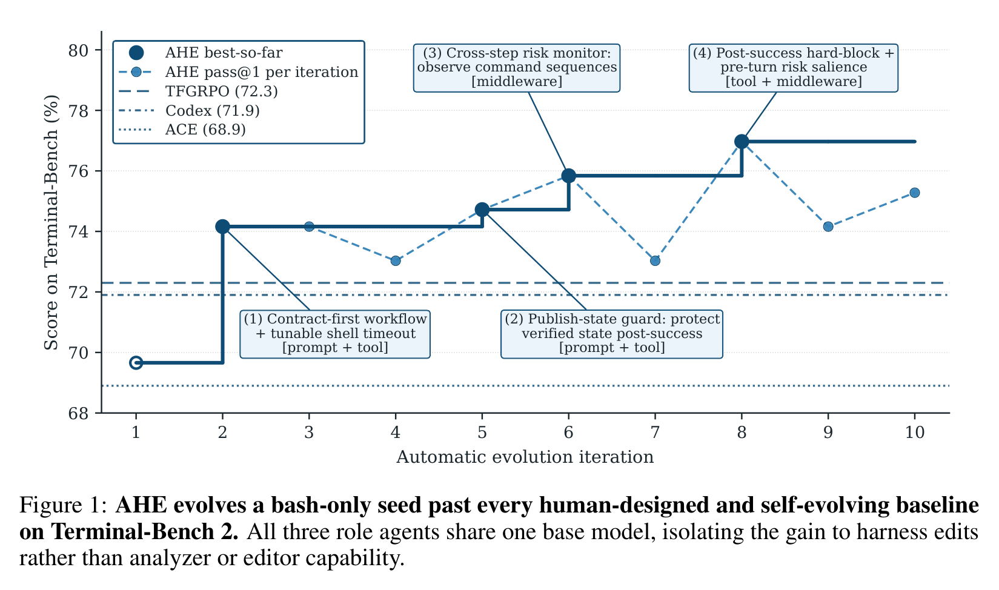
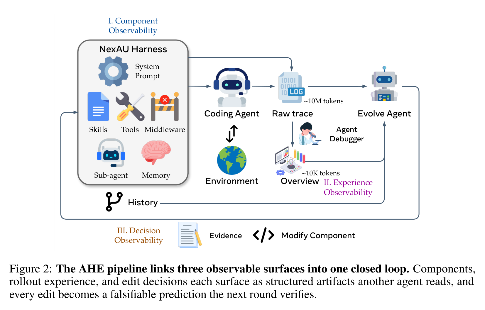
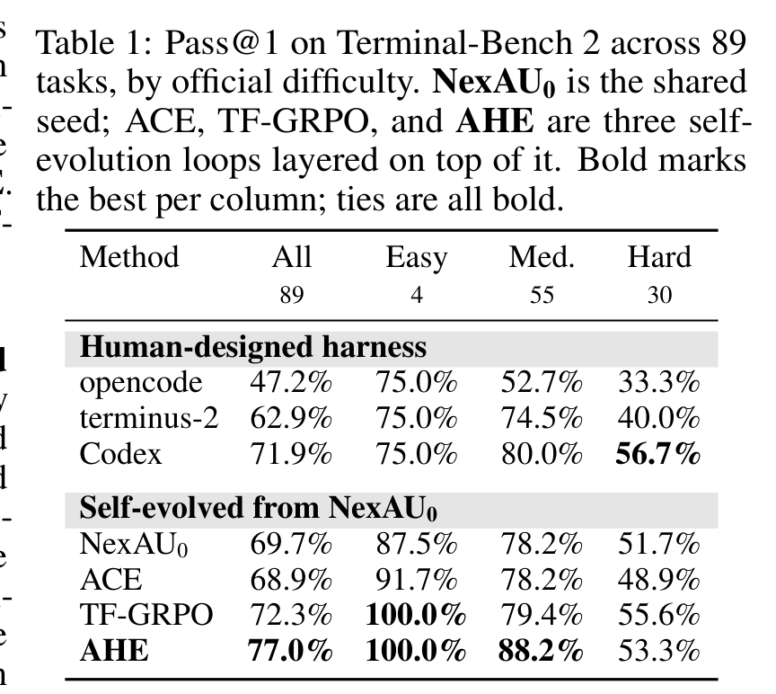
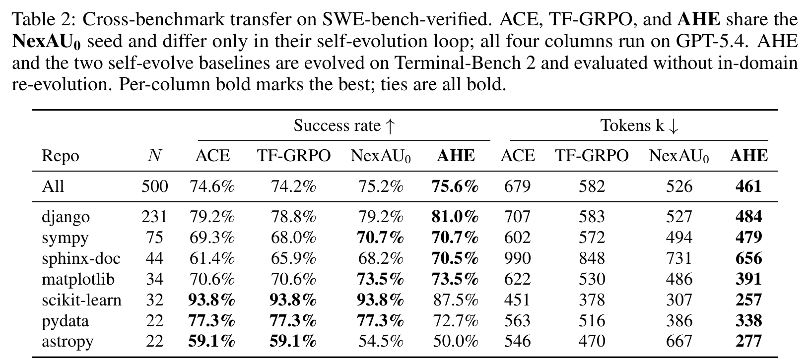
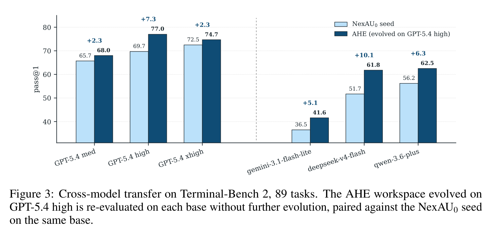
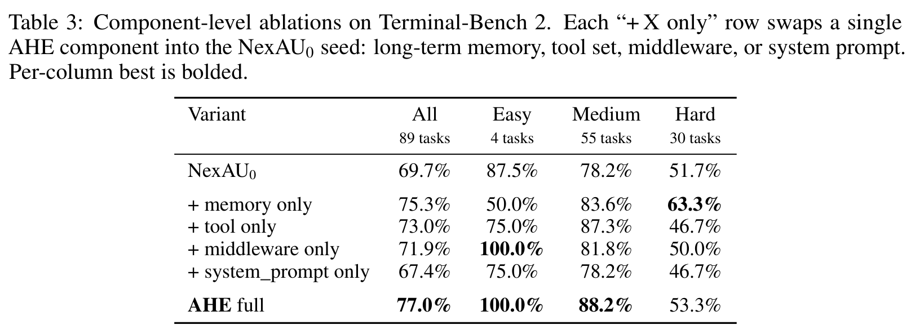
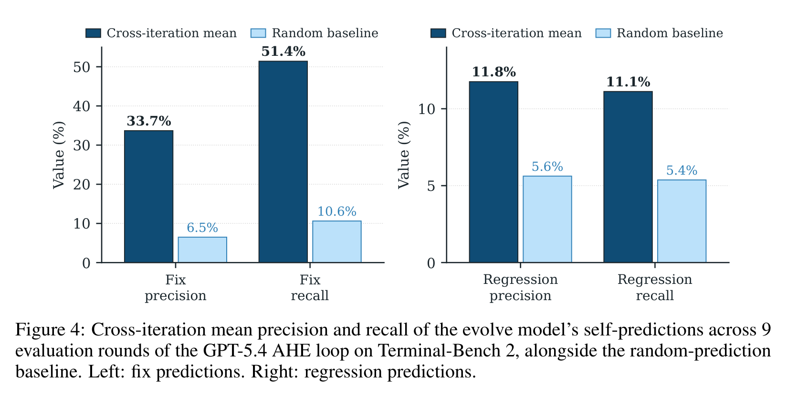

# 别只训练模型了：让 Coding Agent 的“操作系统”自己进化起来

## TL;DR

AHE 这篇论文抓住了 coding agent 里一个常被低估的变量：模型外面的 harness。它把 prompt、工具、中间件、记忆等组件做成可观察、可编辑、可回滚的文件，再让 evolution agent 根据真实轨迹自动改 harness。结果在 Terminal-Bench 2 上从 69.7% 提到 77.0%，还迁移到 SWE-bench 和多种模型。

## 论文基本信息

- 论文链接：[arXiv:2604.25850v3](https://arxiv.org/abs/2604.25850v3)
- 代码链接：[agentic-harness-engineering](https://github.com/china-qijizhifeng/agentic-harness-engineering)
- 作者团队：复旦大学，北京大学，上海奇绩智风
- 关键词：Coding Agent，Harness Engineering，自动进化，可观测性，Terminal-Bench

## 真正影响 Agent 的，常常不是模型本身

很多人看 coding agent，第一反应是比较底座模型：谁的推理更强，谁的代码能力更好，谁在 SWE-bench 上分数更高。但这篇论文提醒我们，模型只是系统的一半。另一半是 harness：系统提示词、工具接口、shell 执行方式、中间件、长期记忆、技能、子 agent 配置，以及这些东西如何把模型放进一个可执行环境里。

这件事很现实。一个模型本来能解决问题，但工具给得不好、状态暴露不清楚、失败恢复机制差、验证流程不稳，它也会在长任务里翻车。反过来，好的 harness 能把模型的能力“导出来”，让它更稳定地完成多步工程任务。

AHE（Agentic Harness Engineering）的核心观点就是：harness 不该只靠人工手调，它本身也应该成为一个可以被 agent 自动观察、修改、验证和回滚的学习对象。

从图里看，AHE 从 bash-only 的 NexAU0 seed 出发，十轮后 best-so-far 到 77.0%，超过 Codex-CLI 的 71.9%、TF-GRPO 的 72.3% 和 ACE 的 68.9%。更关键的是，所有 role agents 共享同一个 GPT-5.4 high base model，所以提升不能简单归因于 analyzer 或 editor 更强，而是来自 harness edits。

## AHE 的底层信念：不是能力不够，是看不见问题

作者把自动演化 harness 的难点归结为三个“看不见”：

第一，action space 看不清。Harness 里有 prompt、tools、middleware、skills、memory 等组件，如果它们紧耦合在一坨 prompt 或代码里，agent 很难知道该改哪里，也很难只回滚一个失败改动。

第二，经验信号看不清。一次 benchmark rollout 会产生海量轨迹，原始 trace 可能有百万级 token。直接把 raw trace 丢给 evolution agent，它很难从噪声里找出可行动的失败模式。

第三，改动效果看不清。Agent 说“我觉得这个 edit 会修复这些任务”，但下一轮到底修了哪些、破坏了哪些，如果没有结构化记录，就会变成自我解释，而不是可验证实验。

所以 AHE 没有先发明一个更花哨的优化算法，而是先重建可观测性。

这张流程图是全文最重要的方法图。AHE 先把 NexAU harness 的组件拆成文件级对象；再让 coding agent 跑任务，产生 raw trace；Agent Debugger 把约 10M token 轨迹压成约 10K token 的 overview 和 drill-down evidence；最后 Evolve Agent 读证据、修改组件，并把每次修改写成带预测的 manifest。下一轮评测会验证这些预测，失败的 edit 可以按文件粒度回滚。

换句话说，AHE 不是“让 agent 随便自我改造”，而是给它搭了一个实验室：每次改动都必须留下证据、目标、预期收益和潜在回归。

## 三个 Observability，解决三类混乱

AHE 的 component observability 来自 NexAU。NexAU 把 system prompt、tool description、tool implementation、middleware、skill、sub-agent configuration 和 long-term memory 暴露为固定路径下的文件。这个设计的好处是，失败模式可以映射到具体组件：工具不够好就改 tool，状态检查不稳就加 middleware，经验可复用就写 memory，而不是把所有东西塞进 prompt。

Experience observability 由 Agent Debugger 完成。它不会要求 evolver 读完整轨迹，而是把每个任务的 trace 组织成可导航文件环境，再产出 per-task analysis 和 benchmark-level overview。这样 evolver 先看总结，需要时再 drill down 到原始 trace。这个 progressive disclosure 很关键，因为 coding agent 失败通常不是一句话能解释，而是“某个命令、某个状态、某个验证步骤”在几十轮操作后埋下的问题。

Decision observability 则是论文里最有意思的治理设计。每个 edit 都要写 manifest：证据是什么，根因是什么，想改什么，预期修复哪些任务，哪些任务有回归风险。下一轮会用真实 task-level delta 检查这些预测。这个设计把 harness evolution 从“我感觉更好了”变成“我预测这些任务会变化，下一轮来验”。

这也是这篇论文最像工程论文的地方：它关心的不只是最终分数，还关心分数为什么变、改动怎么追责、错了怎么退。

## 主结果：AHE 不是多写 prompt，而是改了 prompt 之外的东西

Terminal-Bench 2 是这篇论文的主战场，共 89 个任务，分成 4 个 easy、55 个 medium、30 个 hard。AHE 从最小 seed NexAU0 出发，seed 只有一个 shell-execution tool，没有 middleware、skills、sub-agents。这样做是为了避免 seed 本来就带太多人类经验，污染改动归因。

主表里最直接的数字是：NexAU0 为 69.7%，ACE 为 68.9%，TF-GRPO 为 72.3%，AHE 达到 77.0%。AHE 在 easy 和 medium 上都达到最好，尤其 medium 从 seed 的 78.2% 提到 88.2%。Hard 上 AHE 是 53.3%，略低于 Codex 的 56.7% 和 TF-GRPO 的 55.6%，这不是论文回避的问题，后面消融会解释：多个组件叠在一起时会产生非加性干扰，尤其在长任务预算里反复验证会吃掉步骤。

这里有一个很重要的对比：ACE 和 TF-GRPO 也都是 self-evolution baselines，但它们主要在 prompt/playbook 或 trajectory feedback 层面工作；AHE 能改 tools、middleware、memory 和 prompt。这说明 coding agent 的很多提升不在“再写一段更聪明的提示词”，而在模型外部的工程结构里。

## 迁移实验：如果只是在刷 Terminal-Bench，意义就小了

这类自动进化论文最怕的质疑是：你是不是只把 harness 调成了 Terminal-Bench 专用外挂？作者做了两个迁移测试：一个跨 benchmark，一个跨 base model。

跨 benchmark 用的是 SWE-bench-verified，500 个任务，AHE、ACE、TF-GRPO 都是在 Terminal-Bench 2 上 evolve 后直接迁移过去，不做 in-domain re-evolution。

结果不算巨大，但方向很有意思：AHE 总体成功率 75.6%，略高于 NexAU0 的 75.2%、ACE 的 74.6% 和 TF-GRPO 的 74.2%；同时 tokens/trial 从 seed 的 526k 降到 461k，比 ACE 少 32%，比 TF-GRPO 少 21%。这说明 AHE 的价值不只是多塞策略文本，而是把行为压进工具、中间件和记忆里，减少每次调用时重新推理流程的 token 成本。

跨模型迁移更能说明 harness 结构有没有普适性。作者把在 GPT-5.4 high 上 evolve 出来的 AHE workspace 冻住，然后换 GPT-5.4 medium/xhigh、Gemini-3.1-Flash-Lite、DeepSeek-V4-Flash、Qwen-3.6-Plus 重新评估。

五组都是正增益：GPT-5.4 medium +2.3 pp，GPT-5.4 high +7.3 pp，GPT-5.4 xhigh +2.3 pp，Gemini-3.1-Flash-Lite +5.1 pp，DeepSeek-V4-Flash +10.1 pp，Qwen-3.6-Plus +6.3 pp。作者的解释我觉得合理：越接近饱和的强模型，越能自己从 prompt 里推导出部分操作策略；较弱或不同家族模型更依赖 harness 里固定下来的协调模式。

不过这里也有一个警惕点：同一 GPT-5.4 家族里，medium/high/xhigh 的收益不是单调的。论文认为这和 step budget、per-task timeout 是按 GPT-5.4 high 拟合有关，xhigh 可能因为更容易超时而吃亏。这说明 harness 迁移不只是“换模型还能用”，还要重新匹配时间预算、步数预算和推理强度。

## 消融实验讲了一个反直觉故事：System Prompt 单独换上反而变差

Table 3 是我最喜欢的一张表，因为它拆出了 AHE 的增益到底来自哪里。作者把 AHE full 中的单个组件分别换进 NexAU0 seed：memory only、tool only、middleware only、system_prompt only。

结果很清楚：memory only 从 69.7% 到 75.3%，tool only 到 73.0%，middleware only 到 71.9%，但 system_prompt only 降到 67.4%。Full AHE 是 77.0%。

这说明两个问题。

第一，真正可迁移的经验更多在“可执行结构”里，而不是自然语言策略里。Memory 记录 boundary-case lessons，tools 自动暴露 contract hints，middleware 强制 finish-hook 做 evaluator-isomorphic closure check，这些都是模型可以直接利用的环境结构。

第二，组件之间不是简单相加。三个正向组件单独增益加起来是 +11.1 pp，但 full AHE 只有 +7.3 pp；Hard 上 memory only 甚至达到 63.3%，高于 full AHE 的 53.3%。原因是多个组件可能都在推动类似的 closure-style verification，叠起来会反复检查、浪费步骤，在长任务里尤其伤。

这给自动进化系统一个很实际的提醒：发现好组件还不够，下一步要学会建模组件之间的相互作用，否则“每个局部都好”未必等于“整体最好”。

## 自归因能力：会预测自己能修什么，但不太会预测会弄坏什么

AHE 要求每次 edit 都写下 predicted fixes 和 at-risk regressions。Figure 4 检查了九轮 evolution 中这些预测的 precision/recall。

fix 预测还不错：precision 33.7%，recall 51.4%，大约是随机 baseline 的 5 倍。这说明 Evolve Agent 不是乱改，它确实能从证据里识别一批可能被修复的任务。

但 regression 预测就弱很多：precision 11.8%，recall 11.1%，只比随机 baseline 高约 2 倍。换句话说，agent 比较会解释“这个改动为什么会帮忙”，却不太会预判“这个改动会把哪些任务搞坏”。

这恰好解释了为什么 evolution 曲线不是一路单调上升，也解释了为什么 full AHE 在 Hard 上不如 memory-only。当前 AHE 已经能做“证据驱动的正向修复”，但对负外部性的建模还远远不够。

## 我会如何读这篇论文

我会把 AHE 看成一篇非常及时的 coding agent 系统论文。它没有把所有希望压在更强底座模型上，而是把 agent 周围的 harness 当作一个可以持续积累经验的外部学习层。这很符合真实工程：模型能力每几个月变化一次，benchmark、工具、环境、任务形态也在变，靠人工不断重写 prompt 和工具说明，很难跟上。

这篇论文最有说服力的地方，是它没有停留在“让 LLM 优化 prompt”这种浅层自进化，而是把组件、轨迹和决策都做成可观察对象。尤其 decision manifest 这一步，把自我修改变成可验证合约，避免 agent 只会写漂亮理由。

但它也还是研究原型，不是成熟的自治系统。Terminal-Bench 2 和 SWE-bench-verified 覆盖面有限，step budget 和 timeout 会影响迁移；自回归预测仍然弱；组件交互会造成非加性损失；安全治理也还没有完整展开。所以我不会把 AHE 读成“agent 能完全自己优化自己了”，而会读成“我们终于有了一个比较像工程实验室的 harness evolution 框架”。

## 值得关注的地方

1. **从 prompt optimization 转向 harness optimization。** 未来 coding agent 的差距，很可能不只来自底座模型，而来自谁能更快把失败经验沉淀到工具、middleware、memory 和执行协议里。

2. **回归预测会成为自进化系统的硬门槛。** AHE 已经能较好预测 fix，但 regression blindness 仍明显。真正可长期运行的 evolution loop，必须能在改动前评估负面影响，而不是改坏了再回滚。

3. **组件交互需要被显式建模。** Memory、tools、middleware 单独都有效，但叠加后会互相干扰。后续可以研究 interaction-aware edit selection，让 evolution agent 不只是选“好组件”，而是选“组合后不打架”的组件。

4. **Harness 迁移要和运行预算一起看。** 同一个 harness 换模型、换 reasoning tier、换 timeout 后效果会变。未来的 agent 平台可能需要把 harness、模型、预算和任务类型作为一个联合配置来优化。
