# 别再只盯参数了：DeepSeek-V4 真正想回答的是百万 token 怎么跑得动

## TL;DR

DeepSeek-V4 不是简单把上下文窗口拉到 100 万 token，而是把注意力、MoE 通信、KV cache、后训练和工具场景一起重做了一遍。它最值得看的地方，是把“长上下文能用吗”推进到“长上下文能不能低成本、稳定、可部署地用”。

## 论文基本信息

- 论文链接：未在 PDF 中提取到
- 代码链接：[Hugging Face 模型集合](https://huggingface.co/collections/deepseek-ai/deepseek-v4)
- 作者团队：DeepSeek-AI
- 关键词：长上下文，混合注意力，MoE，推理扩展，系统优化

## 这篇论文的野心，不是做一个更大的模型

如果只看摘要里的数字，DeepSeek-V4 很容易被读成又一篇“大模型升级报告”：DeepSeek-V4-Pro 有 1.6T 总参数、49B 激活参数；DeepSeek-V4-Flash 有 284B 总参数、13B 激活参数；两者都支持 100 万 token 上下文。

但这篇论文真正有意思的地方不在“窗口变长”本身，而在它把长上下文拆成了一个非常现实的问题：当推理模型越来越依赖 test-time scaling，当 agent 工作流越来越长，当跨文档分析、代码仓库理解和多轮工具调用变成日常需求，传统 attention 的计算和 KV cache 会不会先把系统拖死？

DeepSeek-V4 的回答是：会。所以它不是只训练一个更强模型，而是把模型架构、训练稳定性、推理服务、低精度、后训练和真实任务评测打包成一套工程系统。

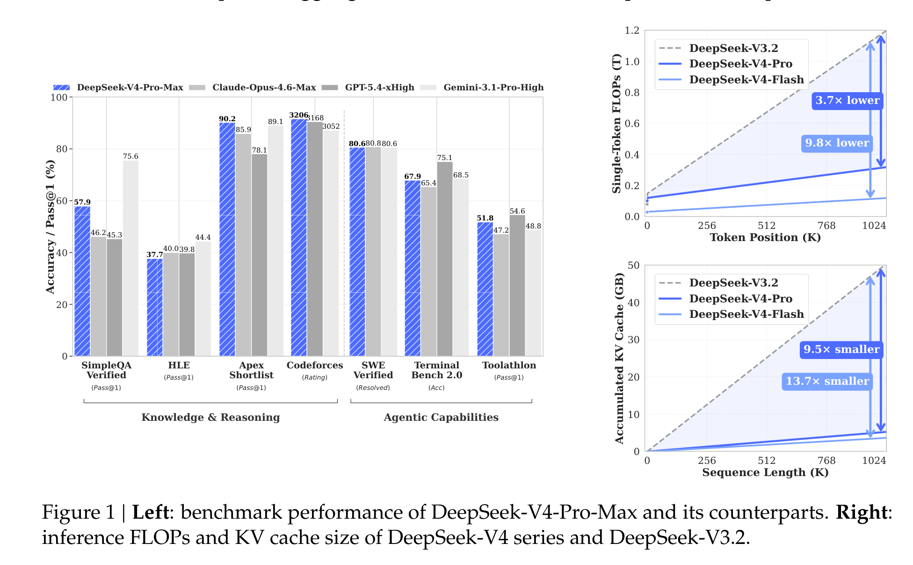

这张总览图很能说明论文的主线：左边告诉你 V4-Pro-Max 在知识、推理、代码和 agentic benchmark 上已经进入第一梯队；右边才是这篇报告的灵魂，在 1M token 位置，DeepSeek-V4-Pro 的单 token 推理 FLOPs 只有 DeepSeek-V3.2 的 27%，KV cache 只有 10%；Flash 版本更激进，分别压到 10% 和 7%。这不是“多给点显存就行”的长上下文，而是在为常态化使用 100 万 token 做预算。

## 架构主菜：CSA 和 HCA 把长上下文拆成两种压缩问题

DeepSeek-V4 保留了 DeepSeekMoE 和 MTP，但核心变化是把 attention 换成 CSA 与 HCA 交错的混合架构，并用 mHC 加强残差连接，再把 Muon 优化器引入训练。它看起来复杂，但思路其实很直白：不同层不必用同一种注意力策略，能稀疏的地方稀疏，能重压缩的地方重压缩。

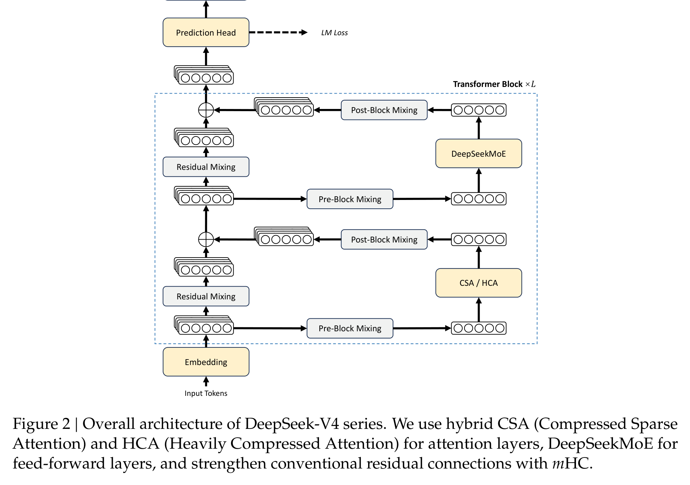

CSA，也就是 Compressed Sparse Attention，先把每 m 个 token 的 KV 压成一个 compressed KV entry，再用 Lightning Indexer 做 top-k 选择，只让 query 关注最相关的一小部分压缩 KV。它同时保留一个 sliding window 分支，避免最近局部信息被压缩得太粗。

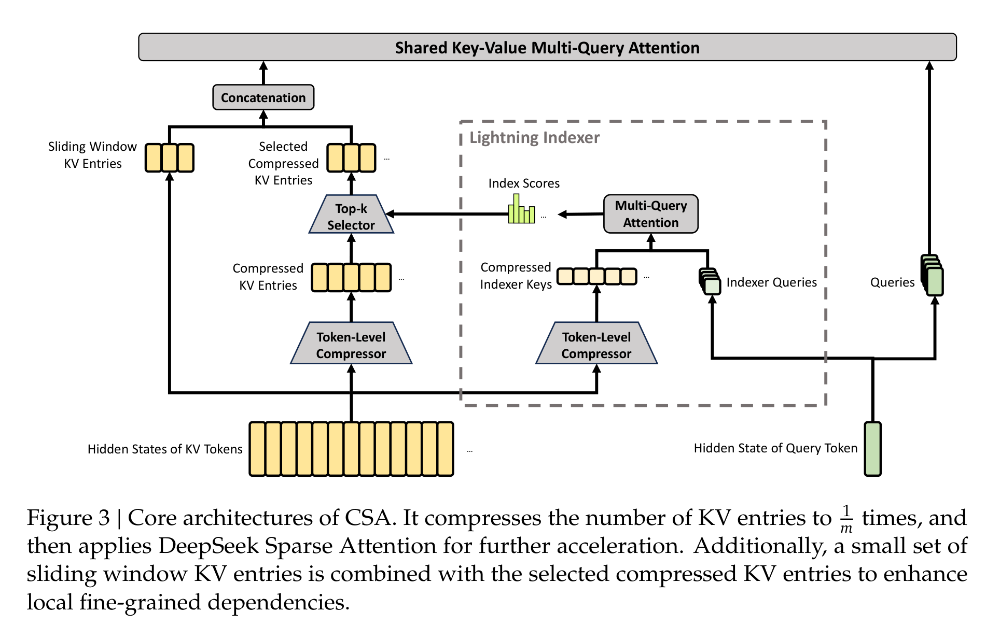

HCA，也就是 Heavily Compressed Attention，走得更狠：用更大的压缩率 m' 把很多 token 的 KV 合成一个 entry，但不再做稀疏选择，而是在更小的压缩序列上做 dense attention。直觉上，CSA 更像“压缩后再挑重点”，HCA 更像“先把历史打成超粗摘要再统一看”。

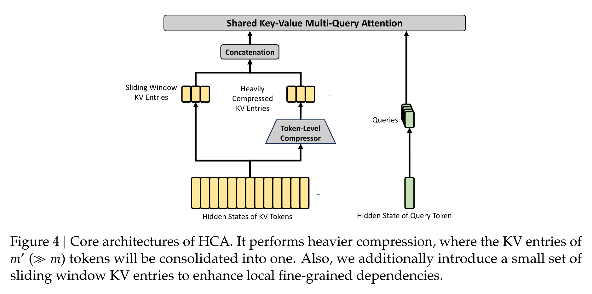

这套设计的关键不是某一个 trick 多漂亮，而是它承认长上下文里存在不同粒度的信息需求：近期 token 要细，远期历史可以粗；有些层需要精确检索，有些层只需要压缩后的全局背景。这样做的代价是架构复杂度明显上升，收益则是 KV cache 和 attention FLOPs 的账面压力被真正打下来。

## 系统工程才是这篇论文最硬的部分

如果只提出 CSA/HCA，论文还只是架构论文；DeepSeek-V4 更像系统报告，是因为它继续追问：这种架构怎么训练、怎么推理、怎么在 MoE 通信里跑得起来？

MoE 的 Expert Parallelism 会引入 Dispatch 和 Combine 两类通信，通信延迟如果处理不好，激活参数再少也会被系统吞掉。论文提出的细粒度 EP scheme 把专家切成 waves，让通信、GEMM、SwiGLU 和 Combine 更细地重叠起来。理论加速是 1.92x，实际在通用推理负载上达到 1.50 到 1.73x，在 RL rollout 和高速 agent serving 这类延迟敏感场景中最高到 1.96x。

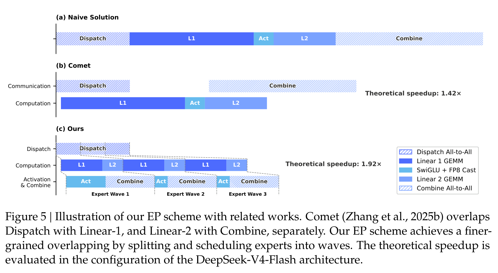

KV cache 这部分也很实在。CSA/HCA 不是传统 homogeneous KV cache：有压缩 KV、有 SWA 的近期 KV、有还没来得及压缩的 tail state，还有不同层不同大小的 cache。DeepSeek-V4 因此设计了 state cache 加 classical KV cache 的异构布局，并支持 on-disk KV cache 复用 shared prefix。

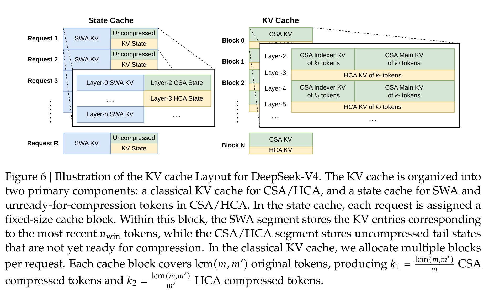

这会直接影响产品体验。长上下文不是把一次请求塞进模型就完了，真实服务里会有共享前缀、反复 prefilling、多用户 batch、缓存命中、磁盘读写和延迟预算。论文在这里的态度很工程化：长上下文如果不能复用、不能低延迟、不能稳定服务，就只是 demo。

此外，V4 还把 FP4 QAT 用到 MoE expert weights 和 CSA indexer 的 QK path 上。index score 从 FP32 进一步量化到 BF16 后，top-k selector 获得 2x 加速，同时保持 99.7% 的 KV recall。这个数字很重要，因为它说明低精度不是简单压缩模型体积，而是在长上下文最贵的选择路径上直接省时间。

## 训练稳定性：这不是优雅答案，但很有现场感

大规模 MoE 训练里，loss spike 和 outlier 是老问题。DeepSeek-V4 这次公开了两个稳定训练的实用方案：Anticipatory Routing 和 SwiGLU Clamping。

Anticipatory Routing 的想法有点反直觉：当前 step 用当前参数算 feature，但 routing index 用历史参数提前算好，降低 backbone 和 router 同步更新带来的不稳定。论文说它把额外 wall-clock 开销控制在约 20%，并且只在检测到 loss spike 后短暂启用，之后再回到常规训练。SwiGLU Clamping 则更直接，把 SwiGLU 的线性分量 clamp 到 [-10, 10]，gate 分量上限设为 10，用来压制异常值。

我喜欢这里的坦诚：作者没有把这两招包装成已被完全理解的理论突破，而是明确说机制还不够清楚。这种“不够优雅但有效”的工程痕迹，反而让论文更可信。它提醒我们，万亿级 MoE 的稳定训练远没有进入可以完全公式化设计的阶段。

## 后训练换挡：从混合 RL 转向 On-Policy Distillation

DeepSeek-V4 的 post-training 也不是简单继续堆 RL。论文说，相比 V3.2，V4 的关键替换是把 mixed RL 阶段换成 On-Policy Distillation（OPD）：先分别训练数学、代码、agent、指令跟随等领域专家，再用多 teacher 的 OPD 把能力蒸馏回一个统一模型。

这一步的动机很好理解：如果直接混合多个目标做 RL，不同能力之间容易互相干扰；如果直接合并权重，也容易掉能力。OPD 让 student 在自己的生成轨迹上学习多个 teacher 的完整输出分布，目标是把“多个专家的行为偏好”变成一个模型里的统一策略。

这里最贵的是 full-vocabulary logit distillation。V4 的解决办法是：teacher 权重放到集中式分布存储里按需加载，不直接存巨大的 logits，而是缓存 teacher 的 last-layer hidden states，训练时再过 prediction head 重建 logits。这个设计很重，但逻辑清楚：为了降低 token-level KL 估计的方差，宁愿在系统层面把完整 KL 做出来。

后训练里另一个值得看的点是 Generative Reward Model（GRM）。对于难验证任务，V4 不再只依赖传统 scalar reward model，而是让 actor 本身承担生成式评估能力，用 rubric-guided RL 数据训练它做判断。这和今天很多“模型既要会做题，又要会评题”的趋势一致：评估能力不再只是外部裁判，而是模型能力的一部分。

## 成绩单好看，但要分清它强在哪里

标准 benchmark 部分，Table 6 是最浓缩的成绩单。DeepSeek-V4-Pro-Max 在开源模型中非常强，尤其是 Codeforces rating 3206、LiveCodeBench 93.5、Toolathlon 51.8、MCPAtlas Public 73.6 等结果，显示它不只是知识问答模型，也在代码和工具任务上有竞争力。

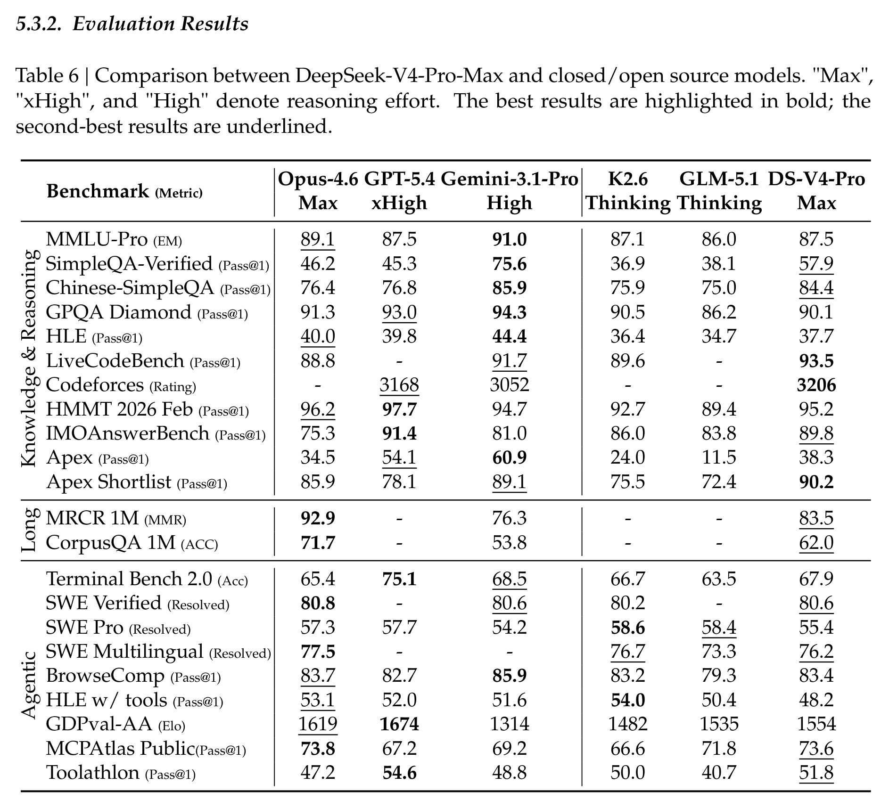

但这张表也要冷静读。V4-Pro-Max 在很多开源对比里领先，但在知识类任务上仍明显落后 Gemini-3.1-Pro，比如 SimpleQA-Verified 57.9 对 75.6，HLE 37.7 对 44.4。长上下文上，它在 MRCR 1M 达到 83.5，超过 Gemini 76.3，但仍低于 Claude Opus 4.6 的 92.9；CorpusQA 1M 为 62.0，也低于 Claude 的 71.7。

这反而说明它的定位更清楚：DeepSeek-V4 不是宣称全面超过所有 frontier closed models，而是在“开放模型 + 超长上下文 + 成本效率 + agent 工程”这个组合上往前推进了一大步。

形式化数学是论文里最吸睛的一段。DeepSeek-V4-Flash-Max 在 Putnam-200 Pass@8 达到 81.00，远高于 Seed-2.0-Pro 的 35.50；在 Putnam-2025 的 frontier regime 里，DeepSeek-V4 达到 120/120。这个结果很强，但也要注意，它右侧 frontier regime 使用了 hybrid formal-informal reasoning 和 substantial compute scaling，不是普通聊天模式下的数学能力。

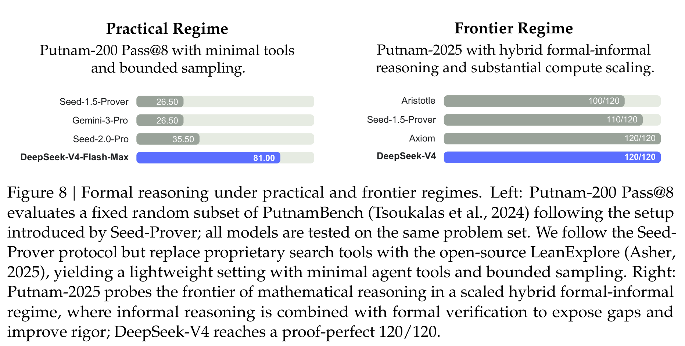

## 百万上下文的好消息和坏消息

长上下文部分最值得看 Figure 9。DeepSeek-V4-Pro-Max 和 Flash-Max 在 MRCR 8-needle 上从 8K 到 128K 都很稳，Pro-Max 在 32K 达到 0.94，128K 还有 0.92。但过了 128K 后，性能开始明显下降：512K 降到 0.66，1024K 只有 0.59；Flash-Max 同样从 128K 的 0.87 降到 1024K 的 0.49。

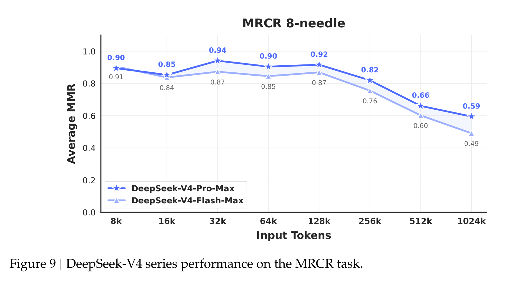

所以我的读法是：DeepSeek-V4 让 1M token “可用”变得更现实，但 1M token 并不等于模型在百万 token 里始终拥有同样稳定的检索和推理质量。它能跑、成本低很多、结果也强，但超长上下文后半段的信息利用仍然是开放问题。

这点很重要，因为行业很容易把 context length 当成静态参数表来宣传。真正的用户问题不是“窗口最大多少”，而是“把重要证据放在 700K token 附近，模型还能不能稳定找回来、用对、并且不被无关信息干扰”。DeepSeek-V4 已经把工程门槛往下压了一大截，但质量曲线仍然提醒我们：百万窗口不是银弹。

## 推理努力能换能力，但账单也会一起变长

DeepSeek-V4 支持 Non-think、Think High 和 Think Max 三种 reasoning effort。Table 7 和 Figure 10 都说明，Max 模式在难任务上确实带来提升，尤其是 HLE 和 TerminalBench 2.0。

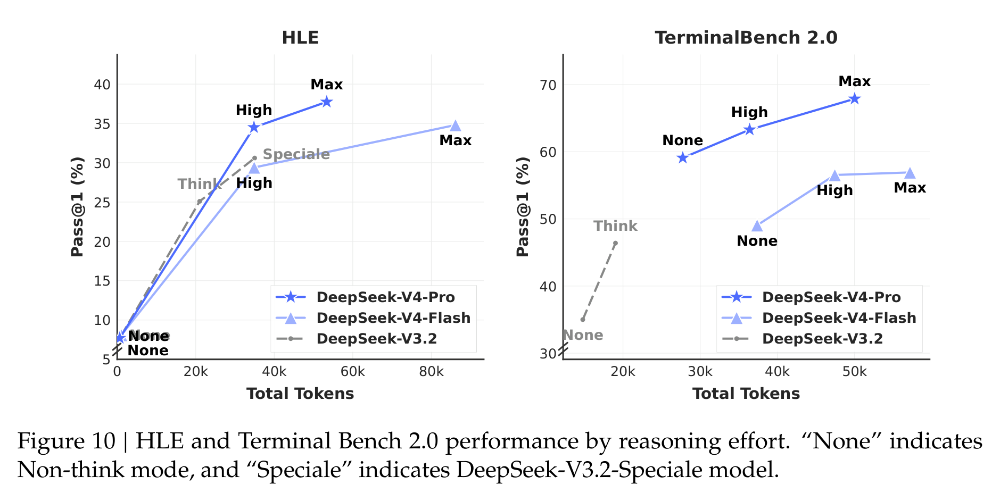

这背后有一个越来越清楚的趋势：模型能力不再只是训练完成时的静态能力，而是“模型 + 推理预算 + 工具 + 上下文管理”的组合能力。V4 的 Flash 版本尤其有意思，它知识储备不如 Pro，但在一些推理任务上给更多 thinking budget 后能逼近甚至超过旧的强模型。这对部署很有启发：未来很多场景可能不是固定选一个最大模型，而是在任务难度、延迟、成本和推理模式之间动态调度。

## 真实任务评测里，V4 的优势更像“会干活”

论文还做了不少内部真实任务评测，包括中文写作、搜索、白领任务和 code agent。白领任务这里，DeepSeek-V4-Pro-Max 对 Opus-4.6-Max 的整体 win/tie/lose 是 53%/10%/37%，non-loss rate 63%。维度分数里，V4 在 Task Completion、Content Quality、Formatting Aesthetics 和 Overall 上更高，但 Instruction Following 低于 Opus。

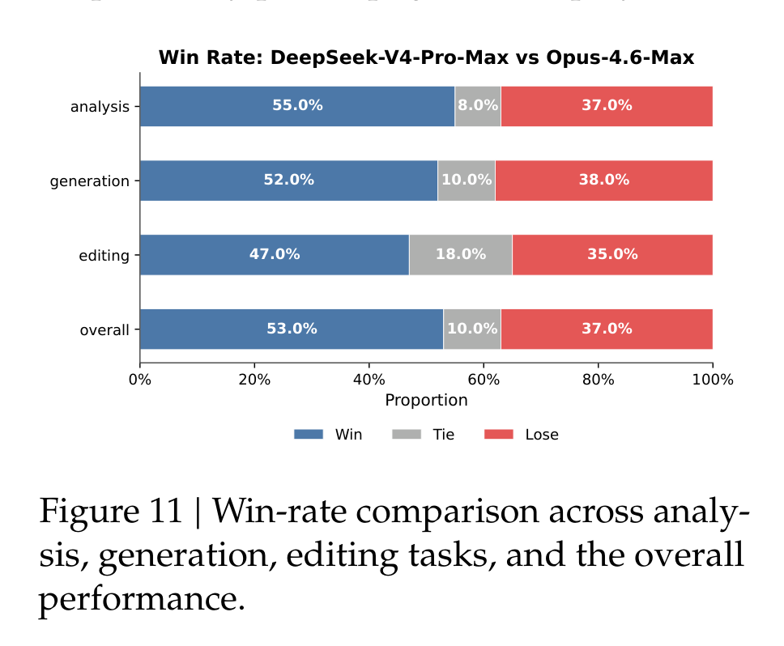

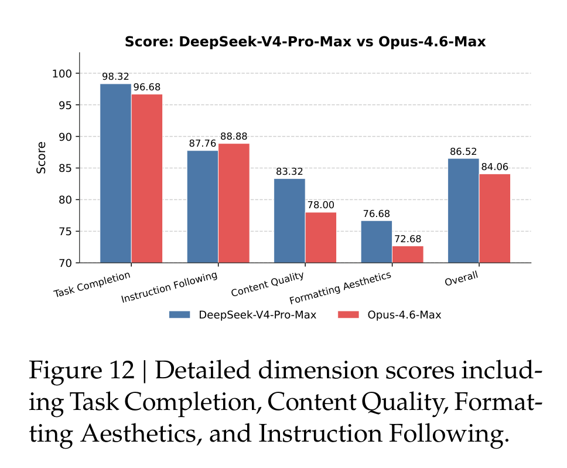

这个结果很有“产品味”。它不是单纯 benchmark 更高，而是说 V4 在长文生成、补充洞察、自检、中文专业文书等任务上更主动；但在严格格式约束、压缩长输入、PPT 视觉设计上仍有明显空间。换句话说，它更像一个能把活往前推的研究/办公助手，但还不是永远服帖的执行器。

Code agent 部分也类似。DeepSeek-V4-Pro-Max 在内部 R&D Coding Benchmark 上 pass rate 67，超过 Sonnet 4.5 的 47，接近 Opus 4.5 的 70，但低于 Opus 4.6 Thinking 的 80。更有意思的是内部调研：85 名 DeepSeek 开发者/研究员中，52% 认为 V4-Pro 已经可以作为默认主力 coding model，39% 倾向同意，不到 9% 否定；反馈的问题包括小错误、误解模糊 prompt、偶尔过度思考。

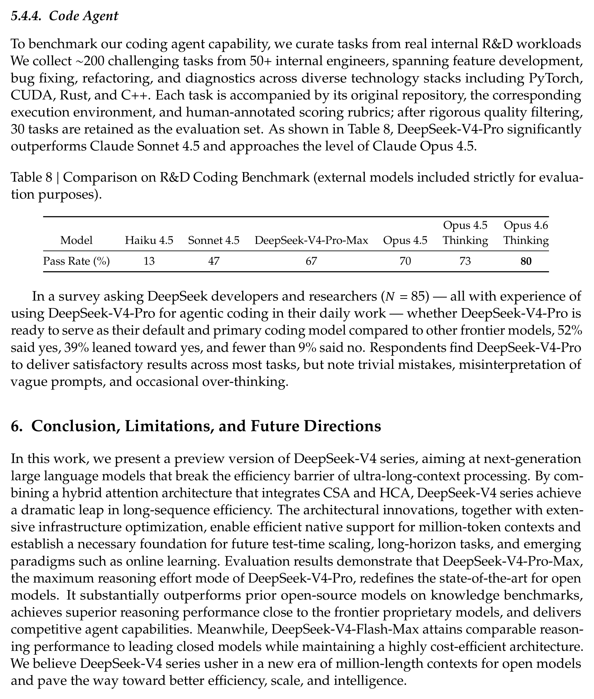

这比单个 public benchmark 更有参考价值，因为 coding agent 的真实难点往往不是一道题答对，而是在复杂仓库、环境、工具和不明确需求里持续推进。V4 还没到最强闭源模型水平，但已经到了可以作为主力候选的区间。

## 我会如何读这篇论文

我会把 DeepSeek-V4 读成一篇“长上下文系统工程宣言”，而不是一篇单点算法论文。它最强的地方，是没有把百万 token 当作一个孤立卖点，而是承认这件事会同时牵动 attention 复杂度、KV cache 结构、MoE 通信、低精度路径、后训练调度、工具调用和真实服务延迟。

它的结果也相当有说服力：在开源模型里，V4-Pro-Max 的综合能力明显站到了第一梯队；在 1M context 下，FLOPs 和 KV cache 相对 V3.2 的下降很大，确实把长上下文从“贵得吓人”推进到“可以认真部署”。形式化数学、代码竞赛、工具 benchmark 和内部真实任务评测，也让它不只是一个长上下文模型。

但这篇论文的弱点也很明显：系统非常复杂，很多稳定性方案仍偏经验主义；部分评测是内部框架，外部可复现性有限；1M token 的性能曲线在 128K 后仍然下降，说明超长上下文的信息利用质量还没有被完全解决。换句话说，DeepSeek-V4 给出的不是终点，而是一个更现实的新起点：长上下文模型要真正有用，必须同时是一套架构、一套训练方法和一套服务系统。

## 值得关注的地方

1. **百万 token 的质量曲线，而不只是最大窗口。** 后续更应该关注“证据在不同位置、不同密度、不同干扰强度下能否被稳定使用”。MRCR 的下降已经说明，context length 参数本身远远不够。

2. **复杂架构能不能被蒸馏成更优雅的设计。** CSA、HCA、mHC、Muon、FP4、异构 KV cache、on-disk cache、OPD 基础设施都有效，但组合起来很重。未来的关键问题是哪些组件不可替代，哪些只是当前规模下的工程补丁。

3. **训练稳定性的理论化。** Anticipatory Routing 和 SwiGLU Clamping 很有价值，但论文也承认机制还不够清楚。MoE 训练的 outlier、router 动态和 loss spike 需要更可预测的监控与控制方法。

4. **agent 评测要从“会调用工具”走向“长期可靠工作”。** V4 已经把 512K/1M context、interleaved thinking、sandbox 和 coding benchmark 连起来了。下一步真正重要的是长周期任务中的状态管理、错误恢复、成本控制和人类可监督性。
