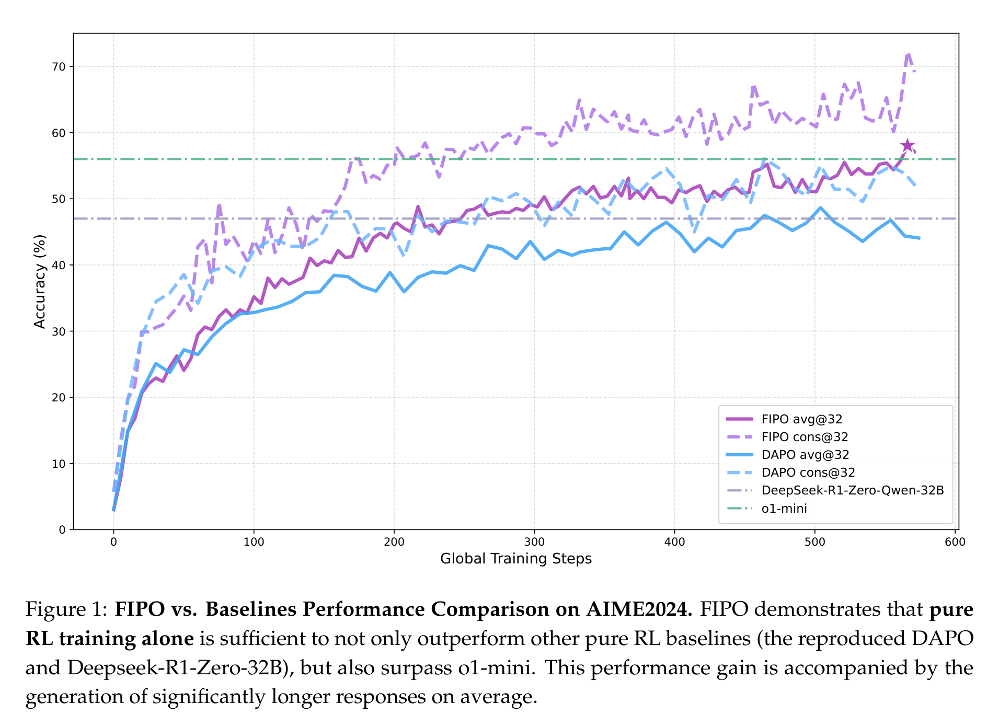
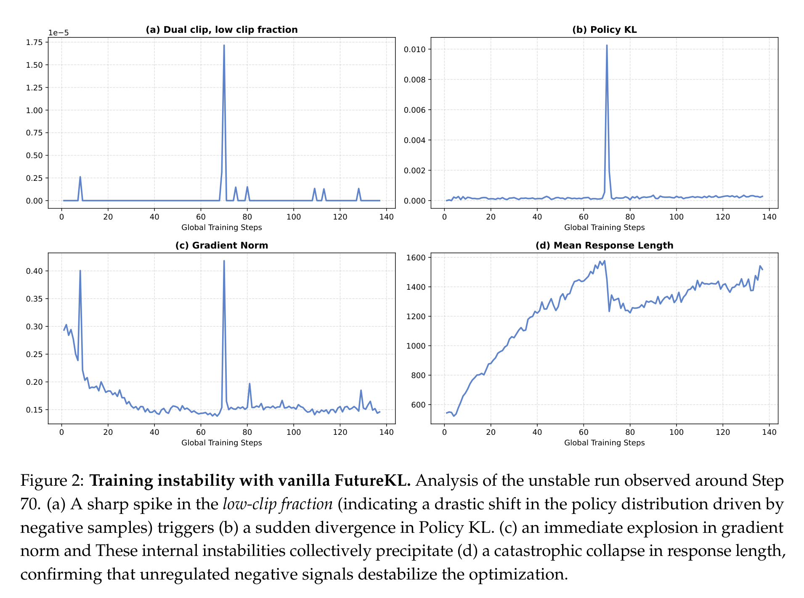
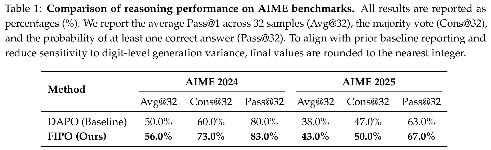
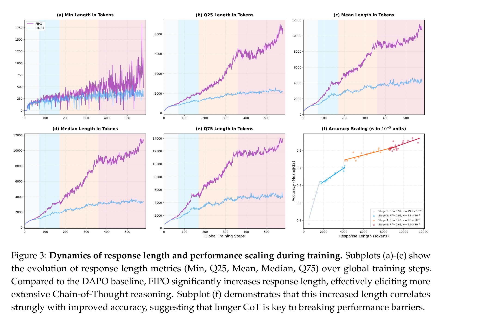
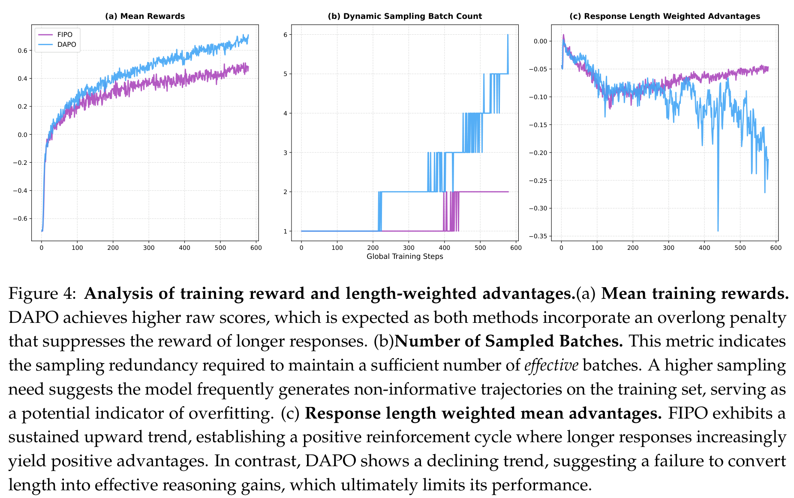
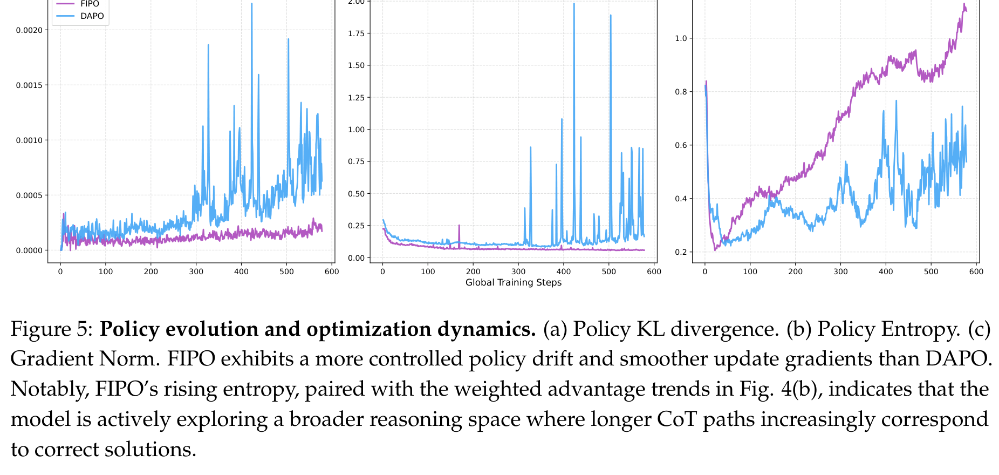

# 别再把奖励平均撒给每个 token：FIPO 想让大模型学会“哪一步推理真有用”

## TL;DR

FIPO 盯上的不是“让模型多写一点”这么简单，而是 GRPO 式 RL 的信用分配太粗：最后答对了，就把同一个奖励撒给整条推理链。它用 Future-KL 把后续轨迹的变化折回当前 token，让关键推理节点拿到更密的更新信号。在 Qwen2.5-32B-Base 上，FIPO 把 AIME 2024 Avg@32 从 DAPO 的 50.0% 推到 56.0%，并把平均 CoT 长度从约 4000 token 拉到 10000 token 以上。

## 论文基本信息

- 论文链接：[arXiv:2603.19835v3](https://arxiv.org/abs/2603.19835v3)
- 代码链接：[Project Page](https://qwen-pilot.notion.site/FIPO-Eliciting-Deep-Reasoning-with-Future-KL-Influenced-Policy-Optimization-30db3eba1add809f9c5df0bed414cec7)，[GitHub](https://github.com/qwenpilot/FIPO)，[HuggingFace](https://huggingface.co/QwenPilot/FIPO_32B)，[ModelScope](https://modelscope.cn/models/chiyum609/FIPO_32B/)
- 作者团队：Qwen Pilot Team，Alibaba Group；核心贡献者包括 Chiyu Ma、Shuo Yang 等
- 关键词：强化学习，长链推理，信用分配，Future-KL，Qwen2.5

## 不是模型不想深思，而是奖励太“平均主义”

这篇 FIPO 的切入点很直接：今天很多 RLVR 方法能够用可验证奖励把模型往更强推理方向推，但 GRPO / DAPO 这一类高效做法有一个结构性问题。最终答案对了，整条 response 里的每个 token 都拿同一个 advantage；最终答案错了，也是一锅端。可真实推理里，关键转折往往只发生在少数 token 附近：一个变量替换、一个分情况讨论、一次自我纠错，可能决定后面几千个 token 的命运。

FIPO 的判断是：如果奖励永远这么粗，大模型很容易学到“短平快地拿分”，却很难持续进入更长、更系统的推理状态。论文把这个现象称为 length stagnation，也就是推理长度和性能一起卡在一个平台上。

Figure 1 是整篇论文最有传播力的一张图：FIPO 不只是比 DAPO 高一点，而是伴随训练过程持续拉开差距。作者强调，这个结果是在 Qwen2.5-32B-Base 这种没有预先吃过 Long-CoT 合成数据的 base model 上做出来的。换句话说，论文想证明的不是“蒸馏一个会长推理的学生”，而是“用 RL 从干净 base model 里把深推理能力激发出来”。

## Future-KL：把“后面发生了什么”反过来告诉当前 token

FIPO 的核心想法可以概括成一句话：当前 token 是否重要，要看它后面带出的整段轨迹有没有被新策略整体强化。

论文先定义 token-level 的 probability shift，也就是当前策略相对旧策略对某个 token 的 log-probability 变化。单看这个局部变化还不够，因为推理是连续的：一个 token 本身看起来很普通，但它可能开启一段正确的推导；另一个 token 短期看没问题，却可能把后续轨迹带进错误分支。

于是作者提出 Future-KL：从当前 token 往后累积 signed probability shift，用它估计“从这里开始的未来轨迹，是否被新策略整体更偏好”。如果 Future-KL 为正，说明这个 token 后面的轨迹正在被强化，它更可能是一个有价值的锚点；如果 Future-KL 为负，说明后续路径正在被压制，它可能对应一个不该继续鼓励的方向。

这比“最后答对就全链条加分”细得多，但它仍然保留了 GRPO / DAPO 不需要 value model 的优势。论文真正想卖的点也在这里：不引入复杂 critic，也能做出更密的信用分配。

## 这招一开始并不稳：Future-KL 也会把训练放大到失控

FIPO 不是直接把 Future-KL 往 objective 里一塞就完事。论文专门展示了 vanilla FutureKL 的失稳过程：在 Step 70 左右，low-clip fraction 突然尖峰，Policy KL 跟着爆，gradient norm 也爆，最后 response length 直接塌下来。这说明 Future-KL 如果不加约束，会把某些负样本上的异常大重要性权重一路传播，导致训练被少数噪声 token 带偏。

为了解这个问题，FIPO 做了两层保护。第一层是过滤触发 Dual-Clip 阈值的高风险 token，避免异常 importance ratio 进入未来累积。第二层是 soft decay window：越远的未来 token，对当前 token 的影响越小。论文里把有效 horizon 设为 32，并用指数衰减代替硬截断，这样不会突然切掉边界外的信息。

最后，Future-KL 被映射成一个 influence weight，用来重加权原本的 advantage。32B 训练中，作者把 Future-KL weight 裁剪在 [1, 1.2]。这个范围其实很克制：它不是把奖励改得面目全非，而是在原有 DAPO 更新上给“后续确实走得更好”的 token 多一点推力。

## 主结果：FIPO 不是扩大了“会做题集合”，而是让会做的题更稳

主结果表很值得细看。AIME 2024 上，DAPO 的 Avg@32 是 50.0%，FIPO 是 56.0%；Cons@32 从 60.0% 到 73.0%；Pass@32 从 80.0% 到 83.0%。AIME 2025 上，Avg@32 从 38.0% 到 43.0%，Cons@32 从 47.0% 到 50.0%，Pass@32 从 63.0% 到 67.0%。

这里有一个非常重要的解释：FIPO 对 Avg@32 的提升更明显，对 Pass@32 的提升更温和。Avg@32 衡量的是模型多次采样时平均能不能答对，Pass@32 衡量的是 32 次里至少有一次答对。也就是说，FIPO 更像是在提升“已在模型潜能范围内的问题，能不能更稳定地解出来”，而不是突然扩张模型绝对会做题的边界。

这个说法比简单喊“性能提升 6%”更诚实。只靠 RL，尤其只在数学数据上做 RL，本质上还是在重新组织模型已有能力。它可以让模型更会搜、更会验、更愿意走长链路，但不一定能凭空生成新知识。

## 真正的突破，是把长推理从“偶尔变长”变成“整体迁移”

FIPO 最有意思的证据不是单张榜单，而是长度分布。Figure 3 里，FIPO 的 Min、Q25、Mean、Median、Q75 几条长度统计都在往上走；DAPO 则在约 4000 token 附近逐渐平台化。尤其是 median response length 从早期约 200 token 一路爬到 10000 token 以上，这说明变长不是少数 outlier 拉出来的，而是整个生成分布都迁移到了更深的思考模式。

论文把这种现象解释为 self-reflection 的逐步涌现：模型开始利用更长的上下文重新检查中间步骤、尝试多种解法、验证自己的结论。这一点和 OpenAI o-series、DeepSeek-R1 这类推理模型展现出的 inference-time scaling 很像。FIPO 的贡献在于，它给了一个相对简洁的 RL 机制解释：如果关键 token 能获得更细的未来反馈，模型就更容易把“多想一会儿”转化成“更可靠地想对”。

## 一个反直觉信号：原始 reward 更低，训练反而更健康

Figure 4 提供了一个很好的提醒：训练中的 raw reward 不是越高越好。因为这里有 overlong penalty，FIPO 生成更长 response 会吃到更多长度惩罚，所以它的 mean training reward 反而低于 DAPO。但 DAPO 更高的 reward 未必代表更强推理，可能只是它学会了更短、更保守地规避惩罚。

更关键的是 Figure 4(c)：FIPO 的 response length weighted advantage 持续向上，而 DAPO 下降。这说明 FIPO 里“更长且正确的样本”越来越能形成正反馈；DAPO 则逐渐丧失把长度转换成有效推理收益的动力。动态采样 batch count 也支持这个判断：DAPO 后期需要更多采样才能拿到有效 batch，暗示训练样本变得更不区分，可能进入了某种局部最优或过拟合状态。

## 稳定性不是配角，而是 FIPO 能跑起来的关键

如果只看方法名，Future-KL 听起来像一个漂亮的 credit assignment trick；但从实验看，FIPO 的稳定性工程同样重要。Figure 5 展示了 Policy KL、Gradient Norm 和 Entropy 的变化：FIPO 的 policy drift 更平滑，gradient norm 更低也更稳定，同时 entropy 持续上升，说明模型在更广的 reasoning space 里探索，而不是靠几次暴力更新把策略甩到危险区域。

这也是我认为这篇论文比较务实的地方。它没有把“长 CoT”简单当成一个越长越好的指标，而是在问：怎样让长度增长、性能增长、训练稳定性同时成立？如果一个方法只会把 response length 拉长，但 accuracy 不涨，或者训练经常崩，那它对真实训练 recipe 的价值会非常有限。FIPO 的实验至少说明，在这组设定下，密集信用分配确实能让这三件事朝同一个方向走。

## 我会如何读这篇论文

我会把 FIPO 看成一篇“把 GRPO 往 PPO 的细粒度信用分配靠近，但尽量不引入 critic 复杂度”的论文。它的立意很清楚：不是继续堆 prompt、堆采样、堆更长 max length，而是回到 RL objective 本身，问每个 token 该不该拿同样的更新信号。

最有说服力的部分，是作者没有只报 AIME 分数，而是把长度分布、advantage 动态、KL、entropy、gradient norm 都拿出来解释。这个证据链说明 FIPO 的提升不是孤立数字，而是伴随训练机制变化出现的。

但也要保持冷静。第一，实验集中在数学推理，且训练数据沿用 DAPO-17K；它能不能迁移到代码、agent、多轮工具调用、开放式推理，还没有被证明。第二，10000 token 以上的 CoT 带来的是实打实的训练和推理成本。第三，论文承认 RL 自我发现仍然比蒸馏低效，强 teacher 给出的 dense supervision 依然是很强的捷径。FIPO 更像是在证明“纯 RL 仍有空间”，而不是宣告“蒸馏不重要了”。

## 值得关注的地方

1. **从数学走向代码和 agent 任务。** FIPO 的逻辑很适合验证在 SWE、工具调用、多步规划里的效果，因为这些任务同样存在“一个早期错误决定后面全错”的 credit assignment 问题。

2. **长 CoT 的压缩与蒸馏。** 论文自己也指出，先激发长推理，再压缩成更高效的推理形式，可能是后续路线。这里可以研究如何把 FIPO 产生的长轨迹变成更短但不掉性能的训练数据。

3. **Future-KL 的可解释性分析。** 如果 Future-KL 真能定位关键 token，那么它不只是训练权重，也可能成为分析模型推理转折点的工具。哪些 token 被放大？它们和人工看到的关键步骤是否一致？这会很有意思。

4. **和 value model / process reward 的关系。** FIPO 证明了不用 critic 也能做更密的 advantage，但它和 PRM、value model、step-level verifier 之间是替代关系还是互补关系，还值得系统比较。

5. **成本约束下的最优 horizon。** 论文使用有效 horizon τ=32 和 [1, 1.2] 的权重裁剪。更大的模型、更长的任务、更高噪声的数据上，这些超参是否稳定，可能决定 FIPO 能否成为通用 recipe。
