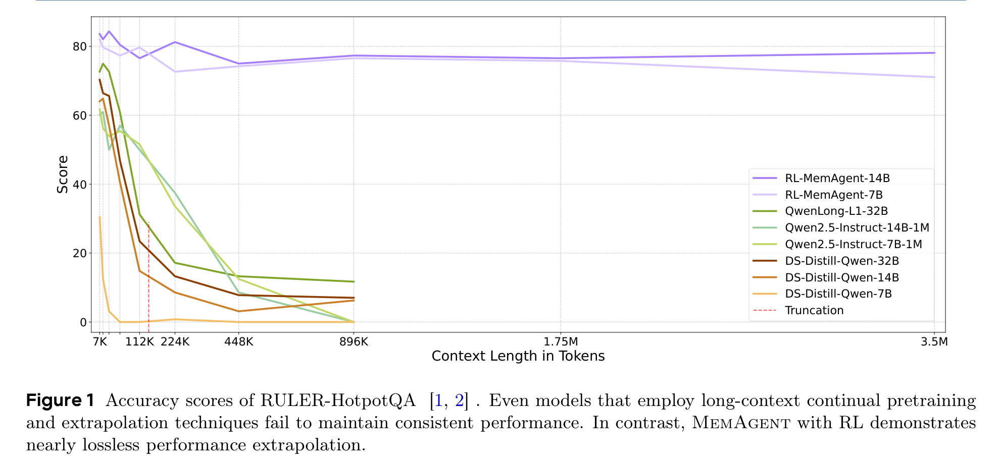
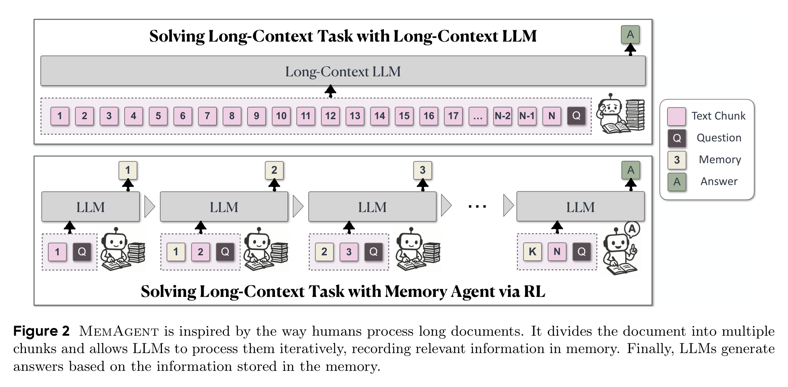
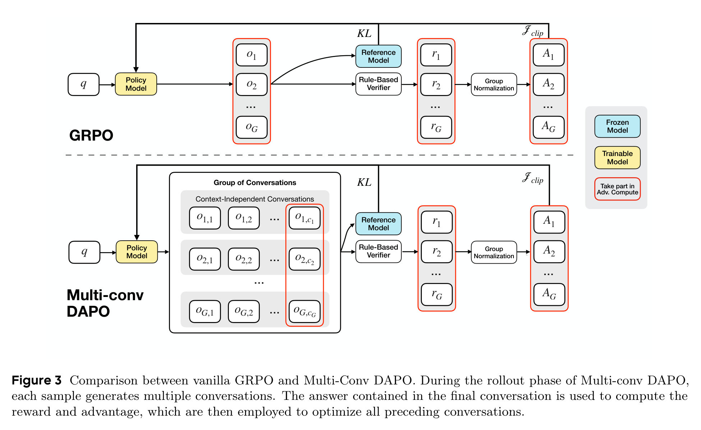
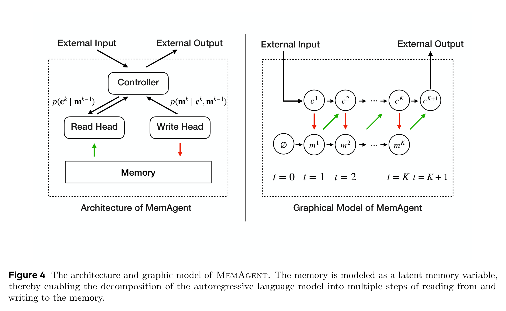
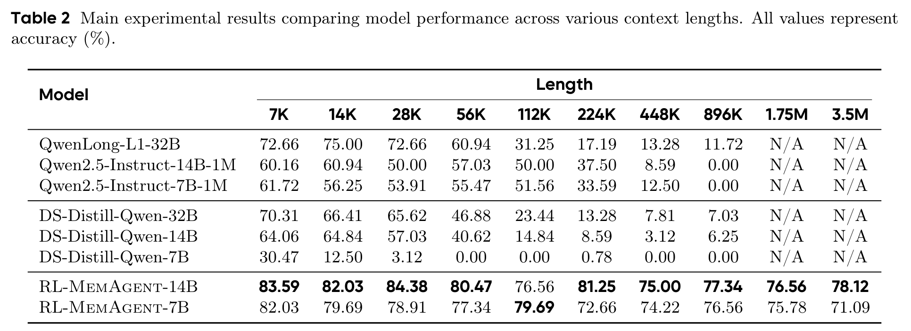
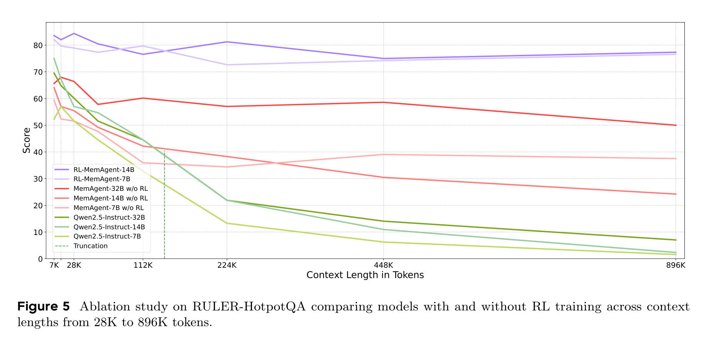
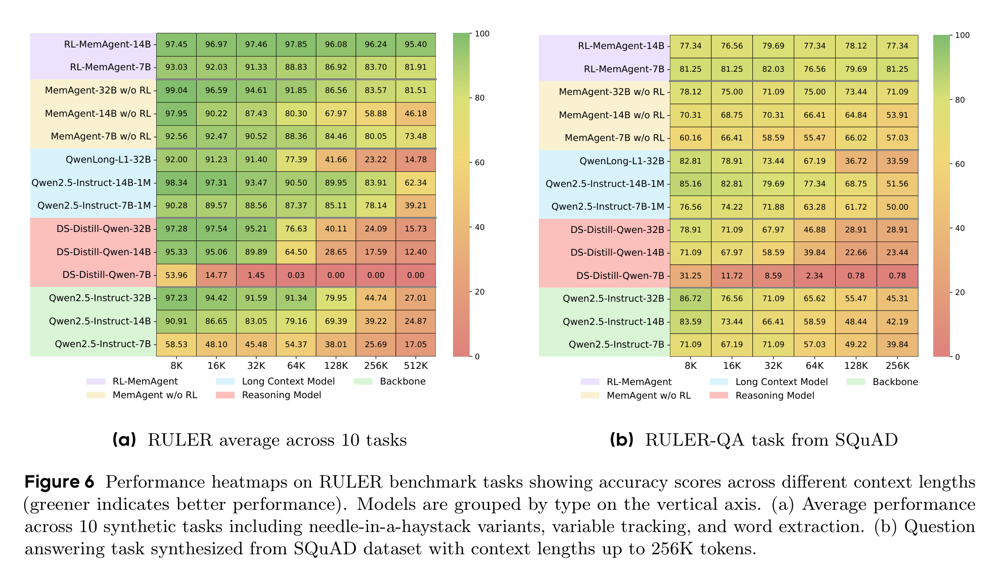

# 8K 窗口硬闯 350 万 tokens：MemAgent 让模型学会边读边记

## TL;DR

长上下文模型最怕的不是窗口不够大，而是窗口越拉越长以后，模型反而不会用。MemAgent 换了个思路：不再把几百万 tokens 塞进一次注意力里，而是让模型像人读论文一样分段阅读、持续改写一份固定长度记忆，再用 RL 教它什么该记、什么该扔。结果很猛：只用 8K 训练窗口，在 HotpotQA 风格的 3.5M tokens 测试里依然几乎不掉线。

## 论文基本信息

- 论文链接：[https://arxiv.org/abs/2507.02259v1](https://arxiv.org/abs/2507.02259v1)
- 代码链接：[项目页](https://memagent-sialab.github.io/)（论文正文未提供 GitHub 仓库）
- 作者团队：Hongli Yu、Tinghong Chen、Jiangtao Feng、Jiangjie Chen、Weinan Dai、Qiying Yu、Ya-Qin Zhang、Wei-Ying Ma、Jingjing Liu、Mingxuan Wang、Hao Zhou；ByteDance Seed，清华大学 AIR，SIA-Lab of Tsinghua AIR and ByteDance Seed
- 关键词：长上下文，记忆智能体，强化学习，Multi-Conv DAPO，RULER

## 长上下文的尴尬：窗口变大了，脑子未必更清楚

这篇论文要解决的痛点很直接：现在很多长上下文方案看起来能“塞得更多”，但不等于能“读得更好”。RoPE 外推、继续预训练、稀疏注意力、线性注意力、压缩记忆模块，各有各的代价：有的计算还是贵，有的需要改架构，有的到超长长度时效果崩得很快。

作者把这个目标总结成一个几乎苛刻的三角：**任意长度输入、外推时不掉性能、推理复杂度线性增长**。这也是 MemAgent 最值得看的地方。它不是继续把上下文窗口往大了焊，而是把长文阅读变成一个“边读边记”的序列决策问题。

Figure 1 的冲击力很强：Qwen2.5-Instruct-1M 系列理论窗口很长，但到 896K 时已经掉到 0；QwenLong-L1-32B 也从 72.66 掉到 11.72。相比之下，RL-MemAgent-14B 从 7K 的 83.59 到 3.5M 的 78.12，性能损失很小。这张图基本奠定了论文的主张：**长上下文能力不只是窗口长度问题，更是信息筛选和记忆管理问题**。

## 它不是把书全背下来，而是训练模型会做笔记

MemAgent 的设计很像一个克制版阅读助手：每次只看一个 chunk，同时带着上一轮留下来的 memory。看完新 chunk 后，模型不是把内容追加到记忆后面，而是直接生成一份新的 memory，覆盖旧 memory。最后，当所有 chunk 都读完，模型只根据问题和最终 memory 回答。

这个 overwrite 策略看起来朴素，但它是整个方法的关键。因为 memory 长度固定，所以每一步的上下文规模固定，总计算量随 chunk 数线性增长。换句话说，MemAgent 不需要在一次 attention 里同时看见整篇文档；它把“读完整篇文档”的压力转移到了“每一步能不能写出有用记忆”上。

这也解释了为什么论文强调 memory 是 token-space memory。它不是隐藏状态里的黑盒压缩，也不是外接数据库，而是一段普通文本 token。好处是可读、可检查，甚至理论上可以被人工修改。坏处也很明显：这份记忆是离散生成出来的，光靠答案监督很难直接告诉模型每一步到底该记什么。

## 真正的训练难点：最后答对，凭什么奖励前面每次记忆？

MemAgent 的训练难点不在 workflow 本身，而在 credit assignment。一个样本会被拆成多轮独立上下文对话：前几轮负责读 chunk 和更新 memory，最后一轮负责回答。奖励只来自最终答案是否正确，但真正影响答案的，是前面每次 memory 更新有没有留下关键证据。

作者为此把 DAPO 扩展成 Multi-Conv DAPO：每个样本生成一组多 conversation 轨迹，最终答案经过 rule-based verifier 得到 reward，再把对应 advantage 分配回同一样本的所有 conversation，用来优化前面的 memory 写入行为。

这一步是论文里最像“把 agent 训练问题讲明白”的部分。普通 GRPO 处理的是一个输入对应一批完整回答；而 MemAgent 的一次回答被拆成多个互不拼接的上下文。如果简单把所有东西串起来，窗口又会膨胀，方法的线性优势也没了。Multi-Conv DAPO 的价值就在于：**不把轨迹硬塞进一个上下文，也能让最终结果训练前面的读写决策**。

## 从模型视角看：把自回归历史换成一块固定大小的状态

论文还给了一个更理论化的解释：标准自回归模型默认历史 token 都应该留在活跃上下文里，这正是长上下文变贵的根源。MemAgent 则把历史压进一个固定长度的 latent memory variable。模型每读一段，就从旧 memory 和当前 chunk 生成新 memory；最后再从 memory 生成答案。

这个视角很重要，因为它让 MemAgent 不只是一个 prompt workflow，而是在重新组织长上下文建模的计算图。它保留普通 decoder 的生成方式，不改 attention kernel，也不需要专门的外部模块；只是把“所有过去 token 都留在上下文里”改成“过去信息必须被压缩进一份可读 memory”。

当然，这也带来一个很现实的风险：如果 memory 写错了，后面就没有原文可以回头看。MemAgent 的强弱，最终取决于 RL 是否真的教会模型在不同任务里保留答案相关证据，而不是学会某种 benchmark 特定的记忆套路。

## 实验最有说服力的地方：8K 训练窗口外推到百万级

实验设置故意把训练窗口限制在 8K，其中 1024 tokens 给 query，5000 tokens 给当前 chunk，1024 tokens 给 memory，1024 tokens 给输出。训练数据来自 HotpotQA 合成的长文 QA，作者还过滤掉不需要上下文就能答对的问题，避免模型靠已有知识蒙对。

主结果集中在 RULER-HotpotQA。表 2 里最值得盯的是两件事：第一，RL-MemAgent-14B/7B 在 7K 到 896K 上都保持高分；第二，14B 还能继续测到 1.75M 和 3.5M，分别是 76.56 和 78.12。相比之下，1M 上下文的 Qwen2.5-Instruct 到 896K 已经清零。

这组结果真正打到长上下文模型的痛处：**上下文窗口标称能装下，不等于模型能在里面找到并利用答案**。MemAgent 的优势来自它强迫模型持续做选择，而不是把选择延迟到最后一次超长 attention。

## 没有 RL 的 memory，也只是半个答案

作者没有只证明“加 memory 有用”，还专门做了 RL 消融。Figure 5 显示，带 memory 但不做 RL 的模型确实比普通 Qwen2.5-Instruct 更抗长文，但仍会随长度增长明显下降；真正稳定的是 RL-MemAgent。

这点很关键。很多“长文记忆”方法容易停留在工程结构层面：给模型一个记忆区、让它总结、再让它回答。MemAgent 的实验提醒我们，记忆不是一个容器，而是一种策略。模型必须学会什么时候保留、什么时候覆盖、什么时候忽略干扰项。没有 RL，这个策略很难自然长出来。

## 换个任务还行吗？OOD 热力图给了一个比较积极的答案

为了验证不是只对 HotpotQA 合成任务有效，论文又在 RULER 的 OOD 任务上测试，包括 needle-in-a-haystack 变体、变量追踪、常见词抽取，以及基于 SQuAD 合成的 QA。

这里最亮眼的是 RL-MemAgent-14B 在 8K 到 512K 的 RULER 平均任务上都超过 95%；SQuAD QA 任务上，7B/14B 也没有出现基线那种 128K 后明显塌陷的趋势。这说明它学到的不是单一 HotpotQA 模板，而是某种更一般的“读、筛、记、答”的能力。

不过也要冷静一点：RULER 仍然是可控合成 benchmark，和真实科研综述、法律卷宗、代码仓库、长期 agent 记忆并不完全等价。MemAgent 证明了这个路线很有潜力，但还没有证明它在所有真实长文任务里都稳。

## 我会如何读这篇论文：很漂亮，但别把它当成免费午餐

我觉得 MemAgent 的最大价值，不是又刷了一个长上下文分数，而是提出了一种更健康的长上下文观：模型不应该被动吞下所有 token，而应该主动维护任务相关记忆。这个方向和人类阅读更接近，也和 agent 系统里的长期记忆需求更贴近。

它的工程吸引力也很强：不改 backbone，不改 attention kernel，使用普通 dense-attention Transformer，通过 workflow 和 RL 训练获得百万级外推能力。对于已经有中等上下文窗口的模型来说，这比从头训练线性注意力模型更现实。

但它不是没有代价。首先，推理虽然是线性的，但仍然要逐 chunk 多轮生成 memory，实际 latency 可能不低。其次，memory 覆盖式更新一旦丢掉关键证据，后面没有完整原文可恢复。第三，当前 reward 主要依赖可验证答案任务，开放式写作、长文综合判断、多证据冲突推理，未必能直接沿用同样的训练信号。

所以我的判断是：**MemAgent 是一条很值得追的长上下文路线，尤其适合“答案可验证、证据稀疏、文档极长”的任务；但它距离通用长文理解系统，还需要更丰富的 reward、可回溯机制和真实场景验证。**

## 值得关注的地方

1. **记忆能不能带引用和证据指针？** 现在的 memory 是可读文本，但如果它能同时保留来源 chunk、段落位置或证据 ID，长文问答会更可信，也能缓解覆盖式记忆的不可逆问题。

2. **开放式任务怎么设计 reward？** HotpotQA、RULER 这类任务可以用规则 verifier，但论文综述、代码理解、法律分析往往没有唯一答案。未来需要能评价“记忆质量”和“论证质量”的训练信号。

3. **推理成本要认真算。** MemAgent 避免了一次性超长 attention，但多 chunk 多轮生成 memory 也会消耗时间。真实部署里，吞吐、缓存、并行 chunk 处理、memory 更新频率都会影响它是否划算。

4. **长期 agent 记忆可能是最自然的落点。** 如果把用户长期交互、项目历史、工具调用轨迹都看成持续输入流，MemAgent 这种 RL 训练出来的 token memory，也许比简单摘要或向量库更接近“会工作的记忆”。
