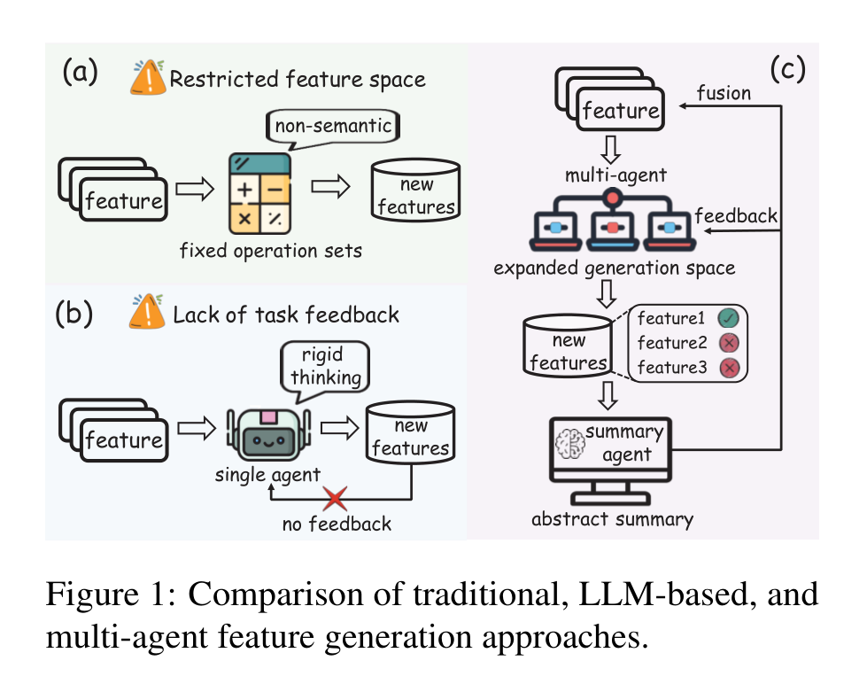
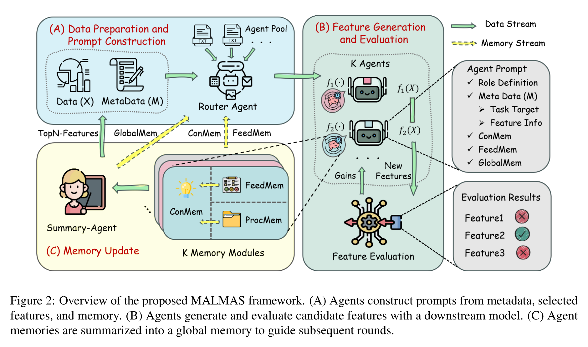
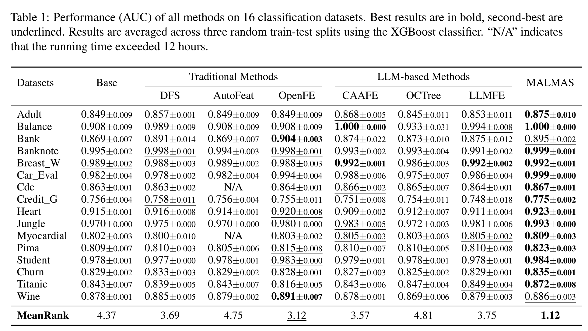
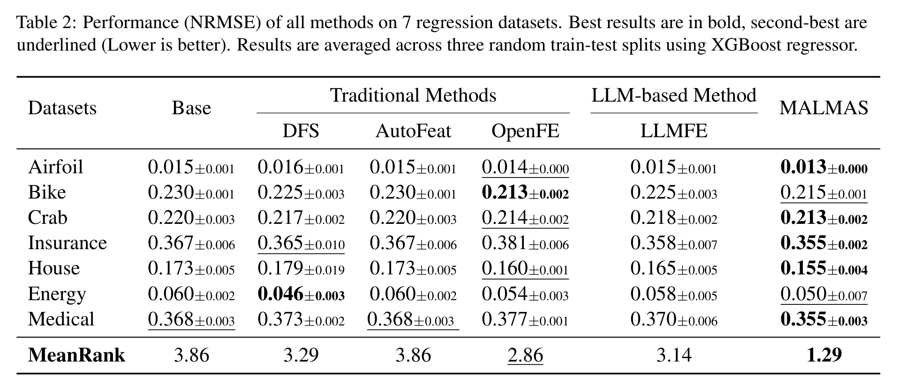
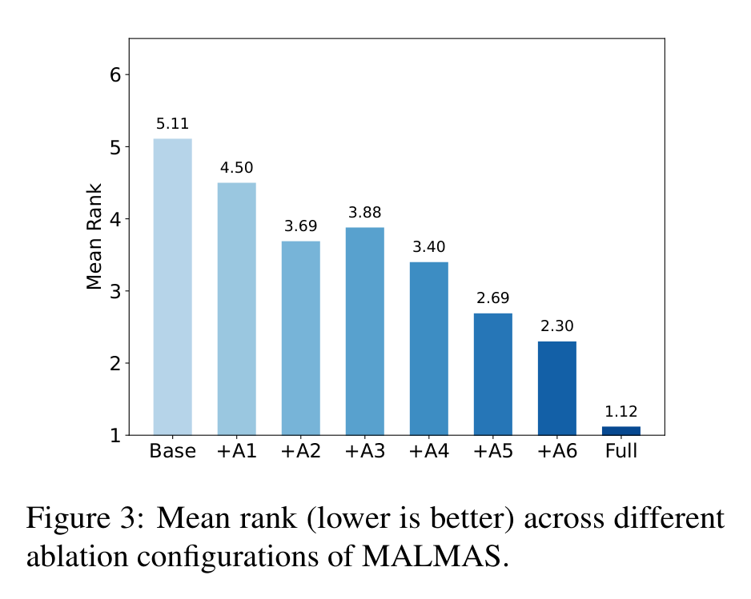
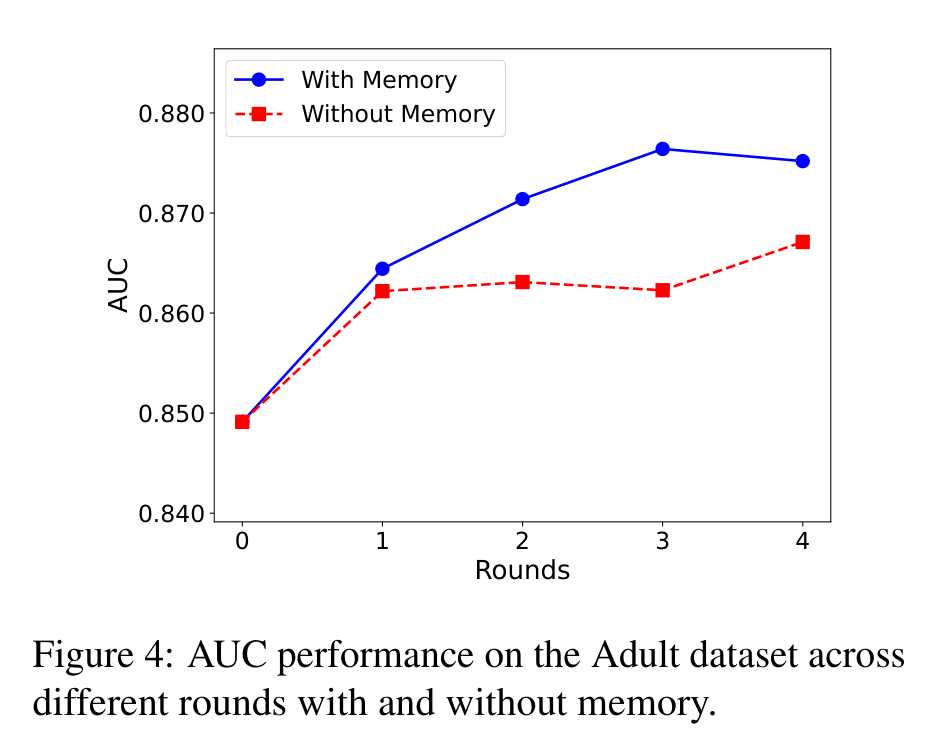
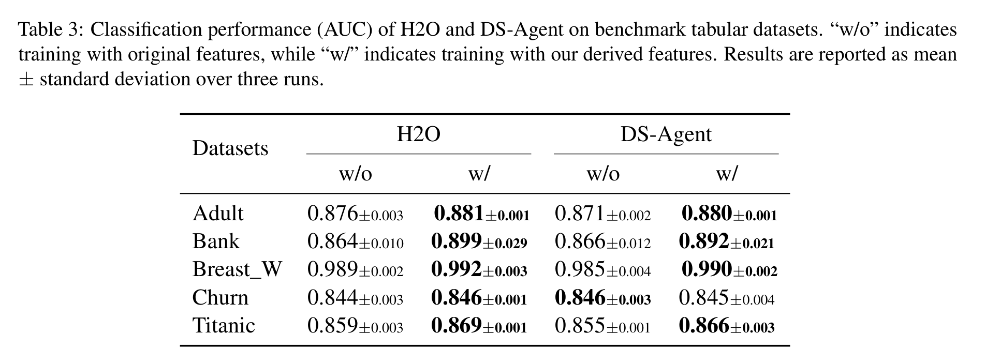

# 让表格特征工程不再靠拍脑袋：MALMAS 给 LLM Agent 装上记忆后，开始会复盘了

## TL;DR

MALMAS 解决的是自动特征生成里一个很现实的问题：传统方法太依赖固定算子，LLM 方法又常常“灵感一闪”但不复盘。它把特征生成拆给多个专职 Agent，再用 procedural、feedback、conceptual memory 记录试过什么、什么有效、为什么有效。实验显示，它在 16 个分类和 7 个回归数据集上取得最好的平均排名，但真正值得关注的是这套“生成-评估-记忆-再生成”的闭环。

- 论文链接: [arXiv:2604.20261v1](https://arxiv.org/abs/2604.20261v1)
- 代码链接: [GitHub: fxdong24/MALMAS](https://github.com/fxdong24/MALMAS)
- 作者团队: 中国科学技术大学；浙江工业大学；美团；Fengxian Dong、Zhi Zheng、Xiao Han、Wei Chen、Jingqing Ruan 等
- 关键词: 自动特征生成，表格数据，多智能体，记忆增强，AutoML

## 🧩 老问题：特征工程自动化了，但还是不太会“想”

表格建模里，特征工程一直很微妙。它不像图像或文本那样可以直接把原始输入丢给大模型，很多时候一个简单的比率、分组统计、时间窗口、局部模式，就能让模型表现明显变好。问题是，这些特征通常来自经验、领域理解和反复试错。

传统自动特征生成方法，比如 DFS、AutoFeat、OpenFE，擅长把预定义算子系统性地套到原始列上，但它们不太理解“这个数据集到底在预测什么”。LLM-based 方法引入了语义理解，可以根据任务描述生成更像人类特征工程师会想到的变换；但单个 LLM agent 如果没有反馈记忆，很容易每轮都在凭直觉生成，缺少“上次哪些特征有效、哪些重复、下一轮该避开什么”的复盘能力。

这张图把论文的动机讲得很清楚：传统方法的问题是特征空间窄，单 Agent LLM 方法的问题是反馈断掉，而 MALMAS 想做的是让多个 Agent 扩展搜索空间，再让评估反馈回流到下一轮生成。

## 🧠 MALMAS 的核心：不是多几个 Agent，而是让 Agent 记住经验

MALMAS 的全名是 Memory-Augmented LLM-based Multi-Agent System。它的设计可以拆成三层：Router Agent 负责根据元数据和历史记忆选择本轮该激活哪些特征生成 Agent；不同 Agent 负责不同类型的特征变换；Summary Agent 把局部经验总结成全局记忆，供下一轮所有 Agent 使用。

论文里的 Agent 分工并不是随便起名，而是沿着特征工程实践中的几个维度展开：单列变换、交叉组合、时间特征、聚合特征、局部变换、局部模式。这样做的好处是减少“大家都在生成类似特征”的同质化问题，也让探索空间更系统。

更关键的是记忆模块。MALMAS 把记忆分成三类：procedural memory 记录试过哪些变换，避免重复；feedback memory 记录特征带来的验证表现，帮助 credit assignment；conceptual memory 把历史轨迹抽象成可复用策略。最后，Summary Agent 再把多个 Agent 的经验汇总成 global memory。这个设计的本质，是把每一轮昂贵的下游评估变成下一轮搜索的资产。

## 📊 主实验：分类和回归都不是只赢一两个数据集

主实验覆盖 16 个分类数据集，评价指标是 AUC，下游模型统一用 XGBoost。MALMAS 的 MeanRank 是 1.12，明显好于 OpenFE 的 3.12、CAAFE 的 3.57、DFS 的 3.69 和 LLMFE 的 3.75。它在大多数数据集上拿到最优或接近最优结果，尤其在 Adult、Credit_G、Heart、Jungle、Titanic 等数据集上有比较清楚的提升。

回归任务的结论也类似。论文用 7 个回归数据集和 NRMSE 指标评估，MALMAS 的 MeanRank 是 1.29，低于 OpenFE 的 2.86 和 LLMFE 的 3.14。具体看，它在 Airfoil、Crab、Insurance、House、Medical 上是最优，在 Bike 和 Energy 上不是第一但接近最优。

这两张表的意义不只是“又一个方法赢了 benchmark”。更有价值的是，MALMAS 同时压过了传统算子式方法和 LLM-based 方法，说明多 Agent 分工与跨轮记忆确实补上了两类方法各自的短板：一个缺语义，一个缺反馈。

## 🔬 消融实验给了一个很直接的信号：Agent 多了有用，记忆更有用

论文的消融从 Base 开始，逐步加入 A1 到 A6 六类 Agent，MeanRank 从 5.11 降到 2.30。这个趋势说明多 Agent 角色分工确实扩展了特征搜索空间，生成的候选特征更丰富。

但最明显的跃迁发生在 Full 配置：加入完整记忆机制后，MeanRank 从 +A6 的 2.30 进一步降到 1.12。这说明 MALMAS 的胜负手不只是“并行生成更多特征”，而是“把历史评估转化成下一轮生成策略”。

这也解释了为什么单纯堆 Agent 不一定可靠。多个 Agent 会带来多样性，也会带来噪声和冗余；没有记忆和反馈筛选，候选池变大不等于质量更高。MALMAS 的记忆模块相当于给探索过程加了一套经验过滤器。

## 🔁 记忆到底有没有用？看多轮曲线更直观

Figure 4 用 Adult 数据集比较了有记忆和无记忆时多轮生成的 AUC。两者第一轮都提升，但无记忆版本很快进入平台期，甚至中间出现回落；有记忆版本则随着轮次继续上升，在第三到第四轮附近趋于稳定。

这个结果和方法设计是对得上的：如果 Agent 知道哪些特征已经尝试过、哪些在验证集上有效、哪些模式应该抽象复用，它的下一轮生成就不再是随机游走。反过来，如果没有记忆，LLM 每轮都像重新开始，语义能力仍然在，但探索效率会低很多。

## 🧪 放进 AutoML 管线后，特征不是只对 XGBoost 有用

论文还把 MALMAS 生成的特征接入 H2O AutoML 和 DS-Agent，测试它是否能在更完整的 AutoML 管线中带来收益。H2O 这边，五个数据集加入特征后 AUC 全部提升；DS-Agent 这边，Adult、Bank、Breast_W、Titanic 提升，Churn 基本持平略低。

这部分我会理解为“可移植性证据”。如果一个特征生成方法只在固定下游模型上有效，风险是它可能学到了某个 learner 的偏好；如果放到 H2O、DS-Agent 这种不同 pipeline 里仍然多数有效，就更像是在发现具有一般预测价值的表格结构。

论文还报告了成本：使用 DeepSeek-V3 API 时，16 个分类数据集平均每个数据集需要 0.452 小时、147.57k tokens，估计成本约 0.17 美元。这个成本不算离谱，至少说明它不是那种只适合论文实验、不适合实际 AutoML 集成的重型方案。

## 💬 我会如何读这篇论文

我觉得 MALMAS 最有价值的点，是它把 LLM 做表格特征工程这件事从“生成一个聪明想法”推进到“维护一个可迭代的搜索过程”。这很符合真实特征工程的工作方式：优秀的数据科学家不是每次都从零开始猜，而是会记录尝试、观察模型反馈、总结规律，再调整下一轮探索。

不过，读这篇论文也要注意边界。第一，它依赖有标签数据和下游验证信号；如果标签稀缺、评估预算很小，记忆机制能积累的有效反馈会明显变少。第二，实验主要集中在 tabular feature generation，能否迁移到更复杂的结构化数据、关系数据库、多表 join 或时间序列流水线，还没有完全证明。第三，LLM 生成的 transformation program 可能带来数据泄露、非法特征或解释不充分的问题，论文在 Ethical Considerations 里也提到了需要 schema constraints、leakage checks、fairness/privacy audits。

换句话说，MALMAS 不是自动特征工程的终点，但它给了一个很合理的方向：LLM 不应该只当“会写特征的生成器”，还应该被放进一个能评估、能记忆、能复盘的系统里。

## 🌱 值得关注的地方

1. 记忆质量如何影响特征搜索。现在的结果说明记忆有效，但不同记忆粒度、总结方式、遗忘机制会不会影响长期搜索质量，值得单独研究。

2. 如何防止自动生成特征造成数据泄露。表格任务里，泄露特征常常非常隐蔽；未来需要更强的 schema 约束、时间切分检查和自动 leakage detection。

3. 多 Agent 不是越多越好。消融里从 +A2 到 +A3 有轻微非单调，说明候选池变大也会引入方差。更聪明的 Router 和动态预算分配，可能比固定 Agent 池更重要。

4. 能否从单表走向真实业务数据。真实 AutoML 经常面对多表关系、脏数据、权限字段、时间漂移和业务规则。MALMAS 如果要走向部署，下一步应该在更接近生产环境的数据管线上验证。

总体来看，MALMAS 的亮点不是“LLM 又会做一个任务了”，而是它把多 Agent、记忆和下游验证组织成了一个可复盘的特征搜索系统。对表格建模这种长期依赖经验和试错的领域来说，这个方向很值得继续看。
