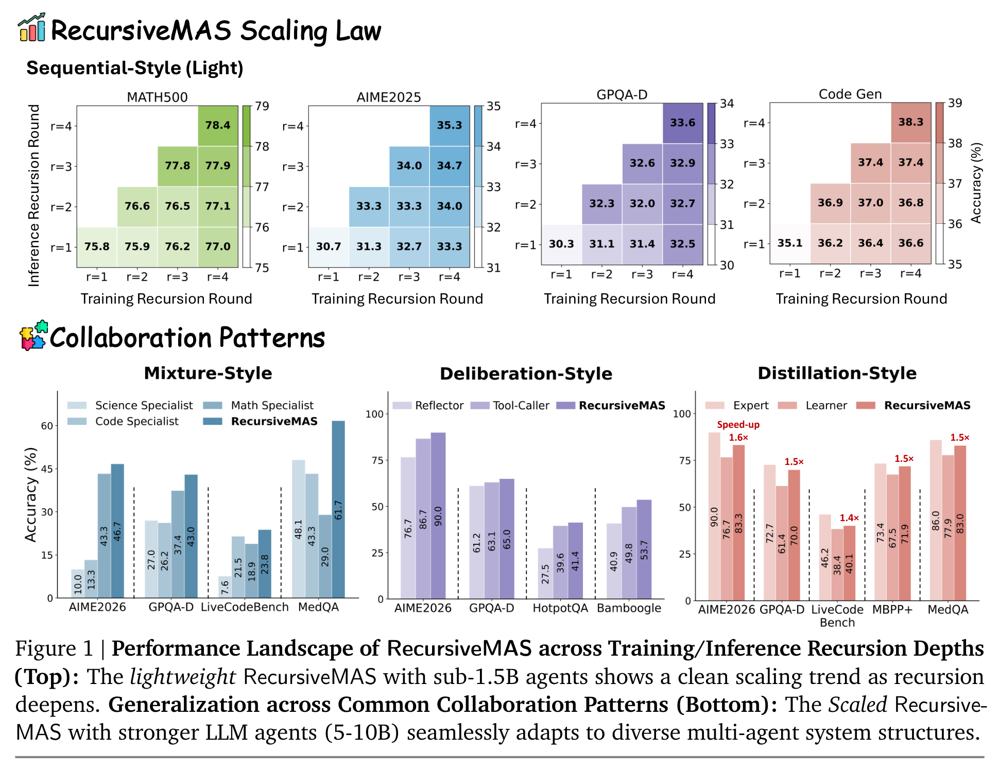
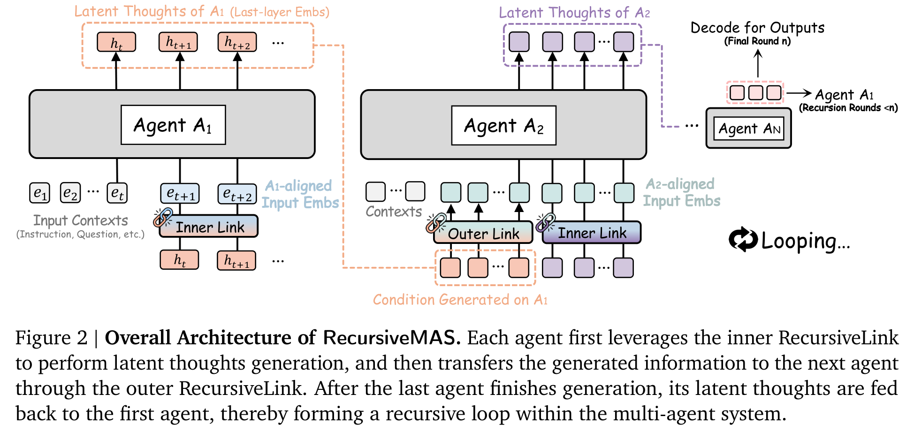
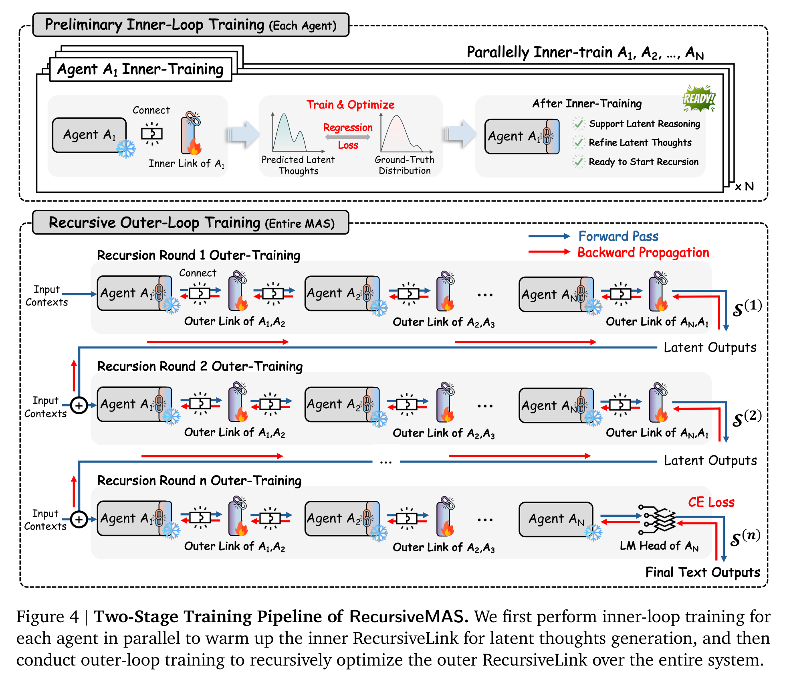
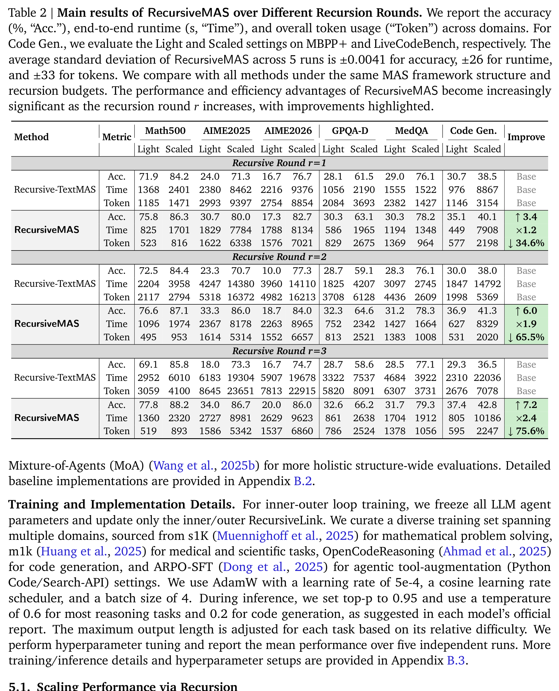
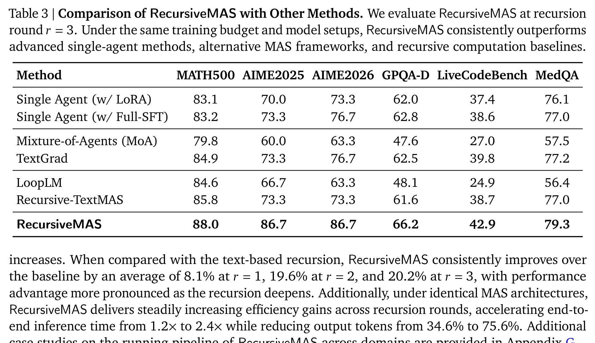
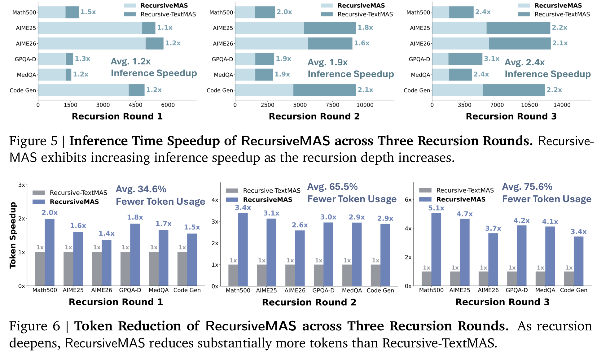
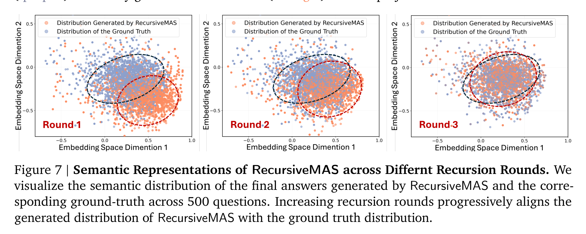
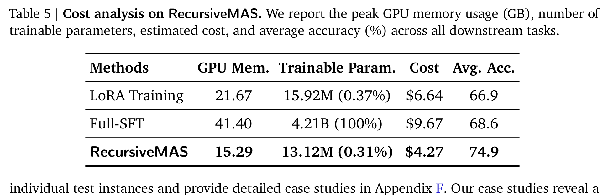

# 让 AI 团队不再“群聊”：RecursiveMAS 把多智能体协作搬进隐空间循环

## TL;DR

RecursiveMAS 想解决一个很现实的问题：多智能体系统靠文本一轮轮交流，既慢、费 token，又很难把整个团队一起优化。它把 agent 协作改造成 latent-space 的递归计算，用轻量 RecursiveLink 在 agent 内部生成 latent thoughts、在不同 agent 间传递隐状态，并只训练这些连接模块。论文在数学、科学、医学、搜索和代码等 9 个 benchmark 上报告平均 8.3% 准确率提升，同时带来 1.2×–2.4× 推理加速和 34.6%–75.6% token 减少。

## 论文基本信息

- 论文链接：[arXiv:2604.25917v1](https://arxiv.org/abs/2604.25917v1)
- 代码链接：[Project Page](https://recursivemas.github.io)
- 作者团队：UIUC，Stanford University，NVIDIA，MIT；Xiyuan Yang、Jiaru Zou、Rui Pan、Ruizhong Qiu、Pan Lu 等
- 关键词：多智能体系统，递归计算，隐空间协作，RecursiveLink，推理效率

## 多智能体的下一步，不一定是让大家多说话

多智能体系统的直觉很诱人：一个 agent 做 planner，一个 agent 做 critic，一个 agent 做 solver，或者让数学、代码、科学专家各自出主意，再由 summarizer 汇总。问题是，这种协作大多发生在文本层面。文本是人类可读的接口，却不是机器协作最高效的中间表示。

RecursiveMAS 的核心判断是：如果 agent 之间每一轮都要完整 decode 成文本，再让下一个 agent 读进去，系统会同时碰到两个瓶颈。第一是效率，重复生成中间文本会带来显著 latency 和 token 开销。第二是学习，文本离散化会切断或削弱梯度流，让“整个团队一起变好”变得很难。

这篇论文的主张很鲜明：把多智能体协作从“文本群聊”改造成“隐空间循环”。每个 agent 不再每轮都把想法说出来，而是在 latent states 里产生、传递、接收、再递归 refine。最后一轮才由最后一个 agent decode 出文本答案。

Figure 1 很好地概括了论文想卖的两个点：一是递归深度本身可以成为 scaling axis；二是这种机制不只适用于一种固定 agent 拓扑。Sequential、Mixture、Deliberation、Distillation 四种常见协作模式都能接上 RecursiveMAS，这使它更像一个系统级接口，而不是某个特定 pipeline 的小修小补。

## RecursiveLink：给 agent 之间装一条隐空间传送带

RecursiveMAS 里最关键的模块叫 RecursiveLink。它很轻：本质上是两层线性层加 GELU，再配 residual connection。它有两个版本。

Inner RecursiveLink 负责 agent 内部的 latent thoughts generation：把模型 last-layer hidden state 映射回 input embedding 空间，让模型可以不经过文本 token，就继续在连续隐空间里“想下一步”。Outer RecursiveLink 负责跨 agent 传递：把一个 agent 的 latent thoughts 映射到另一个 agent 的 embedding 空间，从而支持不同模型、不同尺寸、不同角色之间交换状态。

这个设计有两个值得注意的取舍。第一，它没有更新所有 LLM 参数，而是冻结 agent，只训练 RecursiveLink。这让训练成本可控，也让它更容易挂到现成的 Qwen、Llama、Gemma、Mistral 等模型组合上。第二，它用 residual branch 保留原始语义，让 RecursiveLink 主要学习分布对齐，而不是从零学一个完整映射。对于跨模型隐状态传递，这个保守设计很重要，否则很容易把语义在投影中洗掉。

## 这不是简单串联，而是把整个系统当成一个可训练的循环

如果只把 agent 串起来，RecursiveMAS 还只是一个 latent message passing 系统。它更有野心的地方在训练：作者把整个 MAS 视为一个递归展开的 computation graph，并提出 inner-outer loop training。

第一阶段是 inner-loop training。每个 agent 独立 warm up 自己的 inner RecursiveLink，让它学会把 latent thoughts 对齐到 ground-truth text 的 embedding 分布。第二阶段是 outer-loop training。整个系统按递归轮数展开，agent A1 到 A2 到 ... 到 AN，再把最后 agent 的 latent output 回传给 A1，循环多轮；最后一轮输出文本，用 CE loss 训练所有 outer links，让梯度沿着完整递归路径回传。

这一步是论文和普通 MAS work 最大的区别之一。很多多智能体方法只是在 prompt、角色、上下文或反馈文本上做优化；RecursiveMAS 则试图让 agent 间的信息流本身成为可学习对象。作者还给出复杂度和梯度稳定性的理论分析：相比 text-based recursive MAS，latent-space 传递避免了每步 vocabulary-space decoding 的大头成本；在高置信 token 场景下，文本递归容易梯度消失，而 RecursiveLink 的 latent recursion 可以维持更稳定的梯度。

## 主结果：递归越深，文本协作越吃亏

实验覆盖 9 个 benchmark，横跨数学推理、科学/医学、代码生成和搜索 QA。模型组合也不是单一 backbone：包括 Qwen3/3.5、Llama-3、Gemma3、Mistral 等。作者主要拿 RecursiveMAS 和 Recursive-TextMAS 对比，后者保留相同 MAS 结构和递归预算，但 agent 之间通过文本交流。

Table 2 的信息量很大：在 r=1、r=2、r=3 三种递归轮数下，RecursiveMAS 都在 accuracy、time、token 三个维度压过 Recursive-TextMAS。更关键的是，随着递归加深，差距扩大：相对文本递归，平均性能提升从 r=1 的 8.1% 扩到 r=2 的 19.6%、r=3 的 20.2%；推理加速从 1.2× 到 1.9× 再到 2.4×；token 减少从 34.6% 到 65.5%，最终到 75.6%。

这组结果说明了一个很重要的系统现象：文本协作的成本不是线性小问题。递归轮数越多，文本中间态越多，系统越慢、越费 token；而 latent-space 协作把中间交流压在连续表示里，所以递归越深，效率优势越明显。换句话说，RecursiveMAS 不是在“少说一点文本”，而是在改变协作介质。

## 和强 baseline 比，它靠的是系统级优化

Table 3 把 RecursiveMAS 放到更宽的 baseline 里比较，包括单 agent LoRA、Full-SFT、Mixture-of-Agents、TextGrad、LoopLM、Recursive-TextMAS 等。在 r=3 时，RecursiveMAS 在所有列上都最高：MATH500 88.0，AIME2025 86.7，AIME2026 86.7，GPQA-D 66.2，LiveCodeBench 42.9，MedQA 79.3。

这里最值得看的不是它“赢了所有表格”，而是它赢的方式。单独 fine-tune agent 当然能提升个体能力，但它仍然没有优化 agent 之间如何交换信息。RecursiveMAS 的增益来自系统级连接：不同角色、不同模型族、不同 hidden dimension 的 agent 被统一到一个可训练的 latent loop 里。这也是它在 AIME2025、AIME2026 这类 reasoning-intensive benchmark 上优势很大的原因之一。

不过，Table 3 也提醒我们：RecursiveMAS 不是一个单点模型能力突破，而是一个系统结构和训练方式的突破。它的收益依赖 agent 组合、训练数据、递归轮数和任务类型。如果把这些条件换掉，增益是否还能稳定保留，需要继续验证。

## 最实用的卖点：更快、更省 token

很多多智能体论文最大的问题是：效果涨一点，但成本涨得更多。RecursiveMAS 这篇相对有吸引力的地方，是它同时报告了速度和 token 使用。Figure 5/6 显示，递归 1/2/3 轮时，平均 inference speedup 分别是 1.2×、1.9×、2.4×；token reduction 分别是 34.6%、65.5%、75.6%。

这对真实部署非常关键。多 agent 系统一旦进入复杂任务，最痛的往往不是“能不能多来一轮讨论”，而是每一轮讨论都要花钱、花时间、占上下文。RecursiveMAS 把中间过程留在 hidden states 里，只有最终答案 decode 出来，因此更像是在给 MAS 做一层低成本的内部总线。

当然，这个效率优势也有前提：你得能访问和操作模型 hidden states，并且能训练 RecursiveLink。这不适合只通过黑盒 API 调用模型的场景。它更适合开源模型、本地部署、研究训练框架，或者能控制模型内部表示的系统。

## 递归真的在“变聪明”吗？语义分布给了一个侧面证据

论文没有只停留在准确率和效率，还做了语义分布分析。作者采样 500 个问答对，把 ground-truth answer 和 RecursiveMAS 在不同递归轮数下的 final answers 映射到同一个 embedding space，并用 PCA 可视化。

Figure 7 的信息很直观：r=1 时，生成答案分布和 ground truth 明显错开；r=2 开始靠近；r=3 时，两者基本重叠。这说明递归不是纯粹在堆计算，而是在逐步把系统输出推向更接近正确答案的语义区域。配合 case study 中“早期递归可能答错，深层递归纠正”的描述，这张图给了 RecursiveMAS 一个更像“迭代修正”的解释。

## 便宜但不廉价：只训练 0.31% 参数，还拿到更高平均准确率

成本表也很关键。RecursiveMAS 的 trainable parameters 是 13.12M，占 0.31%；GPU memory 15.29GB，估计成本 4.27 美元，平均准确率 74.9。相比之下，LoRA 是 15.92M 参数、21.67GB、6.64 美元、平均 66.9；Full-SFT 是 4.21B 参数、41.40GB、9.67 美元、平均 68.6。

这张表强化了论文的实用价值：它不是为了提升一点性能就把训练成本推爆，而是把可训练部分集中在连接模块上。对多智能体系统来说，这个思路很自然：既然 agent 已经有能力，下一步也许不是分别把每个 agent 微调得更强，而是让它们之间的信息流更可学习、更稳定、更省。

## 我会如何读这篇论文

我会把 RecursiveMAS 看成一篇“多智能体系统工程”和“递归 latent computation”交叉的论文。它真正有价值的地方，不是又提出一种 agent 角色编排，而是把协作本身从文本接口抽离出来，变成可以训练、可以递归展开、可以分析复杂度和梯度的系统结构。

最让我觉得扎实的，是论文同时回答了三个问题：为什么文本递归慢，为什么 latent 递归更容易训练，以及这种改动在多任务、多模型、多 agent 拓扑下是否有效。主结果、效率图、语义分布和成本表形成了一条比较完整的证据链。

但我也会谨慎看待它。第一，它依赖 hidden-state 级别访问，这意味着黑盒 API agent 很难直接用。第二，跨模型 latent alignment 本身是一个脆弱问题，虽然 residual RecursiveLink 有帮助，但在更异质、更大规模、更开放的 agent 组合里是否稳定，还需要更强证据。第三，论文里的任务大多有明确答案或评价指标；开放式协作、长期记忆、多轮环境交互中，latent-loop 的可控性和可解释性仍然是未知数。

## 值得关注的地方

1. **黑盒 API 场景下有没有替代方案。** 如果不能访问 hidden states，能否用压缩的中间表示、adapter server、或者可学习 memory bridge 近似 RecursiveLink，这是落地时绕不开的问题。

2. **更复杂 agent 网络里的稳定性。** 论文覆盖了 4 种协作模式，但真实 agent 系统可能是动态图、条件路由、工具调用和长期记忆混合体。RecursiveLink 在这些拓扑里是否还能保持梯度稳定，值得继续测。

3. **latent 协作的可解释性和安全边界。** 文本协作虽然慢，但至少人能看见 agent 在说什么。latent 协作更高效，也更黑箱。如何审计中间状态、发现错误传播、做安全约束，是后续必须补上的部分。

4. **和 MoE / routing / test-time compute 的结合。** RecursiveMAS 很像给 agent 系统加了一条隐空间循环总线。它是否能和动态路由、专家选择、预算自适应递归深度结合，可能会决定它能不能成为真正的系统级 scaling recipe。
