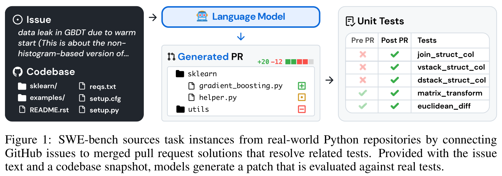
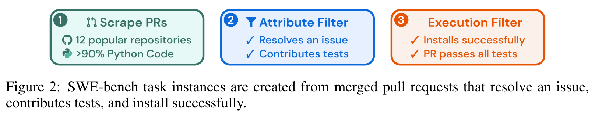
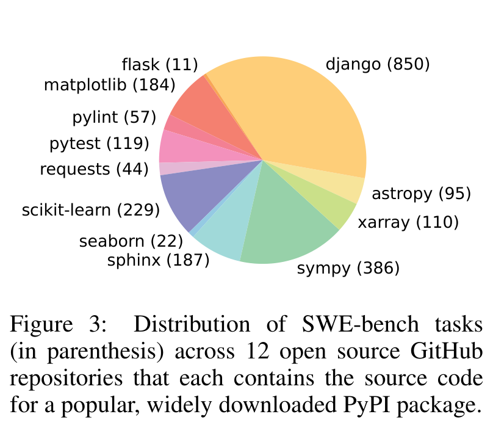
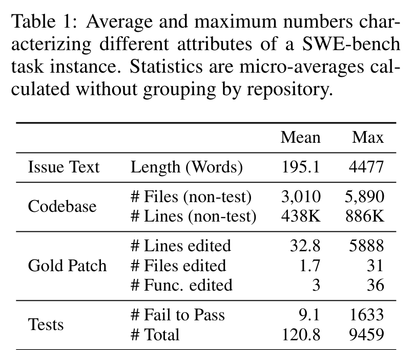
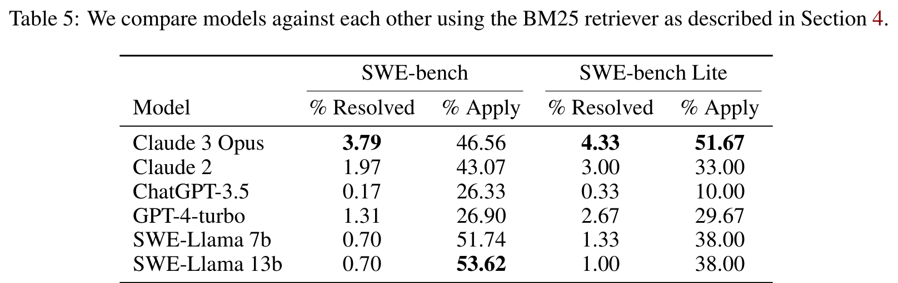
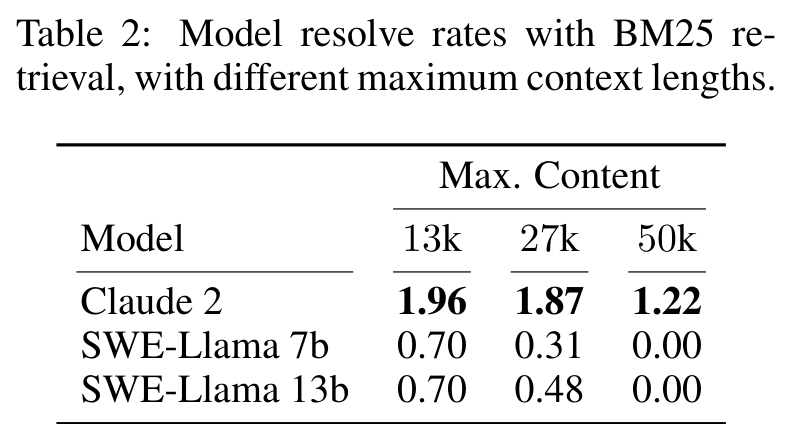
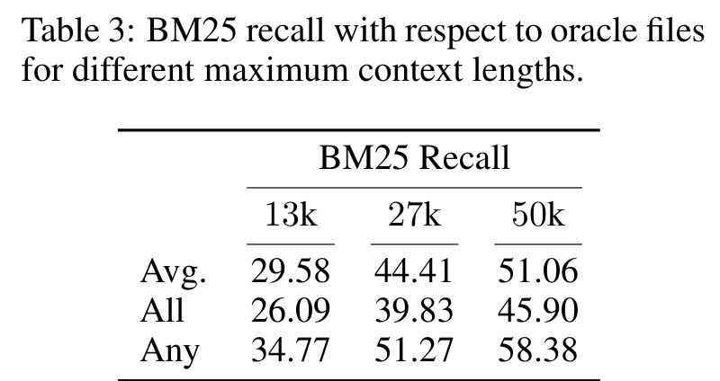
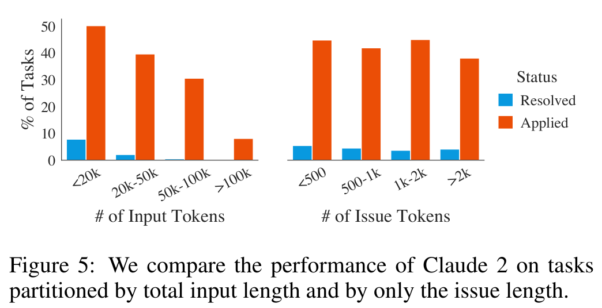
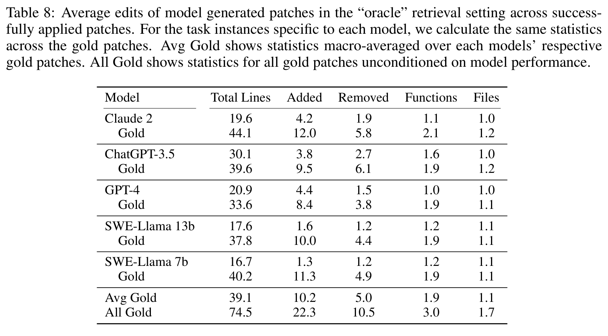
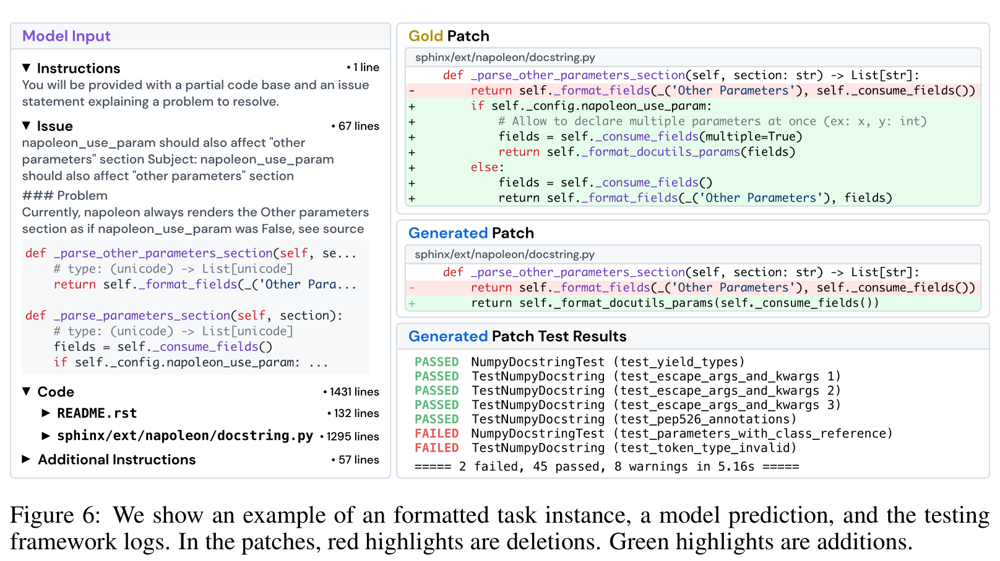

# 会写代码不等于会修仓库：SWE-bench 把大模型拉进真实 GitHub 现场

## TL;DR

SWE-bench 的狠处在于，它不再问模型能不能补全一道小函数，而是让模型面对真实 GitHub issue、庞大代码库和测试框架，生成能真正合入的 patch。结果很刺眼：Claude 2 在 BM25 设置下只解决 1.96% 问题。它后来成为 coding agent 时代的分水岭，不是偶然。

## 论文基本信息

- 论文链接：[arXiv:2310.06770v3](https://arxiv.org/abs/2310.06770v3)
- 代码链接：未在 PDF 中提取到
- 作者团队：Princeton University，Princeton Language and Intelligence，University of Chicago
- 关键词：代码智能，真实仓库修复，SWE-bench，执行评测，长上下文

## 这篇论文为什么重要：它把代码模型从玩具题里拽了出来

在 SWE-bench 之前，很多代码评测更像“考试题”：给一个函数签名、一段自然语言描述，模型补几行代码，跑单元测试。HumanEval 这类 benchmark 很有价值，但它衡量的是相对封闭、短上下文、局部函数级的编码能力。

真实软件工程完全不是这样。一个 bug 可能藏在几千个文件里，issue 里有用户描述、错误日志、版本信息、复现步骤；修复要读代码风格、找相关模块、理解测试意图，还要保证别把旧功能弄坏。SWE-bench 的贡献，就是把这个现实过程做成了可规模化、可执行验证的 benchmark。

这张图把任务说得很清楚：输入不是一个孤立函数，而是 issue + codebase；输出不是一段随便看的代码，而是 pull request 风格的 patch；评估不是人工打分，而是用 pre-PR/post-PR tests 检查 patch 是否真正让 fail-to-pass tests 通过，同时不破坏已有功能。

这就是 SWE-bench 后来影响很大的原因。它衡量的不是“模型像不像程序员”，而是“模型能不能在真实工程环境里完成一个可验证的维护任务”。

## 数据从哪里来：用 GitHub 的协作流程制造可验证任务

SWE-bench 的数据构造非常聪明。作者不是手写题目，而是从 12 个流行 Python 开源仓库中抓取真实 merged pull requests，大约 9 万个 PR，然后通过三步过滤得到 2,294 个任务实例。

三步分别是：先抓取高质量 Python 仓库的 PR；再筛选出解决 GitHub issue 且包含测试改动的 merged PR；最后执行过滤，要求应用 PR 前至少有一个相关测试失败，应用 PR 后这些 fail-to-pass tests 通过，同时仓库能正常安装和运行。

这套流程有两个好处。第一，任务天然来自真实用户问题，不是 benchmark 作者凭空设计。第二，答案可以执行验证：模型生成的 patch 如果能通过与原 PR 相关的测试，就算解决。这样的 benchmark 可以持续更新，也能减少“模型只是背过题”的风险。

## 任务到底有多难：不是代码长，是要在海里找针

SWE-bench 覆盖 12 个 Python 仓库，包括 django、sympy、scikit-learn、sphinx、matplotlib 等。任务分布并不均匀，django 有 850 个，sympy 有 386 个，scikit-learn 有 229 个；这些都是真实、成熟、结构复杂的代码库。

真正吓人的数字在 Table 1。平均每个任务的 issue 文本 195 词，代码库平均 3,010 个非测试文件、43.8 万行非测试代码；gold patch 平均编辑 32.8 行、1.7 个文件、3 个函数；测试方面，平均 9.1 个 fail-to-pass tests，总测试数平均 120.8。

所以 SWE-bench 的难点不是“模型能不能写一段语法正确的 Python”，而是：它能不能从巨大上下文中定位真正相关的文件和函数，理解 issue 和现有代码之间的关系，再做一个足够小、足够准、能通过测试的修改。

这也是为什么这个 benchmark 后来非常适合推动 agent 方法。单次 prompt 生成 patch 只是第一步，真实修复往往需要搜索、查看文件、运行测试、读失败日志、反复修改。

## Baseline 时代的惨烈结果：最好的模型也只解决了 1.96%

论文里的主结果现在看会让人有点穿越感，因为今天大家已经习惯看 SWE-bench Verified 上几十个百分点的 agent 成绩。但在这篇原始论文里，BM25 retrieval + patch generation 的结果非常低。

在 BM25 设置下，Claude 2 只能解决 1.97% 的 SWE-bench 问题，GPT-4-turbo 是 1.31%，ChatGPT-3.5 只有 0.17%。论文摘要中提到 Claude 2 最好为 1.96%，这个数字的意义不是“Claude 2 很弱”，而是当时的评测方式终于把代码模型放到了足够真实的场景里。

有趣的是，apply rate 明显高于 resolve rate。比如 Claude 2 的 patch apply rate 是 43.07%，SWE-Llama 13b 甚至有 53.62%，但 resolved 只有 0.70%。这说明很多模型能生成格式上可应用的 patch，却不能真正修对问题。能 patch，不等于能 repair。

## 检索不是小配角，它几乎决定模型看不看得到答案

SWE-bench 给的是完整代码库，但模型上下文窗口有限，所以论文先用 BM25 选择文件。Table 2 和 Table 3 合在一起看，很能说明问题。

Claude 2 在 13k context 下 resolve rate 是 1.96%，27k 是 1.87%，50k 降到 1.22%。这看上去反直觉：上下文更长，BM25 recall 应该更高，为什么效果反而下降？

Table 3 确实显示，BM25 recall 随上下文长度增加而提高：Avg 从 29.58 到 51.06，Any 从 34.77 到 58.38。但模型性能没有同步提升。作者的解释非常关键：模型不是缺“更多上下文”，而是缺“从更多上下文里定位关键代码”的能力。给它更多文件，可能增加了 relevant files，也同时增加大量干扰。

这点后来在长上下文模型和 coding agent 里不断重演：context window 变大并不会自动带来更好的软件工程能力。真正的问题是检索、定位、压缩、导航和验证。

## 长上下文不是银弹：越长越容易被无关代码拖住

Figure 5 直接把这个问题可视化了。Claude 2 在输入 token 数变长时，resolved 比例明显下降；issue 文本长度也有影响，但核心压力来自代码上下文。

这张图放到今天仍然很有启发。长上下文模型的能力提升当然重要，但 SWE-bench 告诉我们，工程任务里“长”常常意味着噪声更多、文件更多、依赖更多、定位更难。模型必须学会把上下文变成工作记忆，而不是被上下文淹没。

论文还做了 oracle-collapsed 实验：只保留 oracle files 中真实被 PR 修改的代码附近 +/-15 行。结果 Claude 2 从 oracle setting 的 4.8% 提到 5.93%，GPT-4 从 1.3% 提到 3.40%。这说明如果有人提前帮模型压缩到关键区域，模型确实会变好。但现实任务里，关键恰恰是模型自己找到这些区域。

## 模型修出来的 patch 往往太短、太局部、太“贪心”

论文后面还分析了模型生成 patch 的形态。Table 8 对比了成功 apply 的模型 patch 和对应 gold patch 的编辑规模。

All Gold 的平均 patch 是 74.5 行、22.3 行新增、10.5 行删除、涉及 3.0 个函数和 1.7 个文件。相比之下，Claude 2 成功 apply 的 patch 平均只有 19.6 行，GPT-4 是 20.9 行，SWE-Llama 13b 是 17.6 行，通常只改 1 个文件左右。

这说明模型倾向于生成短而局部的修复，往往只解决眼前表面问题，而不是像人类维护者那样做更结构化、更兼顾未来兼容性的修改。论文的定性案例也印证了这一点：模型可能编辑了正确函数，却忽略配置条件，导致相关测试失败。

这个案例很有代表性：模型不是完全不知道该改哪里，它能接近目标区域；但真正的软件修复需要理解现有函数的设计约束、配置开关、类似函数的模式，以及测试为什么失败。差一步，就不是“差一点对”，而是没解决。

## 我会如何读这篇论文

SWE-bench 的历史意义在于，它把代码模型评测从“能不能生成代码”推到了“能不能维护软件”。这看似只是 benchmark 更新，实际上改变了研究问题本身。模型不再只需要语法、API 和短程推理，而要具备定位、规划、编辑、验证、回归避免和工具使用能力。

我觉得这篇论文最强的地方，是任务构造非常自然：GitHub issue、merged PR、fail-to-pass tests、真实仓库快照，这些都来自真实软件协作流程。它没有人为规定模型应该用哪种方法，因此给 retrieval、long-context、agent、test-time search、tool use 都留下了空间。

但它也有边界。早期 SWE-bench 只覆盖 Python，baseline 方法也相对简单，BM25 + single-shot patch generation 不能代表今天更复杂的 agent 系统；测试通过也不等于代码质量完全可靠。更重要的是，benchmark 一旦变成主赛道，社区就会围绕它优化 harness、筛数据、调流程，因此后续必须持续更新和防止过拟合。

不过这些边界不削弱它的贡献。SWE-bench 的价值不是告诉我们某个模型“只会 1.96%”，而是给出了一个足够真实、足够难、又能自动验证的场地，让 coding agent 终于有地方较真。

## 值得关注的地方

1. **评测应从代码生成转向软件维护。** 未来 coding 模型真正有用，不只是会写函数，而是能读 issue、定位代码、改 patch、跑测试、处理回归。

2. **长上下文必须配合定位机制。** SWE-bench 已经展示：更长 context 可以提高 oracle file 覆盖，但也会让模型更容易被无关代码干扰。检索、导航、摘要和工作记忆会比窗口大小本身更关键。

3. **Patch 质量不能只看测试通过。** 模型 patch 往往短、局部、贪心。后续评测需要更多关注可维护性、最小必要修改、风格一致性和潜在未来错误。

4. **Benchmark 会催生 agent harness 的竞争。** SWE-bench 原始 baseline 很低，但正因为它真实且可验证，后续才推动了 SWE-agent、OpenHands、AHE、ACE 等一整类工具化 coding agent。这个方向还会继续演化。
