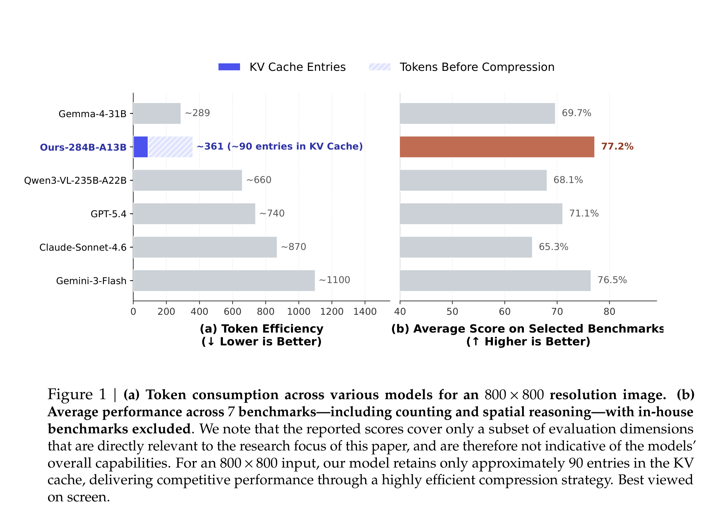
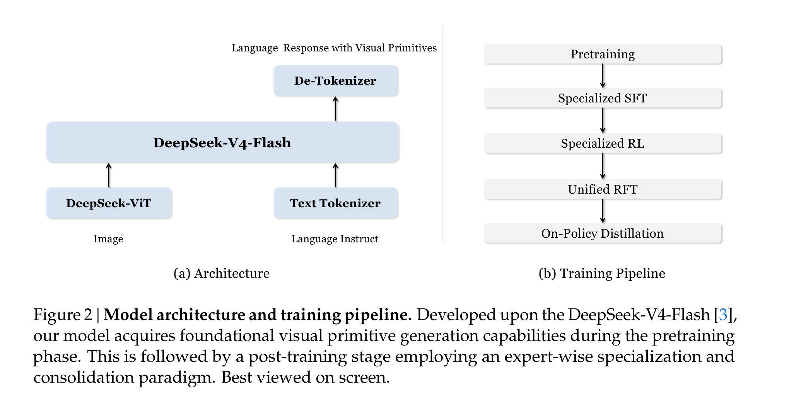
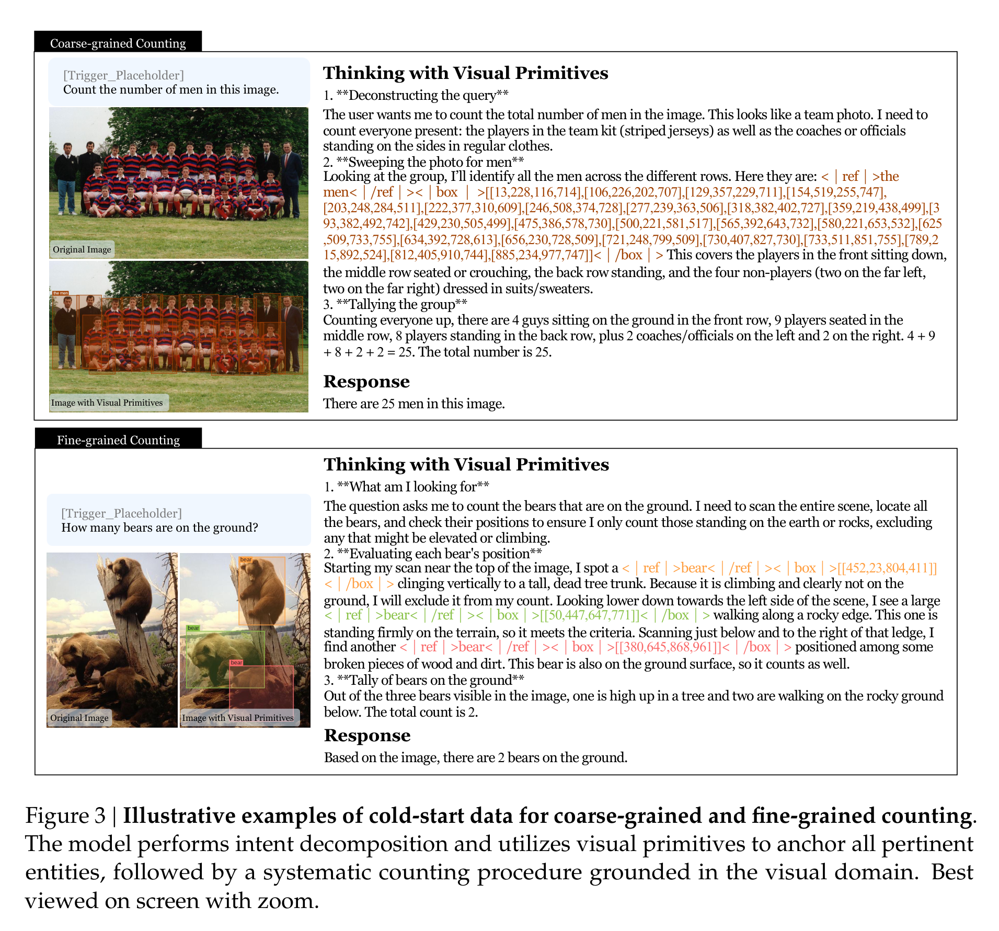
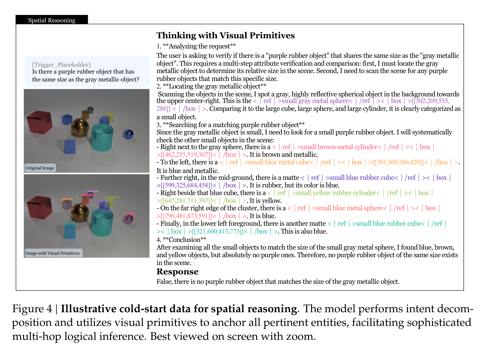
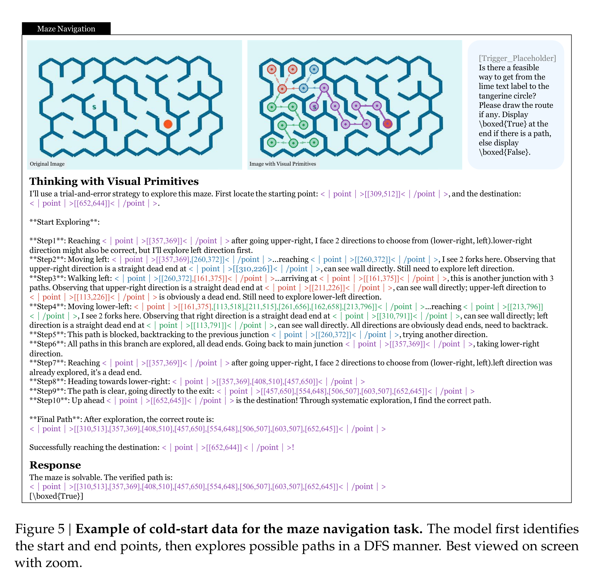
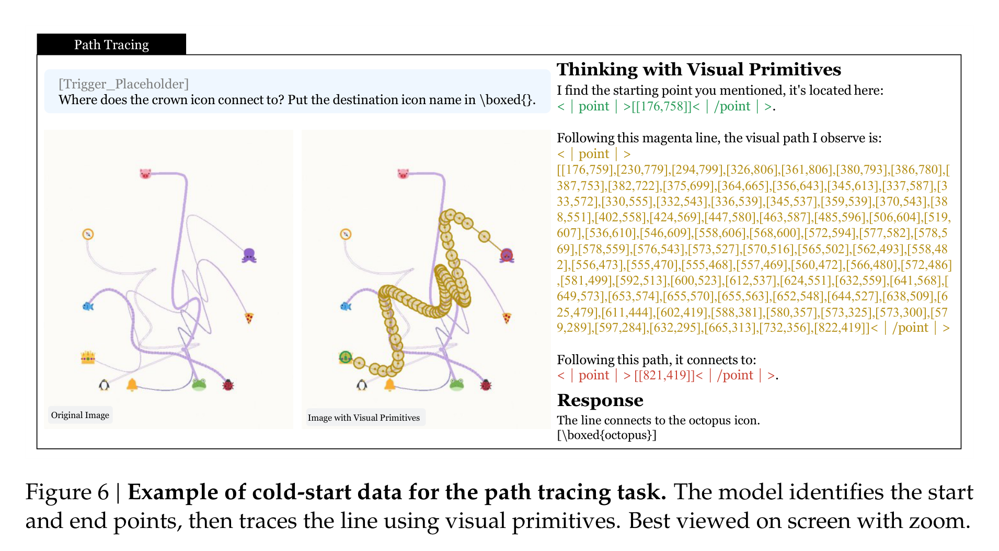
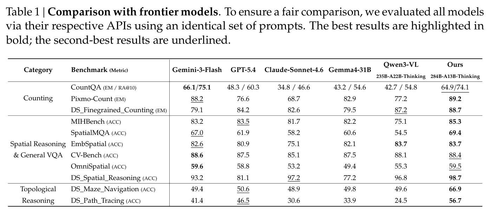
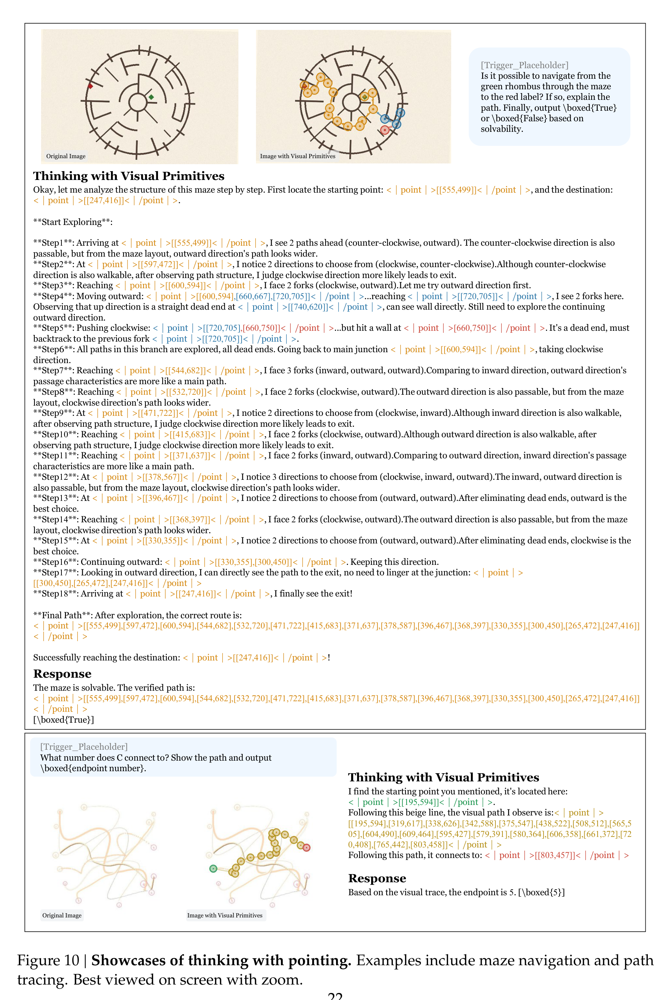

# 别只让多模态模型“看清楚”：DeepSeek 让它边想边指

## TL;DR

很多多模态模型已经能看高清图，但一到密集计数、空间比较、迷宫寻路，就容易“话说得很顺，手却指错地方”。这篇论文抓住的是 Reference Gap：语言 CoT 很难精确绑定图像中的对象和路径。DeepSeek 提出 Thinking with Visual Primitives，把 box 和 point 直接插进推理过程，让模型边推理边定位，在计数、空间推理和拓扑任务上用更少视觉 token 做到接近甚至超过前沿模型的表现。

## 论文基本信息

- 论文链接：未在 PDF 中提取到
- 代码链接：未在 PDF 中提取到
- 作者团队：Ruijie Lu、Yiyang Ma、Xiaokang Chen、Lingxiao Luo、Zhiyu Wu、Zizheng Pan、Xingchao Liu、Yutong Lin、Hao Li、Wen Liu、Zhewen Hao、Xi Gao、Shaoheng Nie、Yixuan Wei、Zhenda Xie、Ting Chen、Gang Zeng；DeepSeek-AI，北京大学，清华大学
- 关键词：多模态推理，视觉基元，视觉定位，空间推理，拓扑推理

## 真问题不是“看不见”，而是“说不准它在哪”

这篇论文的切入点很聪明。过去多模态模型做复杂视觉推理时，大家往往先怀疑模型“看不清”，于是用高分辨率裁剪、动态 patch、更多视觉 token 去补 Perception Gap。但作者指出，很多错误并不是因为模型没有看到对象，而是因为语言推理链没有办法稳定指向图像里的具体实体。

这就是论文说的 **Reference Gap**：自然语言描述在连续视觉空间里太模糊。模型可以说“左边那个小球”“旁边那个物体”“沿着这条线走”，但这些话没有坐标约束。遇到密集计数、多跳空间关系、曲线路径追踪时，语言里的指代一旦漂移，后面的推理就会连环塌掉。

Figure 1 同时给了两个信号：一边是效率，Ours-284B-A13B 对 800 x 800 图像约保留 90 个 KV cache entries；另一边是能力，在 7 个与论文主题相关的 benchmark 上平均 77.2%，高于图中列出的 Gemini-3-Flash、GPT-5.4、Claude-Sonnet-4.6、Qwen3-VL 等模型。注意作者也很谨慎地说明：这不是整体多模态能力榜单，而是围绕计数和空间推理等焦点任务的比较。

## 把 box 和 point 变成“思考里的手指”

Thinking with Visual Primitives 的核心不是让模型最后吐一个框，也不是把 grounding 当成验算步骤，而是把视觉基元放进推理链本身。模型在思考时可以输出 `<|box|>` 或 `<|point|>`，用坐标把语言概念钉到图像空间里。

这件事听起来像格式工程，但意义不小。对于计数，box 能一次性锁定所有候选对象，避免“数着数着忘了数到哪”。对于路径追踪、迷宫导航，point 序列能表示移动轨迹，比“往左上走一点再右转”这种语言描述更可计算、更可检查。

架构上它不是从零造一个奇怪模型，而是接近 LLaVA 的图文 token 拼接范式。语言骨干是 DeepSeek-V4-Flash，284B 总参数、13B active parameters；视觉侧使用 DeepSeek-ViT。图像经过 14 x 14 patch，再做 3 x 3 空间 token 压缩，之后 CSA 进一步把 visual KV cache 压缩 4 倍。论文举例说，756 x 756 图像从 2916 个 patch tokens 到 324 个输入 LLM 的视觉 tokens，最终在 KV cache 里只剩 81 个视觉 entries。

## 数据不是“标框越多越好”，而是先把脏标注筛出去

为了让模型学会输出视觉基元，作者先大规模收集 box grounding 数据。这里值得注意的是他们没有直接把网络检测数据一股脑喂进去，而是专门做了两层清洗。

第一层是语义质量：过滤无意义编号、私有实体、主观标签和模糊缩写。比如 “OK/NG” 这种标签在工业数据里很常见，但它本身不对应稳定视觉概念。第二层是几何质量：检查漏标、严重偏移、截断目标、以及覆盖全图的 mega box。最终从 97,984 个 box-grounding 数据源，筛到 31,701 个数据源，并通过类别采样得到 4000 万级高质量样本。

这个细节很重要，因为 visual primitives 的效果高度依赖坐标准确性。如果标注本身在语义或几何上不可靠，模型学到的就不是“指得准”，而是“像是在指”。

## 计数和空间推理：让模型每一步都落在图上

论文为 post-training 构造了高精度 cold-start 数据，覆盖四类任务：counting、spatial reasoning & general VQA、maze navigation、path tracing。计数任务分成 coarse-grained 和 fine-grained：前者数一般类别，后者需要根据属性或空间约束筛对象。

Figure 3 展示了这个范式为什么适合计数。粗粒度计数时，模型把一整组男人全部框出来再求和；细粒度计数时，它不仅框出熊，还解释为什么树上的熊不算“on the ground”。这比普通 CoT 的优势在于：推理链不是纯文本自说自话，读者和 verifier 都能看到它到底把哪些实体纳入了计算。

空间推理也是类似逻辑。Figure 4 里的问题要求判断有没有一个紫色橡胶物体与灰色金属物体同尺寸。模型先定位灰色金属球，再扫描小物体候选，逐个排除颜色或材质不匹配的对象。这里 visual primitives 的作用不是“展示答案”，而是把每个比较对象显式放到图像坐标里，减少多跳关系推理中的指代漂移。

## 拓扑推理是这篇最有野心的部分

我认为这篇最值得看的不是计数，而是 maze navigation 和 path tracing。因为这类任务很难靠语言描述糊弄过去：路径是不是连通、有没有撞墙、曲线交叉处该沿哪条继续，都需要一串局部几何判断组合起来。

迷宫任务里，作者用 DFS、Prim、Kruskal 生成不同拓扑的迷宫，还专门构造“看起来可走但中间被墙切断”的不可解样本。训练时，模型需要写出探索过程、遇到死路回溯，并输出最终路径或不可达判断。奖励也不是只看最后 True/False，而是包含合法探索进度、探索完整性、撞墙惩罚、最终路径有效性和答案正确性。

Path tracing 更像在考“视觉版手眼协调”。模型要从某个图标出发，沿着一条曲线穿过复杂交叉，判断最终连接到哪个终点。论文还加入统一颜色和线宽的模式，避免模型靠颜色捷径。这类任务逼着模型真正使用 point 序列来跟踪轨迹，而不是靠一句“沿着线走到终点”完成表面推理。

## 训练策略：先专家化，再合并，再蒸馏

训练流程也很工程化。作者先做 Specialized SFT，把 box 方向的 thinking with grounding 和 point 方向的 thinking with pointing 分开训练，避免少量专门数据造成模式冲突。然后分别对两个专家模型做 Specialized RL。

RL 阶段一个关键选择是：不再显式监督 thinking 里的每个 box/point，而只需要 image、question、final answer，再用 reward model 约束格式、质量和准确性。这让 RL 数据池更容易扩展。不同任务对应不同 Accuracy RM：计数用相对误差的平滑奖励；空间推理和 VQA 用 LLM-based GRM；迷宫和路径追踪用规则奖励去检查路径合法性、覆盖度、终点准确性等。

最后，作者把两个专家通过 Unified RFT 合成统一模型，再用 On-Policy Distillation 把专家能力蒸馏进一个模型。这个流程的逻辑很清楚：**视觉基元有两种不同操作习惯，先让专家学精，再让统一模型继承。**

## 结果最亮眼的是拓扑任务，不是常规 VQA

Table 1 的结果基本符合这篇论文的定位：在普通空间/VQA benchmark 上，它是强竞争者；在需要指代精度的自建任务上，优势更明显。

几个数字值得单独拎出来：Pixmo-Count 上 Ours 是 89.2，DS_Finegrained_Counting 是 88.7；DS_Spatial_Reasoning 达到 98.7。最有区分度的是 topological reasoning：DS_Maze_Navigation 是 66.9，而 Gemini-3-Flash、GPT-5.4、Claude-Sonnet-4.6、Gemma4-31B、Qwen3-VL 都在 50 左右或更低；DS_Path_Tracing 是 56.7，也明显高于其他模型。

这说明 visual primitives 最适合的不是“图像问答都来一点”，而是那些必须持续追踪视觉引用的任务：数清楚、指清楚、沿着路径走清楚。

## 定性案例：它开始像是在“用手辅助思考”

论文最后给了很多展示样例，包括细粒度计数、反常识视觉问答、地标识别、行动建议、幽默理解、密室逃脱和群体计数。更有意思的是中文样例：虽然 post-training 视觉基元数据不包含中文语料，模型仍然能用中文思考和回答，这应该主要来自 base model 的多语言能力。

Figure 10 很好地展示了 point 的作用。语言很难精确描述一个圆形迷宫中的每次转向，也很难描述复杂曲线交叉处的路径选择；但 point 序列可以把路线本身变成推理内容。它不只是“解释给人听”，也让系统有机会检查路线是否真的连续、是否撞墙、是否跳到了错误终点。

## 我会如何读这篇论文：方向很对，但触发方式还不够自然

我喜欢这篇论文的地方在于，它没有把多模态推理的问题简单归结为“更大模型、更高分辨率、更多 tokens”。它提出的 Reference Gap 很有解释力：当模型需要在图像中反复指代对象、比较属性、沿路径移动时，纯语言 CoT 的确太松了。

visual primitives 作为“最小思考单元”也很有前景。它让推理链从纯文本变成图文坐标混合结构，既更可解释，也更容易做规则验证。尤其在拓扑任务上，这个方向比单纯提升视觉编码分辨率更像是在补真正缺的能力。

但也要保持一点冷静。第一，论文的模型仍然依赖显式 trigger words 来启动 thinking with visual primitives，这意味着它还不是自然地知道“什么时候该用手指”。第二，作者自己也承认，在输入分辨率受限时，细粒度场景仍会有不精确的 primitives。第三，point-based topological reasoning 的跨场景泛化仍有限，当前强项很大程度来自为 maze/path tracing 定制的数据和 reward。

所以我的判断是：**这篇论文不是在宣告多模态 System-2 已经解决，而是给出了一个很扎实的接口设计：让模型的思考能携带坐标。这个接口如果和更强感知、更好的自动触发、更通用的 verifier 结合，价值会很大。**

## 值得关注的地方

1. **模型能否自动决定什么时候“边想边指”？** 现在需要 trigger words，未来更理想的系统应该能根据任务类型自动切换：简单问答直接回答，密集计数和路径任务才启用 visual primitives。

2. **visual primitives 能否成为通用 verifier 接口？** box/point 让推理过程可检查。后续可以把它和外部几何检查器、物理约束、地图/规划器结合，减少多模态推理里的自圆其说。

3. **更强感知和 Reference Gap 不是二选一。** 论文承认细粒度任务仍受输入分辨率限制。未来很可能需要“看得清”的 perception pipeline 加上“指得准”的 primitive reasoning，两个模块互补。

4. **拓扑推理还有很大空间。** 迷宫和曲线追踪已经说明 point 有用，但真实世界里的路线、操作、装配、机器人导航更复杂。如何从合成轨迹泛化到真实场景，是这条路线接下来最值得追的问题。
